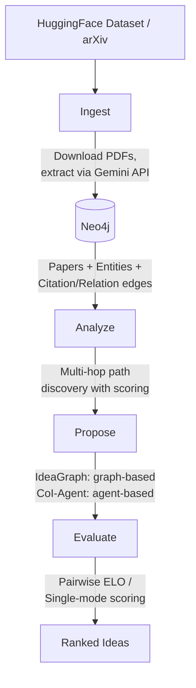

<h1 align="center">IdeaGraph</h1>

<p align="center">
  An AI-powered tool that builds citation and entity knowledge graphs from research papers, performs multi-hop analysis to discover research paths, and generates novel research ideas.
</p>

<p align="center">
  <a href="README.md">English</a> | <a href="README_ja.md">日本語</a>
</p>

---

## Features

- **Knowledge Graph Construction** — Ingest papers from the [AI_Idea_Bench_2025](https://huggingface.co/datasets/AI-Idea-Bench/AI_Idea_Bench_2025) dataset and arXiv, extract entities and citation relationships, and store them in Neo4j
- **Multi-Hop Analysis** — Discover indirect research connections through graph traversal with relevance scoring
- **Dual-Path Idea Generation** — Generate research ideas via two complementary approaches:
  - **IdeaGraph**: graph-traversal-based generation grounded in citation paths
  - **CoI-Agent**: [Chain-of-Ideas](https://github.com/DAMO-NLP-SG/CoI-Agent) agent-based generation
- **Idea Evaluation** — Compare and rate generated ideas using pairwise ELO ratings or single-mode absolute scoring
- **Web UI** — Interactive graph visualization, analysis, proposal management, and idea comparison
- **Full CLI** — All operations available from the command line with rich output formatting

## Requirements

- Python 3.11+
- [Docker](https://docs.docker.com/get-docker/) (for Neo4j)
- [uv](https://docs.astral.sh/uv/) package manager
- API keys:
  - **Google Gemini** — for paper information extraction
  - **OpenAI** — for idea generation and evaluation
  - Semantic Scholar (optional) — for paper metadata fallback
  - Anthropic (optional)

## Quick Start

### 1. Clone the repository

```bash
# Include --recursive to fetch the CoI-Agent submodule
git clone --recursive https://github.com/frkake/IdeaGraph.git
cd IdeaGraph
```

If you have already cloned without `--recursive`:

```bash
git submodule init
git submodule update
```

### 2. Set up environment variables

```bash
cp .env.template .env
# Edit .env and fill in your API keys
```

### 3. Start Neo4j

```bash
docker compose up -d
```

Neo4j Browser is available at http://localhost:7474.

### 4. Install dependencies

```bash
# Core dependencies
uv sync --all-extras

# Additionally, if you want to use Chain-of-Ideas:
uv sync --group coi
```

### 5. Ingest papers and start the server

```bash
# Ingest papers (e.g., limit to 10)
uv run idea-graph ingest --limit 10

# Start the web server
uv run idea-graph serve
```

Open http://localhost:8000 in your browser.

## CLI Commands

| Command | Description |
|---------|-------------|
| `idea-graph ingest` | Ingest papers from dataset and arXiv into the knowledge graph |
| `idea-graph serve` | Start the web server (API + UI) |
| `idea-graph status` | Check Neo4j connection and graph statistics |
| `idea-graph rebuild` | Rebuild the knowledge graph from cached data |
| `idea-graph analyze` | Run multi-hop path analysis on a paper |
| `idea-graph propose` | Generate research idea proposals for a paper |
| `idea-graph evaluate` | Evaluate and compare generated ideas |
| `coi` | Run the Chain-of-Ideas agent directly |

For detailed usage of each command, see [USAGE.md](USAGE.md).

## Architecture



**Tech stack**: Python, FastAPI, Neo4j, LangChain, Vanilla JS + CSS (frontend)

## Project Structure

```
src/idea_graph/
├── api/            # FastAPI application
├── coi/            # CoI-Agent integration wrapper
├── ingestion/      # Paper ingestion pipeline
├── models/         # Pydantic data models
└── services/       # Core services (analysis, proposal, evaluation, storage)
3rdparty/
└── CoI-Agent/      # Chain-of-Ideas agent (git submodule, unmodified)
static/             # Frontend assets (JS, CSS)
templates/          # Jinja2 HTML templates
```

## Third-Party Components

This project includes [CoI-Agent](https://github.com/DAMO-NLP-SG/CoI-Agent) by DAMO-NLP-SG as a git submodule under `3rdparty/CoI-Agent/`. The submodule is included **without modification** and is licensed under the [Apache License 2.0](https://github.com/DAMO-NLP-SG/CoI-Agent/blob/main/LICENSE).

## Acknowledgements

- [CoI-Agent](https://github.com/DAMO-NLP-SG/CoI-Agent) — Chain-of-Ideas agent for research idea generation.
- [AI_Idea_Bench_2025](https://huggingface.co/datasets/AI-Idea-Bench/AI_Idea_Bench_2025) — Research paper dataset used for knowledge graph construction.
- [Neo4j](https://neo4j.com/) — Graph database for storing citation and entity relationships.
- [LangChain](https://www.langchain.com/) — LLM orchestration framework.

## License

This project is licensed under the [Apache License 2.0](LICENSE).

The included CoI-Agent submodule is also licensed under the Apache License 2.0. See [3rdparty/CoI-Agent/LICENSE](3rdparty/CoI-Agent/LICENSE) for details.
