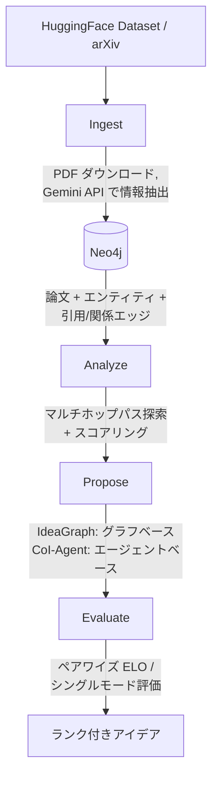

<h1 align="center">IdeaGraph</h1>

<p align="center">
  論文間の引用関係とエンティティをナレッジグラフ化し、マルチホップ分析で研究パスを発見し、研究アイデアを自動生成するAIツール
</p>

<p align="center">
  <a href="README.md">English</a> | <a href="README_ja.md">日本語</a>
</p>

---

## 機能

- **ナレッジグラフ構築** — [AI_Idea_Bench_2025](https://huggingface.co/datasets/AI-Idea-Bench/AI_Idea_Bench_2025) データセットおよび arXiv から論文を取得し、エンティティと引用関係を抽出して Neo4j に格納
- **マルチホップ分析** — グラフ探索により論文間の間接的な研究つながりをスコアリング付きで発見
- **デュアルパスアイデア生成** — 2つの補完的なアプローチで研究アイデアを生成：
  - **IdeaGraph**: 引用パスに基づくグラフ探索型の生成
  - **CoI-Agent**: [Chain-of-Ideas](https://github.com/DAMO-NLP-SG/CoI-Agent) エージェントベースの生成
- **アイデア評価** — ペアワイズ ELO レーティングまたはシングルモード絶対評価で生成アイデアを比較・評価
- **Web UI** — グラフ可視化、分析、提案管理、アイデア比較のインタラクティブUI
- **CLI** — 全操作をコマンドラインから実行可能（リッチ出力対応）

## 必要要件

- Python 3.11+
- [Docker](https://docs.docker.com/get-docker/)（Neo4j 用）
- [uv](https://docs.astral.sh/uv/) パッケージマネージャ
- API キー：
  - **Google Gemini** — 論文情報の抽出用
  - **OpenAI** — アイデア生成・評価用
  - Semantic Scholar（オプション）— 論文メタデータのフォールバック
  - Anthropic（オプション）

## クイックスタート

### 1. リポジトリをクローン

```bash
# --recursive で CoI-Agent サブモジュールも取得
git clone --recursive https://github.com/frkake/IdeaGraph.git
cd IdeaGraph
```

`--recursive` なしでクローン済みの場合：

```bash
git submodule init
git submodule update
```

### 2. 環境変数の設定

```bash
cp .env.template .env
# .env を編集して API キーを入力
```

### 3. Neo4j の起動

```bash
docker compose up -d
```

Neo4j Browser: http://localhost:7474

### 4. 依存関係のインストール

```bash
# 基本機能
uv sync --all-extras

# Chain-of-Ideas を使う場合は追加で
uv sync --group coi
```

### 5. 論文のインジェストとサーバー起動

```bash
# 論文データをインジェスト（例：10件制限）
uv run idea-graph ingest --limit 10

# Web サーバーを起動
uv run idea-graph serve
```

ブラウザで http://localhost:8000 を開いてください。

## CLI コマンド

| コマンド | 説明 |
|---------|------|
| `idea-graph ingest` | データセットと arXiv からナレッジグラフに論文を取り込む |
| `idea-graph serve` | Web サーバーを起動（API + UI） |
| `idea-graph status` | Neo4j 接続状態とグラフ統計を確認 |
| `idea-graph rebuild` | キャッシュデータからナレッジグラフを再構築 |
| `idea-graph analyze` | 論文のマルチホップパス分析を実行 |
| `idea-graph propose` | 論文の研究アイデア提案を生成 |
| `idea-graph evaluate` | 生成されたアイデアを評価・比較 |
| `coi` | Chain-of-Ideas エージェントを直接実行 |

各コマンドの詳細は [USAGE_ja.md](USAGE_ja.md) を参照してください。

## アーキテクチャ



**技術スタック**: Python, FastAPI, Neo4j, LangChain, Vanilla JS + CSS（フロントエンド）

## プロジェクト構成

```
src/idea_graph/
├── api/            # FastAPI アプリケーション
├── coi/            # CoI-Agent 連携ラッパー
├── ingestion/      # 論文インジェストパイプライン
├── models/         # Pydantic データモデル
└── services/       # コアサービス（分析、提案、評価、ストレージ）
3rdparty/
└── CoI-Agent/      # Chain-of-Ideas エージェント（git submodule、未変更）
static/             # フロントエンドアセット（JS, CSS）
templates/          # Jinja2 HTML テンプレート
```

## サードパーティコンポーネント

本プロジェクトは DAMO-NLP-SG の [CoI-Agent](https://github.com/DAMO-NLP-SG/CoI-Agent) を `3rdparty/CoI-Agent/` に git サブモジュールとして含んでいます。サブモジュールは**変更なし**で使用しており、[Apache License 2.0](https://github.com/DAMO-NLP-SG/CoI-Agent/blob/main/LICENSE) でライセンスされています。

## 謝辞

- [CoI-Agent](https://github.com/DAMO-NLP-SG/CoI-Agent) — 研究アイデア生成のための Chain-of-Ideas エージェント。
- [AI_Idea_Bench_2025](https://huggingface.co/datasets/AI-Idea-Bench/AI_Idea_Bench_2025) — ナレッジグラフ構築に使用する研究論文データセット。
- [Neo4j](https://neo4j.com/) — 引用関係とエンティティを格納するグラフデータベース。
- [LangChain](https://www.langchain.com/) — LLM オーケストレーションフレームワーク。

## ライセンス

本プロジェクトは [Apache License 2.0](LICENSE) でライセンスされています。

含まれる CoI-Agent サブモジュールも Apache License 2.0 でライセンスされています。詳細は [3rdparty/CoI-Agent/LICENSE](3rdparty/CoI-Agent/LICENSE) を参照してください。
