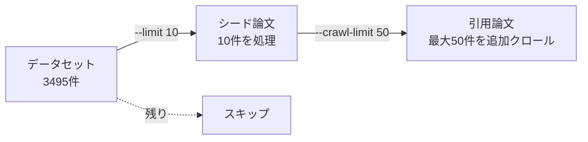

# IdeaGraph 使用ガイド

AI論文のナレッジグラフ構築・可視化・研究アイデア提案・評価ツールの詳細な使い方

## 目次

- [セットアップ](#セットアップ)
- [CLI コマンド](#cli-コマンド)
  - [idea-graph ingest](#idea-graph-ingest---論文データのインジェスト)
  - [idea-graph serve](#idea-graph-serve---web-サーバー起動)
  - [idea-graph status](#idea-graph-status---ステータス確認)
  - [idea-graph rebuild](#idea-graph-rebuild---グラフ再構築)
  - [idea-graph analyze](#idea-graph-analyze---マルチホップ分析)
  - [idea-graph propose](#idea-graph-propose---研究アイデア提案)
  - [idea-graph evaluate](#idea-graph-evaluate---研究アイデア評価)
  - [coi](#coi---chain-of-ideas-エージェント)
- [Web UI](#web-ui)
- [API エンドポイント](#api-エンドポイント)
- [出力ファイルの場所](#出力ファイルの場所)
- [ワークフロー例](#ワークフロー例)
- [トラブルシューティング](#トラブルシューティング)

## セットアップ

### 1. 環境変数の設定

`.env` ファイルを作成し、以下の環境変数を設定：

```bash
# Neo4j 接続情報
NEO4J_URI=bolt://localhost:7687
NEO4J_USER=neo4j
NEO4J_PASSWORD=password
# メモリ設定（WSL2等でメモリが少ない場合に調整）
NEO4J_HEAP_MAX=4G
NEO4J_PAGECACHE_SIZE=4G

# Google Gemini API キー（情報抽出に必要）
GOOGLE_API_KEY=your-api-key-here

# OpenAI API キー（研究アイデア提案・評価に必要）
OPENAI_API_KEY=your-openai-api-key-here

# CoI-Agent 設定（オプション）
COI_MAIN_LLM_MODEL=gpt-4o          # CoIのメインモデル
COI_CHEAP_LLM_MODEL=gpt-4o-mini    # CoIの軽量モデル
COI_OPENAI_BASE_URL=               # カスタムエンドポイント（オプション）
COI_SEMANTIC_SEARCH_API_KEY=        # Semantic Scholar API キー

# CoI Azure 設定（オプション）
COI_IS_AZURE=false
COI_AZURE_OPENAI_ENDPOINT=
COI_AZURE_OPENAI_KEY=
COI_AZURE_OPENAI_API_VERSION=

# CoI Embedding 設定（オプション）
COI_EMBEDDING_API_KEY=
COI_EMBEDDING_API_ENDPOINT=
COI_EMBEDDING_MODEL=
```

### 2. Neo4j の起動

```bash
docker compose up -d
```

Neo4j Browser: http://localhost:7474 でアクセス可能

### 3. 依存関係のインストール

```bash
# 基本機能
uv sync --all-extras

# CoI-Agent を使う場合は追加で
uv sync --group coi
```

## CLI コマンド

グローバルオプション: `-v, --verbose` で詳細ログを表示

### `idea-graph ingest` - 論文データのインジェスト

HuggingFace データセットから論文を読み込み、ダウンロード、情報抽出、グラフ書き込みを行う。

```bash
uv run idea-graph ingest [オプション]
```

**オプション:**

| オプション | 説明 |
|-----------|------|
| `--limit N` | データセットから処理するシード論文数を N 件に制限 |
| `--skip-download` | arXiv からのダウンロードをスキップ |
| `--skip-extract` | Gemini による情報抽出をスキップ |
| `--skip-write` | Neo4j への書き込みをスキップ |
| `--max-depth N` | 引用論文の再帰的探索の最大深度（デフォルト: 1, 0=シード論文のみ）|
| `--crawl-limit N` | 引用クロールする論文の最大数（全シード論文合計）|
| `--top-n-citations N` | 各論文から探索する引用の最大数（重要度上位N件、デフォルト: 5）|

**`--limit` と `--crawl-limit` の違い:**



**例:**

```bash
# 10件だけテスト実行
uv run idea-graph ingest --limit 10

# 詳細ログ付きで全件処理
uv run idea-graph ingest -v

# ダウンロード済みデータから抽出・書き込みのみ
uv run idea-graph ingest --skip-download

# メイン論文のみ処理（引用クロールなし）
uv run idea-graph ingest --max-depth 0

# 引用を2ホップまで探索、各論文から上位10件の引用を取得
uv run idea-graph ingest --max-depth 2 --top-n-citations 10

# 引用クロールを100件に制限
uv run idea-graph ingest --crawl-limit 100
```

**処理フロー:**

1. HuggingFace `yanshengqiu/AI_Idea_Bench_2025` データセットを読み込み
2. Paper ノードと引用関係（CITES）を Neo4j に書き込み
3. 各論文を arXiv から検索・ダウンロード（LaTeX優先、PDFフォールバック）
4. Gemini API で構造化情報を抽出（要約、主張、エンティティ、関係）
5. 抽出結果を Neo4j に書き込み（エンティティ、MENTIONS 関係など）
6. 引用論文のクロール（`--max-depth > 0` の場合）
   - 各論文の引用から重要度上位 N 件を選択
   - 優先度付きキューで重要な論文から順に処理
   - 指定された深度まで再帰的に探索

**進捗管理:**

- 処理は中断しても `cache/progress.json` に保存され、再実行時に続きから処理
- 失敗した論文は `failed` として理由が記録される（再実行時は **再試行** される）
- arXiv 側の一時的エラー（HTTP 429/503 等）は検索時に指数バックオフでリトライ

**arXiv リトライ設定（任意）:**

```bash
ARXIV_SEARCH_MAX_RETRIES=6           # 検索リトライ回数（デフォルト: 6）
ARXIV_SEARCH_BACKOFF_BASE_SECONDS=2.0 # バックオフ基底（秒）
ARXIV_SEARCH_BACKOFF_MAX_SECONDS=60.0 # バックオフ上限（秒）
ARXIV_SEARCH_JITTER_SECONDS=1.0       # ジッター（秒）
```

### `idea-graph serve` - Web サーバー起動

```bash
uv run idea-graph serve [オプション]
```

**オプション:**

| オプション | 説明 |
|-----------|------|
| `--host HOST` | バインドするホスト（デフォルト: 0.0.0.0）|
| `--port PORT` | ポート番号（デフォルト: 8000）|
| `--reload` | コード変更時に自動リロード（開発用）|

**例:**

```bash
uv run idea-graph serve
uv run idea-graph serve --port 3000
uv run idea-graph serve --reload
```

### `idea-graph status` - ステータス確認

現在の処理状況と Neo4j の接続状態を表示。

```bash
uv run idea-graph status
```

**出力例:**

```
=== IdeaGraph Status ===
Total papers: 3495
Processed: 100
Failed: 5
Pending: 3390
Last updated: 2025-12-21T16:37:10

=== Neo4j Connection ===
Status: Connected

Node counts:
  ['Paper']: 500
  ['Entity']: 1200

Relationship counts:
  CITES: 2000
  MENTIONS: 3500
```

### `idea-graph rebuild` - グラフ再構築

`cache/extractions` から Neo4j グラフを再構築する。DB をリセットした後、LLM 抽出をやり直さずにグラフを復元したい場合に使用。

```bash
uv run idea-graph rebuild [オプション]
```

**オプション:**

| オプション | 説明 |
|-----------|------|
| `--limit N` | 処理するアイテム数を制限 |
| `--batch-size N` | 書き込みバッチサイズ（デフォルト: 200）|

### `idea-graph analyze` - マルチホップ分析

指定した論文に対してグラフ上のマルチホップ分析を実行し、関連する論文・エンティティのパスを取得する。

```bash
uv run idea-graph analyze <paper_id> [オプション]
```

**オプション:**

| オプション | 説明 |
|-----------|------|
| `--max-hops N` | 最大ホップ数（デフォルト: 3）|
| `--top-k N` | 表示用のパス上限（デフォルト: 10）|
| `--format FORMAT` | 出力形式: `table`, `json`, `rich`（デフォルト: table）|
| `--save` | 分析結果をデータベースに保存 |

**例:**

```bash
uv run idea-graph analyze abc123def456
uv run idea-graph analyze abc123def456 --max-hops 5 --top-k 20
uv run idea-graph analyze abc123def456 --format rich --save
```

### `idea-graph propose` - 研究アイデア提案

分析結果をもとに LLM（OpenAI）を使って研究アイデアを生成する。

```bash
uv run idea-graph propose <paper_id> [オプション]
```

**基本オプション:**

| オプション | 説明 |
|-----------|------|
| `--num-proposals N` | 生成する提案数（デフォルト: 3）|
| `--max-hops N` | 分析時の最大ホップ数（デフォルト: 3）|
| `--top-k N` | 表示用のパス上限（デフォルト: 10）|
| `--format FORMAT` | 出力形式: `markdown`, `json`, `rich`（デフォルト: markdown）|
| `-o, --output FILE` | 出力ファイルパス（指定しない場合は標準出力）|
| `--compare` | 比較テーブル形式で表示（`--format rich` と併用）|
| `--save` | 提案をデータベースに保存 |

**プロンプト拡張オプション:**

LLM に渡すグラフコンテキストをカスタマイズするオプション。

| オプション | 説明 |
|-----------|------|
| `--prompt-graph-format FORMAT` | グラフ表現形式: `mermaid`, `paths`（デフォルト: mermaid）|
| `--prompt-scope SCOPE` | 拡張スコープ: `path`, `k_hop`, `path_plus_k_hop`（デフォルト: path）|
| `--prompt-node-type-fields JSON` | ノードタイプ別フィールド `{"Paper": ["paper_title", "paper_summary"]}` |
| `--prompt-edge-type-fields JSON` | エッジタイプ別フィールド `{"CITES": ["citation_type", "context"]}` |
| `--prompt-max-paths N` | 最大パス数（省略時は自動計算）|
| `--prompt-max-nodes N` | 最大ノード数（省略時は自動計算）|
| `--prompt-max-edges N` | 最大エッジ数（省略時は自動計算）|
| `--prompt-neighbor-k N` | k-hop近傍の深度（省略時は自動計算）|
| `--prompt-no-inline-edges` | インラインエッジ表示を無効化 |

**例:**

```bash
# 基本的な提案生成
uv run idea-graph propose abc123def456

# 5件の提案を生成してファイルに保存
uv run idea-graph propose abc123def456 --num-proposals 5 -o proposals.md

# カスタムグラフ形式で提案生成
uv run idea-graph propose abc123def456 \
  --prompt-graph-format paths --prompt-scope k_hop

# リッチ表示で比較テーブルを表示
uv run idea-graph propose abc123def456 --format rich --compare --save
```

### `idea-graph evaluate` - 研究アイデア評価

研究提案を LLM で評価・ランキングする。Pairwise（ペアワイズ比較）と Single（絶対スコア）の2つのモードをサポート。

```bash
uv run idea-graph evaluate <proposals_file> [オプション]
```

**引数:**

| 引数 | 説明 |
|------|------|
| `proposals_file` | 提案を含むJSONファイル（ProposalResult形式またはProposalのリスト）|

**オプション:**

| オプション | 説明 |
|-----------|------|
| `--mode MODE` | 評価モード: `pairwise`, `single`（デフォルト: pairwise）|
| `--format FORMAT` | 出力形式: `markdown`, `json`, `rich`（デフォルト: rich）|
| `-o, --output FILE` | 出力ファイルパス |
| `--model MODEL` | 使用するLLMモデル |
| `--no-experiment` | 実験計画の評価をスキップ |
| `--include-target` | ターゲット論文を比較対象に含める（ProposalResult形式のみ）|

**評価指標（5つ）:**

| 指標 | 説明 |
|------|------|
| Novelty（独自性）| アプローチの新規性 |
| Significance（重要性）| 研究のインパクト |
| Feasibility（実現可能性）| 実装の実現性 |
| Clarity（明確さ）| 記述の明瞭さ |
| Effectiveness（有効性）| 既存手法を上回る見込み |

**Pairwise モード:**
- 全ペアを比較（O(n²)）
- スワップテスト（A→B と B→A の両方向で比較し、一貫性のない結果は引き分けとする）でポジションバイアスを軽減
- ELO レーティングで最終ランキングを計算

**Single モード:**
- 各提案を個別に1-10点で絶対評価（O(n)）
- 平均スコアでランキング
- ELO 計算不要

**例:**

```bash
# Pairwise 評価（デフォルト）
uv run idea-graph evaluate proposals.json --format rich

# Single 評価
uv run idea-graph evaluate proposals.json --mode single

# Markdown レポートをファイルに出力
uv run idea-graph evaluate proposals.json --mode pairwise \
  --format markdown -o evaluation_report.md

# ターゲット論文との比較を含む
uv run idea-graph evaluate proposals.json --include-target
```

### `coi` - Chain-of-Ideas エージェント

Chain-of-Ideas (CoI) 手法で論文チェーンを辿りながら研究アイデアを生成する。

```bash
uv run --group coi coi --topic "研究トピック" [オプション]
```

**必須引数:**

| 引数 | 説明 |
|------|------|
| `--topic TEXT` | 研究トピック |

**オプション:**

| オプション | 説明 |
|-----------|------|
| `--save-file DIR` | 出力ディレクトリ（デフォルト: saves/）|
| `--improve-cnt N` | 実験改善イテレーション数（デフォルト: 1）|
| `--max-chain-length N` | アイデアチェーンの最大長（デフォルト: 5）|
| `--min-chain-length N` | アイデアチェーンの最小長（デフォルト: 3）|
| `--max-chain-numbers N` | 処理するチェーンの最大数（デフォルト: 1）|

**前提条件:**
- Grobid（Java）が稼働していること
- spaCy英語モデルがインストール済みであること

**セットアップ:**

```bash
# 依存関係
uv sync --group coi

# Grobid 用 JDK
wget https://download.oracle.com/java/GA/jdk11/9/GPL/openjdk-11.0.2_linux-x64_bin.tar.gz
tar -zxvf openjdk-11.0.2_linux-x64_bin.tar.gz
export JAVA_HOME=Your_path/jdk-11.0.2

# spaCy モデル（初回のみ）
uv run --group coi python -m ensurepip --upgrade
uv run --group coi python -m spacy download en_core_web_sm
```

**例:**

```bash
# 基本的な実行
uv run --group coi coi --topic "Graph neural networks for drug discovery"

# チェーン長と改善回数を指定
uv run --group coi coi --topic "Vision Transformer" \
  --max-chain-length 7 --improve-cnt 2
```

## Web UI

### アクセス

```bash
uv run idea-graph serve
```

ブラウザで http://localhost:8000 を開く

### 画面構成

3パネルレイアウト：

- **左サイドバー** - フィルタ、検索、設定
- **中央** - グラフ可視化（neovis.js）
- **右パネル** - 分析結果・提案表示（折りたたみ可）

### タブ一覧

#### 1. Explore タブ（デフォルト）

グラフのインタラクティブ探索。

- **クイックフィルタ**: 全て / Papers / Methods / Datasets / Benchmarks / Tasks / 引用関係 / 言及関係
- **キーワード検索**: 論文タイトルやEntity名で検索
- **Cypher クエリ**: Neo4j クエリを直接実行（読み取り専用）
- **ノード/エッジ詳細表示**: クリックでプロパティを表示
- Paper ノードをクリックすると分析フォームに自動入力

#### 2. Analyze タブ

マルチホップパス分析。

- **入力**: 論文ID、ホップ数（1-5）
- **結果表示**: ランク付きパスカード（スコアバー、ノード経路の矢印表示）
- パスをクリックするとグラフ上でハイライト
- **プロンプト設定パネル**（折りたたみ）: 出力形式（Mermaid/Paths）、スコープ（path/k_hop/path_plus_k_hop）、ノード・エッジフィールド選択、パラメータ制限

#### 3. Propose タブ

研究アイデアの生成と管理。

- **提案カード**: タイトル、ソースバッジ（IdeaGraph/CoI/Target Paper）、動機・手法の概要、星評価
- **詳細モーダル**: 全セクション表示（Rationale、Research Trends、Motivation、Method、Experiment Plan、Differences、Grounding）
- **比較ビュー**: 複数提案の並列比較モーダル
- **エクスポート**: Markdown / JSON 形式
- **生成プロンプト表示**: LLM に送信されたプロンプトの確認・コピー

**CoI 統合:**
- 「CoIを実行」: Web UI から直接 CoI-Agent を実行（SSE でリアルタイム進捗表示）
- 「結果を読み込み」: 保存済み CoI 結果ファイルを読み込み
- CoI 結果は自動的に IdeaGraph 形式の Proposal に変換される

#### 4. Evaluate タブ

提案の評価・ランキング。

- **評価モード選択**: Pairwise（ペアワイズ比較）/ Single（絶対スコア）
- **ランキング表示**: メダル付き順位（金/銀/銅）、指標別スコアバー

**Pairwise モード:**
- 全ペア比較の詳細表示（勝者・理由）
- ELO レーティングによるランキング
- 指標: 独自性 / 重要性 / 実現可能性 / 明確さ / 有効性 / 実験設計

**Single モード:**
- 1-10点の絶対スコア表示
- 指標ごとの理由（折りたたみ）

- **エクスポート**: JSON / Markdown 形式

#### 5. History タブ

保存済みデータの管理。

- **分析履歴**: タイトル、日付、パス数。クリックで読み込み
- **提案履歴**: タイトル、日付、星評価、グループ数。クリックで読み込み
- 個別削除・一括削除

### モデル設定

左サイドバーのプリセットドロップダウンから選択：

| プリセット | CoI メイン | CoI 軽量 | IdeaGraph |
|-----------|-----------|----------|-----------|
| GPT-4o | gpt-4o-2024-11-20 | gpt-4o-mini-2024-07-18 | gpt-4o-2024-11-20 |
| GPT-5 | gpt-5-2025-08-07 | gpt-4o-mini-2024-07-18 | gpt-5-2025-08-07 |

### ノード・エッジの色分け

**ノードタイプ:**
| タイプ | 色 |
|--------|-----|
| Paper | 青 (#4A90D9) |
| Method | オレンジ (#FF9800) |
| Dataset | 紫 (#9C27B0) |
| Benchmark | シアン (#00BCD4) |
| Task | ピンク (#E91E63) |
| Entity（その他）| 緑 (#7CB342) |

**エッジタイプ:**
| タイプ | 色 |
|--------|-----|
| EXTENDS | 赤橙 (#FF5722) |
| COMPARES | 青 (#2196F3) |
| USES | 緑 (#4CAF50) |
| MENTIONS | スレート (#607D8B) |
| BACKGROUND | グレー (#9E9E9E) |

## API エンドポイント

### 一覧

| メソッド | パス | 説明 |
|---------|------|------|
| GET | `/health` | ヘルスチェック |
| GET | `/api/visualization/config` | 可視化設定取得 |
| POST | `/api/visualization/query` | Cypher クエリ実行 |
| POST | `/api/analyze` | マルチホップ分析 |
| POST | `/api/propose` | 研究アイデア提案 |
| POST | `/api/propose/preview` | 提案プロンプトプレビュー |
| POST | `/api/evaluate` | 評価（Pairwise） |
| POST | `/api/evaluate/stream` | 評価（Pairwise, SSE） |
| POST | `/api/evaluate/single` | 評価（Single） |
| POST | `/api/evaluate/single/stream` | 評価（Single, SSE） |
| POST | `/api/coi/run` | CoI 実行（SSE） |
| POST | `/api/coi/run/sync` | CoI 実行（同期） |
| POST | `/api/coi/convert` | CoI 結果を Proposal に変換 |
| POST | `/api/coi/load` | CoI 結果ファイル読み込み |
| POST | `/api/storage/analyses` | 分析結果の保存 |
| GET | `/api/storage/analyses` | 分析結果一覧 |
| GET | `/api/storage/analyses/{id}` | 分析結果の取得 |
| DELETE | `/api/storage/analyses/{id}` | 分析結果の削除 |
| POST | `/api/storage/proposals` | 提案の保存 |
| GET | `/api/storage/proposals` | 提案一覧 |
| GET | `/api/storage/proposals/{id}` | 提案の取得 |
| PATCH | `/api/storage/proposals/{id}` | 提案の更新 |
| DELETE | `/api/storage/proposals/{id}` | 提案の削除 |
| GET | `/api/storage/export/proposals` | 提案のエクスポート |

### ヘルスチェック

```
GET /health
```

**レスポンス:**
```json
{
  "status": "ok",
  "neo4j": "connected"
}
```

### 可視化

#### 可視化設定取得

```
GET /api/visualization/config
```

neovis.js の設定情報（Neo4j接続情報、ノードスタイリング）を返す。

#### Cypher クエリ実行

```
POST /api/visualization/query
Content-Type: application/json

{
  "cypher": "MATCH (p:Paper) RETURN p LIMIT 10",
  "params": {}
}
```

読み取り専用。CREATE, DELETE, SET, REMOVE, MERGE はブロックされる。

**レスポンス:**
```json
{
  "nodes": [
    {"id": "string", "labels": ["Paper"], "properties": {}}
  ],
  "edges": [
    {"id": "string", "type": "CITES", "source": "node_id", "target": "node_id", "properties": {}}
  ]
}
```

### マルチホップ分析

```
POST /api/analyze
Content-Type: application/json

{
  "target_paper_id": "abc123def456",
  "multihop_k": 3,
  "top_n": 10,
  "response_limit": 20,
  "save": true
}
```

| パラメータ | 型 | 説明 |
|-----------|-----|------|
| `target_paper_id` | string | 分析対象の論文ID |
| `multihop_k` | int | 探索するホップ数（デフォルト: 3）|
| `top_n` | int | paper_paths / entity_paths の表示上限（デフォルト: 10）|
| `response_limit` | int | candidates の上限（省略時は全件）|
| `save` | bool | 保存して analysis_id を返す（デフォルト: false）|

**レスポンス:**
```json
{
  "target_paper_id": "abc123def456",
  "candidates": [
    {
      "nodes": [
        {"id": "paper1", "label": "Paper", "name": "論文タイトル"},
        {"id": "entity1", "label": "Entity", "name": "Transformer", "entity_type": "method"}
      ],
      "edges": [
        {"type": "MENTIONS", "from_id": "paper1", "to_id": "entity1"}
      ],
      "score": 85.0,
      "score_breakdown": {
        "cite_importance_score": 15.0,
        "cite_type_score": 20.0,
        "mentions_score": 9.0,
        "entity_relation_score": 0.0,
        "length_penalty": -4.0,
        "base": 100
      }
    }
  ],
  "multihop_k": 3,
  "analysis_id": "a1b2c3d4",
  "total_paths": 42,
  "total_paper_paths": 30,
  "total_entity_paths": 12
}
```

**スコアリング:**

| 要素 | 説明 |
|------|------|
| `cite_importance_score` | LLM抽出の重要度（1-5）× 3.0 |
| `cite_type_score` | 引用タイプ別重み（EXTENDS=20, COMPARES=15, USES=12 等）|
| `mentions_score` | エンティティ言及数 × 3.0 |
| `entity_relation_score` | エンティティ関係タイプ別重み |
| `length_penalty` | パス長ペナルティ（-2.0/ホップ）|
| `base` | 基本スコア（100）|

### 研究アイデア提案

#### 提案生成

```
POST /api/propose
Content-Type: application/json

{
  "target_paper_id": "abc123def456",
  "analysis_id": "a1b2c3d4",
  "num_proposals": 3,
  "constraints": {},
  "prompt_options": {
    "graph_format": "mermaid",
    "scope": "path",
    "max_paths": 5,
    "max_nodes": 50,
    "max_edges": 100,
    "neighbor_k": 2,
    "include_inline_edges": true
  },
  "model_name": "gpt-5-2025-08-07"
}
```

| パラメータ | 型 | 説明 |
|-----------|-----|------|
| `target_paper_id` | string | 対象論文ID |
| `analysis_id` | string | 保存済み分析のID |
| `analysis_result` | object | 分析結果（analysis_id 未指定時に必須）|
| `num_proposals` | int | 生成する提案数（デフォルト: 3）|
| `constraints` | object | 制約条件（オプション）|
| `prompt_options` | object | プロンプト拡張設定（オプション）|
| `model_name` | string | 使用するモデル（オプション）|

**レスポンス:**
```json
{
  "target_paper_id": "abc123def456",
  "proposals": [
    {
      "title": "提案タイトル",
      "rationale": "アイデアの背景理由",
      "research_trends": "関連する研究トレンド",
      "motivation": "この研究の動機",
      "method": "提案手法の説明",
      "experiment": {
        "datasets": ["ImageNet", "COCO"],
        "baselines": ["ResNet", "ViT"],
        "metrics": ["Accuracy", "F1-score"],
        "ablations": ["モジュールAの除去"],
        "expected_results": "期待される結果",
        "failure_interpretation": "失敗時の解釈"
      },
      "grounding": {
        "papers": ["参照論文1", "参照論文2"],
        "entities": ["関連エンティティ1"],
        "path_mermaid": "graph LR\n  A[Paper] --> B[Entity]"
      },
      "differences": ["既存手法との差異1", "既存手法との差異2"]
    }
  ],
  "prompt": "LLMに送信されたプロンプト全文"
}
```

#### プロンプトプレビュー

LLM を呼ばずにプロンプトのみ生成する。

```
POST /api/propose/preview
Content-Type: application/json

{
  "target_paper_id": "abc123def456",
  "analysis_id": "a1b2c3d4",
  "num_proposals": 3,
  "prompt_options": {}
}
```

**レスポンス:**
```json
{
  "prompt": "生成されるプロンプト全文"
}
```

### 評価 API

#### Pairwise 評価

```
POST /api/evaluate
Content-Type: application/json

{
  "proposals": [
    {
      "title": "...",
      "motivation": "...",
      "method": "...",
      "experiment": {},
      "grounding": {},
      "differences": []
    }
  ],
  "proposal_sources": ["ideagraph", "coi"],
  "include_experiment": true,
  "model_name": "gpt-5-2025-08-07",
  "target_paper_id": "abc123def456",
  "target_paper_content": "論文全文テキスト",
  "target_paper_title": "論文タイトル"
}
```

| パラメータ | 型 | 説明 |
|-----------|-----|------|
| `proposals` | array | 評価する提案のリスト（最低2件） |
| `proposal_sources` | array | 各提案のソース（`ideagraph`, `coi`, `target_paper`）|
| `include_experiment` | bool | 実験計画を評価に含める（デフォルト: true）|
| `model_name` | string | 使用モデル（オプション）|
| `target_paper_id` | string | ターゲット論文ID（ターゲット含める場合）|
| `target_paper_content` | string | ターゲット論文テキスト |
| `target_paper_title` | string | ターゲット論文タイトル |

**レスポンス:**
```json
{
  "evaluated_at": "2026-02-07T10:00:00",
  "model_name": "gpt-5-2025-08-07",
  "ranking": [
    {
      "rank": 1,
      "idea_id": "idea_0",
      "idea_title": "提案タイトル",
      "overall_score": 1520.5,
      "scores_by_metric": {
        "novelty": 1550.0,
        "significance": 1500.0,
        "feasibility": 1480.0,
        "clarity": 1530.0,
        "effectiveness": 1542.5
      },
      "is_target_paper": false,
      "source": "ideagraph"
    }
  ],
  "pairwise_results": [
    {
      "idea_a_id": "idea_0",
      "idea_b_id": "idea_1",
      "scores": [
        {
          "metric": "novelty",
          "winner": 0,
          "reasoning": "理由..."
        }
      ]
    }
  ]
}
```

#### Pairwise 評価（SSE ストリーミング）

```
POST /api/evaluate/stream
```

リクエストは `/api/evaluate` と同じ。SSE で進捗イベントを送信。

**イベント形式:**
```json
{
  "event_type": "progress|extracting_target|completed|error",
  "current_comparison": 3,
  "total_comparisons": 10,
  "phase": "comparing",
  "message": "比較 3/10 完了"
}
```

#### Single 評価

```
POST /api/evaluate/single
Content-Type: application/json

{
  "proposals": [...],
  "proposal_sources": ["ideagraph"],
  "model_name": "gpt-5-2025-08-07"
}
```

| パラメータ | 型 | 説明 |
|-----------|-----|------|
| `proposals` | array | 評価する提案のリスト（最低1件）|
| `proposal_sources` | array | 各提案のソース |
| `model_name` | string | 使用モデル（オプション）|

**レスポンス:**
```json
{
  "evaluated_at": "2026-02-07T10:00:00",
  "model_name": "gpt-5-2025-08-07",
  "evaluation_mode": "single",
  "ranking": [
    {
      "idea_id": "idea_0",
      "idea_title": "提案タイトル",
      "scores": [
        {"metric": "novelty", "score": 8, "reasoning": "理由..."},
        {"metric": "significance", "score": 7, "reasoning": "理由..."},
        {"metric": "feasibility", "score": 9, "reasoning": "理由..."},
        {"metric": "clarity", "score": 8, "reasoning": "理由..."},
        {"metric": "effectiveness", "score": 7, "reasoning": "理由..."}
      ],
      "overall_score": 7.8,
      "source": "ideagraph"
    }
  ]
}
```

#### Single 評価（SSE ストリーミング）

```
POST /api/evaluate/single/stream
```

リクエストは `/api/evaluate/single` と同じ。

### CoI API

#### CoI 実行（SSE ストリーミング）

```
POST /api/coi/run
Content-Type: application/json

{
  "topic": "Graph neural networks for drug discovery",
  "max_chain_length": 5,
  "min_chain_length": 3,
  "max_chain_numbers": 1,
  "improve_cnt": 1,
  "coi_main_model": "gpt-4o",
  "coi_cheap_model": "gpt-4o-mini"
}
```

| パラメータ | 型 | 説明 |
|-----------|-----|------|
| `topic` | string | 研究トピック（必須）|
| `max_chain_length` | int | チェーン最大長（デフォルト: 5）|
| `min_chain_length` | int | チェーン最小長（デフォルト: 3）|
| `max_chain_numbers` | int | チェーン最大数（デフォルト: 1）|
| `improve_cnt` | int | 改善イテレーション数（デフォルト: 1）|
| `coi_main_model` | string | メインモデル（オプション）|
| `coi_cheap_model` | string | 軽量モデル（オプション）|

**SSE レスポンス:**
```json
{
  "status": "running|completed|error",
  "progress": "進捗メッセージ",
  "result": {
    "idea": "生成されたアイデア",
    "idea_chain": "アイデアチェーン",
    "experiment": "実験計画",
    "related_experiments": ["関連実験"],
    "entities": "抽出エンティティ",
    "trend": "研究トレンド",
    "future": "将来展望",
    "year": [2023, 2024, 2025]
  }
}
```

#### CoI 実行（同期）

```
POST /api/coi/run/sync
```

リクエストは `/api/coi/run` と同じ。完了まで待機して結果を返す。

#### CoI 結果を Proposal に変換

CoI の出力を IdeaGraph 標準の Proposal 形式に LLM で変換する。

```
POST /api/coi/convert
Content-Type: application/json

{
  "coi_result": { ... },
  "model_name": "gpt-5-2025-08-07"
}
```

**レスポンス:**
```json
{
  "proposal": { ... },
  "source": "coi"
}
```

#### CoI 結果ファイル読み込み

保存済みの CoI 結果ファイルを読み込む。

```
POST /api/coi/load
Content-Type: application/json

{
  "result_path": "saves/result.json"
}
```

### ストレージ API

#### 分析結果の保存

```
POST /api/storage/analyses
Content-Type: application/json

{
  "target_paper_id": "abc123def456",
  "target_paper_title": "論文タイトル",
  "analysis_result": { ... }
}
```

#### 分析結果一覧の取得

```
GET /api/storage/analyses?target_paper_id=abc123def456&limit=50
```

#### 特定の分析結果を取得

```
GET /api/storage/analyses/{analysis_id}?preview_limit=20
```

#### 分析結果の削除

```
DELETE /api/storage/analyses/{analysis_id}
```

#### 提案の保存

```
POST /api/storage/proposals
Content-Type: application/json

{
  "target_paper_id": "abc123def456",
  "target_paper_title": "論文タイトル",
  "analysis_id": "a1b2c3d4",
  "proposal": { ... },
  "prompt": "使用したプロンプト",
  "rating": 4,
  "notes": "メモ",
  "proposal_type": "idea-graph",
  "model_name": "gpt-5-2025-08-07"
}
```

| パラメータ | 型 | 説明 |
|-----------|-----|------|
| `proposal_type` | string | `idea-graph`, `coi`, `target`（デフォルト: idea-graph）|
| `rating` | int | 評価（オプション）|
| `notes` | string | メモ（オプション）|
| `model_name` | string | 使用モデル（オプション）|

#### 提案一覧の取得

```
GET /api/storage/proposals?target_paper_id=abc123def456&limit=50
```

#### 特定の提案を取得

```
GET /api/storage/proposals/{proposal_id}
```

#### 提案の評価・メモを更新

```
PATCH /api/storage/proposals/{proposal_id}
Content-Type: application/json

{
  "rating": 5,
  "notes": "更新されたメモ"
}
```

#### 提案の削除

```
DELETE /api/storage/proposals/{proposal_id}
```

#### 提案のエクスポート

```
GET /api/storage/export/proposals?format=markdown&target_paper_id=abc123def456
```

| パラメータ | 型 | 説明 |
|-----------|-----|------|
| `format` | string | `markdown` または `json`（デフォルト: markdown）|
| `target_paper_id` | string | フィルタ用論文ID（オプション）|
| `proposal_ids` | string | カンマ区切りの提案ID（オプション）|

## 出力ファイルの場所

### ディレクトリ構造

```
cache/
├── papers/              # ダウンロードした論文ファイル
│   ├── {paper_id}/
│   │   ├── source.tar.gz   # LaTeX ソース
│   │   └── paper.pdf       # PDF ファイル
│   └── ...
├── extractions/         # Gemini 抽出結果のキャッシュ
│   ├── {paper_id}.json
│   └── ...
├── analyses/            # 保存された分析結果
│   └── {analysis_id}.json
├── proposals/           # 保存された提案
│   ├── idea-graph/      # IdeaGraph 生成の提案
│   ├── chain-of-ideas/  # CoI 生成の提案
│   └── target/          # ターゲット論文の抽出
└── progress.json        # 処理進捗の永続化

saves/                   # CoI-Agent の出力
└── result.json
```

### progress.json の構造

```json
{
  "total": 3495,
  "papers": {
    "abc123def456": {
      "paper_id": "abc123def456",
      "title": "Paper Title Here",
      "status": "completed",
      "error": null,
      "updated_at": "2025-12-21T16:37:00"
    }
  },
  "last_updated": "2025-12-21T16:40:00"
}
```

**ステータス値:**

| ステータス | 説明 |
|-----------|------|
| `pending` | 未処理 |
| `downloading` | ダウンロード中 |
| `extracting` | 情報抽出中 |
| `writing` | グラフ書き込み中 |
| `completed` | 完了 |
| `failed` | 失敗（error フィールドに理由）|
| `not_found` | arXiv で見つからなかった |

### 抽出結果 JSON の構造

`cache/extractions/{paper_id}.json`:

```json
{
  "paper_id": "abc123def456",
  "paper_summary": "この論文は...",
  "claims": ["主張1: ...", "主張2: ..."],
  "entities": [
    {
      "type": "method",
      "name": "Transformer",
      "description": "自己注意機構を用いた..."
    }
  ],
  "internal_relations": [
    {
      "source": "Method A",
      "target": "Method B",
      "relation_type": "EXTENDS"
    }
  ]
}
```

### Neo4j データ

**ノードラベル:**

| ラベル | プロパティ |
|--------|-----------|
| `Paper` | `id`, `title`, `summary`, `claims` |
| `Entity` | `id`, `type`, `name`, `description` |

**関係タイプ:**

| タイプ | 説明 |
|--------|------|
| `CITES` | Paper → Paper 引用関係（`importance_score`, `citation_type`, `context`）|
| `MENTIONS` | Paper → Entity 言及関係 |
| `EXTENDS` | Entity → Entity 拡張関係 |
| `COMPARES` | Entity → Entity 比較関係 |
| `USES` | Entity → Entity 使用関係 |
| `ENABLES` | Entity → Entity 有効化関係 |
| `IMPROVES` | Entity → Entity 改善関係 |
| `ADDRESSES` | Entity → Entity 対処関係 |
| `ALIAS_OF` | Entity → Entity 別名関係 |

## ワークフロー例

### 基本ワークフロー

```bash
# 1. Neo4j 起動
docker compose up -d

# 2. 少量でテスト
uv run idea-graph ingest --limit 5 --workers 4

# 3. ステータス確認
uv run idea-graph status

# 4. Web UI で可視化
uv run idea-graph serve
# ブラウザで http://localhost:8000 を開く

# 5. 全件処理（時間がかかる）
uv run idea-graph ingest
```

### 分析・提案ワークフロー（CLI）

```bash
# 1. マルチホップ分析を実行して保存
uv run idea-graph analyze abc123def456 --max-hops 3 --top-k 10 --save --format rich

# 2. 研究アイデアを生成
uv run idea-graph propose abc123def456 --num-proposals 5 -o proposals.json --format json --save

# 3. 提案を評価（Pairwise）
uv run idea-graph evaluate proposals.json --mode pairwise --format rich

# 4. 提案を評価（Single）
uv run idea-graph evaluate proposals.json --mode single --format markdown -o evaluation.md
```

### 分析・提案ワークフロー（API）

```bash
# 1. マルチホップ分析を実行
curl -X POST http://localhost:8000/api/analyze \
  -H "Content-Type: application/json" \
  -d '{"target_paper_id": "abc123def456", "multihop_k": 3, "top_n": 10, "save": true}' \
  -o analysis.json

# 2. 分析IDを取得
analysis_id=$(jq -r '.analysis_id' analysis.json)

# 3. 研究アイデアを生成
curl -X POST http://localhost:8000/api/propose \
  -H "Content-Type: application/json" \
  -d '{
    "target_paper_id": "abc123def456",
    "analysis_id": "'"$analysis_id"'",
    "num_proposals": 3
  }' -o proposals.json

# 4. Pairwise 評価
curl -X POST http://localhost:8000/api/evaluate \
  -H "Content-Type: application/json" \
  -d '{
    "proposals": '"$(jq '.proposals' proposals.json)"',
    "include_experiment": true
  }' -o evaluation.json

# 5. 提案をMarkdownでエクスポート
curl "http://localhost:8000/api/storage/export/proposals?format=markdown" \
  -o proposals_export.md
```

### CoI + IdeaGraph 統合ワークフロー

```bash
# 1. CoI でアイデア生成
uv run --group coi coi --topic "Vision Transformer for medical imaging"

# 2. Web UI でCoI結果を読み込み → Proposal に変換
#    Propose タブ → 「結果を読み込み」→ saves/result.json を指定

# 3. IdeaGraph でも提案を生成
#    Analyze タブ → 分析実行 → Propose タブ → 提案生成

# 4. CoI と IdeaGraph の提案を並べて評価
#    Evaluate タブ → Pairwise または Single で評価
```

### キャッシュを使った再処理

```bash
# ダウンロード済みデータから抽出のみやり直し
uv run idea-graph ingest --skip-download

# グラフ書き込みのみ
uv run idea-graph ingest --skip-download --skip-extract
```

## トラブルシューティング

### Neo4j に接続できない

```bash
# コンテナの状態確認
docker compose ps

# ログ確認
docker compose logs neo4j

# 再起動
docker compose restart neo4j

# 再起動＆確認
sudo docker compose up -d --force-recreate
sudo docker compose ps
sudo docker compose logs neo4j --tail 200
uv run idea-graph status
```

WSL2 やメモリが少ない環境では `.env` で `NEO4J_HEAP_MAX` / `NEO4J_PAGECACHE_SIZE` を小さく設定する。

### Gemini API エラー

- `GOOGLE_API_KEY` が正しく設定されているか確認
- レート制限に達した場合は自動的にリトライされる
- 429 エラーが続く場合は時間を置いて再実行

### 処理が途中で止まった

```bash
# 進捗を確認
uv run idea-graph status

# 続きから再開（自動的に完了分をスキップ）
uv run idea-graph ingest
```

### キャッシュをクリアして再処理

```bash
# 特定の論文のキャッシュを削除
rm -rf cache/papers/{paper_id}
rm cache/extractions/{paper_id}.json

# 全キャッシュをクリア（注意）
rm -rf cache/

# 進捗もリセット
rm cache/progress.json
```

### Neo4j データベースを初期化

#### 方法1: Cypher クエリで削除（データのみ）

```bash
docker exec idea-graph-neo4j cypher-shell -u neo4j -p password "MATCH (n) DETACH DELETE n"
```

#### 方法2: Docker ボリュームごとリセット（完全初期化）

```bash
docker compose down -v
docker compose up -d
```

#### cache/ から Neo4j を再構築（おすすめ）

Neo4j を `down -v` で完全初期化しても、`cache/extractions` が残っていれば **LLM抽出や再ダウンロードをせずに** グラフを再構築できる。

```bash
docker compose down -v
docker compose up -d
uv run idea-graph rebuild
```

注意: `uv run idea-graph ingest` は `cache/progress.json` によって「完了済みをスキップ」するため、**DBだけ消して progress を残すと復元されない**ことがある。DB再構築用途は `rebuild` を使う。

#### 完全リセット（Neo4j + ローカルキャッシュ）

```bash
docker compose down -v
docker compose up -d
rm -rf cache/papers cache/extractions cache/progress.json
```
