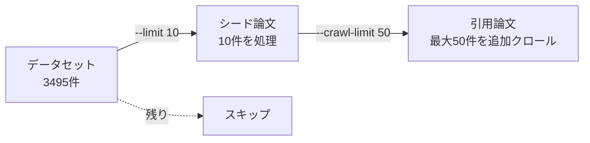

# IdeaGraph 使用ガイド

AI論文のナレッジグラフ構築・可視化・研究アイデア提案ツールの詳細な使い方

## 目次

- [セットアップ](#セットアップ)
- [CLI コマンド](#cli-コマンド)
- [Web UI](#web-ui)
- [API エンドポイント](#api-エンドポイント)
- [出力ファイルの場所](#出力ファイルの場所)
- [ワークフロー例](#ワークフロー例)
- [トラブルシューティング](#トラブルシューティング)

## セットアップ

### 1. 環境変数の設定

`.env` ファイルを作成し、以下の環境変数を設定：

```bash
# Neo4j 接続情報
NEO4J_URI=bolt://localhost:7687
NEO4J_USER=neo4j
NEO4J_PASSWORD=password

# Google Gemini API キー（情報抽出に必要）
GOOGLE_API_KEY=your-api-key-here

# OpenAI API キー（研究アイデア提案に必要）
OPENAI_API_KEY=your-openai-api-key-here
OPENAI_MODEL=gpt-4o  # オプション: 使用するモデル
```

### 2. Neo4j の起動

```bash
docker compose up -d
```

Neo4j Browser: http://localhost:7474 でアクセス可能

### 3. 依存関係のインストール

```bash
uv sync --all-extras
```

## CLI コマンド

### `idea-graph ingest` - 論文データのインジェスト

HuggingFace データセットから論文を読み込み、ダウンロード、情報抽出、グラフ書き込みを行う。

```bash
uv run idea-graph ingest [オプション]
```

**オプション:**

| オプション | 説明 |
|-----------|------|
| `--limit N` | データセットから処理するシード論文数を N 件に制限 |
| `--skip-download` | arXiv からのダウンロードをスキップ |
| `--skip-extract` | Gemini による情報抽出をスキップ |
| `--skip-write` | Neo4j への書き込みをスキップ |
| `--max-depth N` | 引用論文の再帰的探索の最大深度（デフォルト: 1, 0=シード論文のみ）|
| `--crawl-limit N` | 引用クロールする論文の最大数（全シード論文合計）|
| `--top-n-citations N` | 各論文から探索する引用の最大数（重要度上位N件、デフォルト: 5）|
| `-v, --verbose` | 詳細ログを表示 |

**`--limit` と `--crawl-limit` の違い:**



**例:**

```bash
# 10件だけテスト実行
uv run idea-graph ingest --limit 10

# 詳細ログ付きで全件処理
uv run idea-graph ingest -v

# ダウンロード済みデータから抽出・書き込みのみ
uv run idea-graph ingest --skip-download

# メイン論文のみ処理（引用クロールなし）
uv run idea-graph ingest --max-depth 0

# 引用を2ホップまで探索、各論文から上位10件の引用を取得
uv run idea-graph ingest --max-depth 2 --top-n-citations 10

# 引用クロールを100件に制限
uv run idea-graph ingest --crawl-limit 100
```

**処理フロー:**

1. HuggingFace `yanshengqiu/AI_Idea_Bench_2025` データセットを読み込み
2. Paper ノードと引用関係（CITES）を Neo4j に書き込み
3. 各論文を arXiv から検索・ダウンロード（LaTeX優先、PDFフォールバック）
4. Gemini API で構造化情報を抽出（要約、主張、エンティティ、関係）
5. 抽出結果を Neo4j に書き込み（エンティティ、MENTIONS 関係など）
6. 引用論文のクロール（`--max-depth > 0` の場合）
   - 各論文の引用から重要度上位 N 件を選択
   - 優先度付きキューで重要な論文から順に処理
   - 指定された深度まで再帰的に探索

**進捗管理:**

- 処理は中断しても `cache/progress.json` に保存され、再実行時に続きから処理
- 失敗した論文は `failed` として理由が記録される（再実行時は **再試行** される）
- arXiv 側の一時的エラー（HTTP 429/503 等）は検索時に指数バックオフでリトライ（必要に応じて環境変数で調整可能）

**arXiv リトライ設定（任意）:**

```bash
# 検索リトライ回数（デフォルト: 6）
ARXIV_SEARCH_MAX_RETRIES=6

# バックオフ設定（秒）
ARXIV_SEARCH_BACKOFF_BASE_SECONDS=2.0
ARXIV_SEARCH_BACKOFF_MAX_SECONDS=60.0

# ジッター（秒）
ARXIV_SEARCH_JITTER_SECONDS=1.0
```

### `idea-graph serve` - Web サーバー起動

```bash
uv run idea-graph serve [オプション]
```

**オプション:**

| オプション | 説明 |
|-----------|------|
| `--host HOST` | バインドするホスト（デフォルト: 0.0.0.0）|
| `--port PORT` | ポート番号（デフォルト: 8000）|
| `--reload` | コード変更時に自動リロード（開発用）|

**例:**

```bash
# デフォルト設定で起動
uv run idea-graph serve

# ポート3000で起動
uv run idea-graph serve --port 3000

# 開発モード
uv run idea-graph serve --reload
```

### `idea-graph status` - ステータス確認

現在の処理状況と Neo4j の接続状態を表示。

```bash
uv run idea-graph status
```

**出力例:**

```
=== IdeaGraph Status ===
Total papers: 3495
Processed: 100
Failed: 5
Pending: 3390
Last updated: 2025-12-21T16:37:10

=== Neo4j Connection ===
Status: Connected

Node counts:
  ['Paper']: 500
  ['Entity']: 1200

Relationship counts:
  CITES: 2000
  MENTIONS: 3500
```

### `idea-graph rebuild` - グラフ再構築

`cache/extractions` から Neo4j グラフを再構築する。DB をリセットした後、LLM 抽出をやり直さずにグラフを復元したい場合に使用。

```bash
uv run idea-graph rebuild [オプション]
```

**オプション:**

| オプション | 説明 |
|-----------|------|
| `--limit N` | 処理するアイテム数を制限 |
| `--batch-size N` | 書き込みバッチサイズ（デフォルト: 200）|

**例:**

```bash
# キャッシュから全件再構築
uv run idea-graph rebuild

# 100件だけ再構築
uv run idea-graph rebuild --limit 100
```

### `idea-graph analyze` - マルチホップ分析

指定した論文に対してグラフ上のマルチホップ分析を実行し、関連する論文・エンティティのパスを取得する。

```bash
uv run idea-graph analyze <paper_id> [オプション]
```

**引数:**

| 引数 | 説明 |
|------|------|
| `paper_id` | 分析対象の論文ID（必須）|

**オプション:**

| オプション | 説明 |
|-----------|------|
| `--max-hops N` | 最大ホップ数（デフォルト: 3）|
| `--top-k N` | 表示用のパス上限（`paper_paths` / `entity_paths` の件数、デフォルト: 10）|
| `--format FORMAT` | 出力形式: `table`, `json`, `rich`（デフォルト: table）|
| `--save` | 分析結果をデータベースに保存 |

**例:**

```bash
# 基本的な分析
uv run idea-graph analyze abc123def456

# 詳細な分析（5ホップ、表示上位20パス）
uv run idea-graph analyze abc123def456 --max-hops 5 --top-k 20

# JSON形式で出力
uv run idea-graph analyze abc123def456 --format json

# リッチ表示で結果を保存
uv run idea-graph analyze abc123def456 --format rich --save
```

### `idea-graph propose` - 研究アイデア提案

分析結果をもとに LLM（OpenAI）を使って研究アイデアを生成する。

```bash
uv run idea-graph propose <paper_id> [オプション]
```

**引数:**

| 引数 | 説明 |
|------|------|
| `paper_id` | 対象論文ID（必須）|

**オプション:**

| オプション | 説明 |
|-----------|------|
| `--num-proposals N` | 生成する提案数（デフォルト: 3）|
| `--max-hops N` | 分析時の最大ホップ数（デフォルト: 3）|
| `--top-k N` | 表示用のパス上限（`paper_paths` / `entity_paths` の件数、デフォルト: 10）|
| `--format FORMAT` | 出力形式: `markdown`, `json`, `rich`（デフォルト: markdown）|
| `-o, --output FILE` | 出力ファイルパス（指定しない場合は標準出力）|
| `--compare` | 比較テーブル形式で表示（`--format rich` と併用）|
| `--save` | 提案をデータベースに保存 |

**例:**

```bash
# 基本的な提案生成
uv run idea-graph propose abc123def456

# 5件の提案を生成してファイルに保存
uv run idea-graph propose abc123def456 --num-proposals 5 -o proposals.md

# JSON形式で出力
uv run idea-graph propose abc123def456 --format json

# リッチ表示で比較テーブルを表示
uv run idea-graph propose abc123def456 --format rich --compare

# 結果をデータベースに保存
uv run idea-graph propose abc123def456 --save
```

**注意:** このコマンドは OpenAI API を使用します。環境変数 `OPENAI_API_KEY` の設定が必要です。

## Web UI

### アクセス

```bash
uv run idea-graph serve
```

ブラウザで http://localhost:8000 を開く

### 機能

#### グラフ可視化

- neovis.js によるインタラクティブなグラフ表示
- ノードのドラッグ、ズーム、パン操作
- Paper ノード（青）と Entity ノード（緑）を色分け表示

#### Cypher クエリ実行

画面上部のテキストエリアに Cypher クエリを入力して実行可能：

```cypher
// 特定の論文とその引用を表示
MATCH (p:Paper)-[r:CITES]->(cited:Paper)
WHERE p.title CONTAINS 'Gaussian'
RETURN p, r, cited
LIMIT 50

// 特定のエンティティに関連する論文
MATCH (p:Paper)-[:MENTIONS]->(e:Entity)
WHERE e.name CONTAINS 'Transformer'
RETURN p, e
LIMIT 100
```

**注意:** セキュリティのため、読み取りクエリ（MATCH, RETURN）のみ実行可能。書き込みクエリ（CREATE, DELETE, MERGE）はブロックされます。

## API エンドポイント

### ヘルスチェック

```
GET /health
```

**レスポンス:**
```json
{
  "status": "ok",
  "neo4j": "connected"
}
```

### 可視化設定取得

```
GET /api/visualization/config
```

neovis.js の設定情報を返す。

### Cypher クエリ実行

```
POST /api/visualization/query
Content-Type: application/json

{
  "cypher": "MATCH (p:Paper) RETURN p LIMIT 10"
}
```

### マルチホップ分析

```
POST /api/analyze
Content-Type: application/json

{
  "target_paper_id": "abc123def456",
  "multihop_k": 3,
  "top_n": 10,
  "response_limit": 20,
  "save": true
}
```

**パラメータ:**

| パラメータ | 型 | 説明 |
|-----------|-----|------|
| `target_paper_id` | string | 分析対象の論文ID |
| `multihop_k` | int | 探索するホップ数（デフォルト: 3）|
| `top_n` | int | 表示用のパス上限（`paper_paths` / `entity_paths` の件数、デフォルト: 10）|
| `response_limit` | int | レスポンスで返す `candidates` の上限（省略時は全件）|
| `save` | bool | 分析結果を保存して `analysis_id` を返す（デフォルト: false）|

**レスポンス:**
```json
{
  "target_paper_id": "abc123def456",
  "candidates": [
    {
      "nodes": [
        {"id": "paper1", "label": "Paper", "name": "論文タイトル"},
        {"id": "entity1", "label": "Entity", "name": "Transformer"}
      ],
      "edges": [
        {"type": "MENTIONS"}
      ],
      "score": 85.0,
      "score_breakdown": {
        "cite_importance_score": 15.0,
        "cite_type_score": 20.0,
        "mentions_score": 9.0,
        "entity_relation_score": 0.0,
        "length_penalty": -4.0,
        "base": 100
      }
    }
  ],
  "multihop_k": 3,
  "analysis_id": "a1b2c3d4",
  "total_paths": 42,
  "total_paper_paths": 30,
  "total_entity_paths": 12
}
```

**補足:**
- `candidates` は全パス（`response_limit` 指定時はプレビュー件数）
- `paper_paths` / `entity_paths` は `top_n` で表示件数を制限
- `total_paths` は全件数（`response_limit` に関係なく全体数）
- `total_paper_paths` は Paper引用パスの合計件数
- `total_entity_paths` は Entity関連パスの合計件数

**スコアリング:**

| 要素 | 説明 |
|------|------|
| `cite_importance_score` | LLM抽出の重要度（1-5）× 3.0 |
| `cite_type_score` | 引用タイプ別重み（EXTENDS=20, COMPARES=15, USES=12 等）|
| `mentions_score` | エンティティ言及数 × 3.0 |
| `entity_relation_score` | エンティティ関係タイプ別重み |
| `length_penalty` | パス長ペナルティ（-2.0/ホップ）|
| `base` | 基本スコア（100）|

### 研究アイデア提案

```
POST /api/propose
Content-Type: application/json

{
  "target_paper_id": "abc123def456",
  "analysis_id": "a1b2c3d4",
  "num_proposals": 3,
  "constraints": {
    "compute_budget": "medium"
  }
}
```

**パラメータ:**

| パラメータ | 型 | 説明 |
|-----------|-----|------|
| `target_paper_id` | string | 対象論文ID |
| `analysis_id` | string | 保存済み分析のID（指定時は `analysis_result` 不要）|
| `analysis_result` | object | `/api/analyze` の結果（`analysis_id` 未指定時に必須）|
| `num_proposals` | int | 生成する提案数（デフォルト: 3）|
| `constraints` | object | 制約条件（オプション）|

**レスポンス:**

```json
{
  "target_paper_id": "abc123def456",
  "proposals": [
    {
      "title": "提案タイトル",
      "motivation": "この研究の動機...",
      "method": "提案手法の説明...",
      "experiment": {
        "datasets": ["ImageNet", "COCO"],
        "baselines": ["ResNet", "ViT"],
        "metrics": ["Accuracy", "F1-score"],
        "ablations": ["モジュールAの除去", "モジュールBの変更"],
        "expected_results": "期待される結果の説明",
        "failure_interpretation": "失敗時の解釈"
      },
      "grounding": {
        "papers": ["参照論文1", "参照論文2"],
        "entities": ["関連エンティティ1", "関連エンティティ2"],
        "path_mermaid": "graph LR\\n  A[Paper] --> B[Entity]"
      },
      "differences": [
        "既存手法との差異1",
        "既存手法との差異2"
      ]
    }
  ]
}
```

**注意:** このエンドポイントは OpenAI API を使用します。環境変数 `OPENAI_API_KEY` の設定が必要です。

### 分析結果の保存・取得

#### 分析結果の保存

```
POST /api/storage/analyses
Content-Type: application/json

{
  "target_paper_id": "abc123def456",
  "analysis_result": { ... }
}
```

#### 分析結果一覧の取得

```
GET /api/storage/analyses?target_paper_id=abc123def456&limit=50
```

| パラメータ | 型 | 説明 |
|-----------|-----|------|
| `target_paper_id` | string | フィルタ用論文ID（オプション）|
| `limit` | int | 取得件数（デフォルト: 50）|

#### 特定の分析結果を取得

```
GET /api/storage/analyses/{analysis_id}?preview_limit=20
```

| パラメータ | 型 | 説明 |
|-----------|-----|------|
| `preview_limit` | int | `candidates` をプレビュー件数に制限（オプション）|

#### 分析結果の削除

```
DELETE /api/storage/analyses/{analysis_id}
```

### 提案の保存・取得

#### 提案の保存

```
POST /api/storage/proposals
Content-Type: application/json

{
  "target_paper_id": "abc123def456",
  "proposals": [...],
  "rating": 4,
  "notes": "メモ"
}
```

| パラメータ | 型 | 説明 |
|-----------|-----|------|
| `rating` | int | 評価（1-5、オプション）|
| `notes` | string | メモ（オプション）|

#### 提案一覧の取得

```
GET /api/storage/proposals?target_paper_id=abc123def456&limit=50
```

#### 特定の提案を取得

```
GET /api/storage/proposals/{proposal_id}
```

#### 提案の評価・メモを更新

```
PATCH /api/storage/proposals/{proposal_id}
Content-Type: application/json

{
  "rating": 5,
  "notes": "更新されたメモ"
}
```

#### 提案の削除

```
DELETE /api/storage/proposals/{proposal_id}
```

### 提案のエクスポート

```
GET /api/storage/export/proposals?format=markdown&target_paper_id=abc123def456
```

| パラメータ | 型 | 説明 |
|-----------|-----|------|
| `format` | string | `markdown` または `json`（デフォルト: markdown）|
| `target_paper_id` | string | フィルタ用論文ID（オプション）|
| `proposal_ids` | string | カンマ区切りの提案ID（オプション）|

## 出力ファイルの場所

### ディレクトリ構造

```
cache/
├── papers/              # ダウンロードした論文ファイル
│   ├── {paper_id}/
│   │   ├── source.tar.gz   # LaTeX ソース
│   │   └── paper.pdf       # PDF ファイル
│   └── ...
├── extractions/         # Gemini 抽出結果のキャッシュ
│   ├── {paper_id}.json
│   └── ...
└── progress.json        # 処理進捗の永続化
```

### progress.json の構造

```json
{
  "total": 3495,
  "papers": {
    "abc123def456": {
      "paper_id": "abc123def456",
      "title": "Paper Title Here",
      "status": "completed",
      "error": null,
      "updated_at": "2025-12-21T16:37:00"
    },
    "def789ghi012": {
      "paper_id": "def789ghi012",
      "title": "Another Paper",
      "status": "failed",
      "error": "arXiv paper not found",
      "updated_at": "2025-12-21T16:38:00"
    }
  },
  "last_updated": "2025-12-21T16:40:00"
}
```

**ステータス値:**

| ステータス | 説明 |
|-----------|------|
| `pending` | 未処理 |
| `downloading` | ダウンロード中 |
| `extracting` | 情報抽出中 |
| `writing` | グラフ書き込み中 |
| `completed` | 完了 |
| `failed` | 失敗（error フィールドに理由）|
| `not_found` | arXiv で見つからなかった |

### 抽出結果 JSON の構造

`cache/extractions/{paper_id}.json`:

```json
{
  "paper_id": "abc123def456",
  "paper_summary": "この論文は...",
  "claims": [
    "主張1: ...",
    "主張2: ..."
  ],
  "entities": [
    {
      "type": "method",
      "name": "Transformer",
      "description": "自己注意機構を用いた..."
    }
  ],
  "internal_relations": [
    {
      "source": "Method A",
      "target": "Method B",
      "relation_type": "EXTENDS"
    }
  ]
}
```

### Neo4j データ

**ノードラベル:**

| ラベル | プロパティ |
|--------|-----------|
| `Paper` | `id`, `title`, `summary`, `claims` |
| `Entity` | `id`, `type`, `name`, `description` |

**関係タイプ:**

| タイプ | 説明 |
|--------|------|
| `CITES` | Paper → Paper 引用関係 |
| `MENTIONS` | Paper → Entity 言及関係 |
| `EXTENDS` | Entity → Entity 拡張関係 |
| `ALIAS_OF` | Entity → Entity 別名関係 |

## ワークフロー例

### 基本ワークフロー

```bash
# 1. Neo4j 起動
docker compose up -d

# 2. 少量でテスト
uv run idea-graph ingest --limit 5

# 3. ステータス確認
uv run idea-graph status

# 4. Web UI で可視化
uv run idea-graph serve
# ブラウザで http://localhost:8000 を開く

# 5. 全件処理（時間がかかる）
uv run idea-graph ingest
```

### 分析ワークフロー

```bash
# 1. 特定の論文IDを取得（Neo4j Browser または API で）
# 例: abc123def456

# 2. マルチホップ分析を実行
curl -X POST http://localhost:8000/api/analyze \
  -H "Content-Type: application/json" \
  -d '{"target_paper_id": "abc123def456", "multihop_k": 3, "top_n": 10, "response_limit": 20, "save": true}' \
  -o analysis.json

# 3. 保存された分析IDを取得
analysis_id=$(jq -r '.analysis_id' analysis.json)

# 4. 分析結果を使って研究アイデアを生成
curl -X POST http://localhost:8000/api/propose \
  -H "Content-Type: application/json" \
  -d '{
    "target_paper_id": "abc123def456",
    "analysis_id": "'"$analysis_id"'",
    "num_proposals": 3
  }' -o proposals.json

# 5. 提案を保存（評価・メモ付き）
curl -X POST http://localhost:8000/api/storage/proposals \
  -H "Content-Type: application/json" \
  -d '{
    "target_paper_id": "abc123def456",
    "proposals": '"$(cat proposals.json | jq '.proposals')"',
    "rating": 4,
    "notes": "有望な提案"
  }'

# 6. 提案をMarkdownでエクスポート
curl "http://localhost:8000/api/storage/export/proposals?format=markdown" \
  -o proposals_export.md
```

### キャッシュを使った再処理

```bash
# ダウンロード済みデータから抽出のみやり直し
uv run idea-graph ingest --skip-download

# グラフ書き込みのみ
uv run idea-graph ingest --skip-download --skip-extract
```

## トラブルシューティング

### Neo4j に接続できない

```bash
# コンテナの状態確認
docker compose ps

# ログ確認
docker compose logs neo4j

# 再起動
docker compose restart neo4j

# 再起動＆確認
sudo docker compose up -d --force-recreate
sudo docker compose ps
sudo docker compose logs neo4j --tail 200
uv run idea-graph status
```

### Gemini API エラー

- `GOOGLE_API_KEY` が正しく設定されているか確認
- レート制限に達した場合は自動的にリトライされる
- 429 エラーが続く場合は時間を置いて再実行

### 処理が途中で止まった

```bash
# 進捗を確認
uv run idea-graph status

# 続きから再開（自動的に完了分をスキップ）
uv run idea-graph ingest
```

### キャッシュをクリアして再処理

```bash
# 特定の論文のキャッシュを削除
rm -rf cache/papers/{paper_id}
rm cache/extractions/{paper_id}.json

# 全キャッシュをクリア（注意）
rm -rf cache/

# 進捗もリセット
rm cache/progress.json
```

### Neo4j データベースを初期化

#### 方法1: Cypher クエリで削除（データのみ）

Neo4j Browser (http://localhost:7474) で実行：

```cypher
// 全ノード・関係を削除
MATCH (n) DETACH DELETE n
```

またはコマンドラインから：

```bash
docker exec idea-graph-neo4j cypher-shell -u neo4j -p password \
  "MATCH (n) DETACH DELETE n"
```

#### 方法2: Docker ボリュームごとリセット（完全初期化）

```bash
docker compose down -v
docker compose up -d
```

この方法はインデックスや制約も削除されるため、次回 `ingest` 実行時に自動再作成されます。

#### cache/ から Neo4j を再構築（おすすめ）

Neo4j を `down -v` で完全初期化しても、`cache/extractions` が残っていれば **LLM抽出や再ダウンロードをせずに** グラフを再構築できます。

```bash
# Neo4j を完全初期化（DBを捨てる）
docker compose down -v
docker compose up -d

# cache/extractions から再構築（progress.json を見ない）
uv run idea-graph rebuild
```

注意: `uv run idea-graph ingest` は `cache/progress.json` によって「完了済みをスキップ」するため、**DBだけ消して progress を残すと復元されない**ことがあります。DB再構築用途は `rebuild` を使ってください。

#### 完全リセット（Neo4j + ローカルキャッシュ）

```bash
# Neo4j リセット
docker compose down -v
docker compose up -d

# ローカルキャッシュ削除
rm -rf cache/papers cache/extractions cache/progress.json
```

これで最初からインジェストをやり直せます。

## 再現

### Chain-of-Ideas

#### 依存関係インストール

```
uv sync --group coi
```

grobidのセットアップ

```
wget  https://download.oracle.com/java/GA/jdk11/9/GPL/openjdk-11.0.2_linux-x64_bin.tar.gz
tar -zxvf openjdk-11.0.2_linux-x64_bin.tar.gz
export JAVA_HOME=Your_path/jdk-11.0.2
```

#### spaCyモデルダウンロード（初回のみ）

```
uv run --group coi python -m ensurepip --upgrade
uv run --group coi python -m spacy download en_core_web_sm
```

#### 実行
```
uv run --group coi coi --topic "研究トピック"
```
