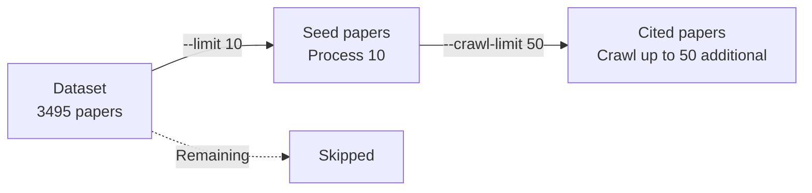

# IdeaGraph Usage Guide

> Back to [README.md](README.md) | [日本語版](USAGE_ja.md)

Detailed guide for the AI research paper knowledge graph construction, visualization, idea proposal, and evaluation tool.

## Table of Contents

- [Setup](#setup)
- [CLI Commands](#cli-commands)
  - [idea-graph ingest](#idea-graph-ingest---ingest-paper-data)
  - [idea-graph serve](#idea-graph-serve---start-web-server)
  - [idea-graph status](#idea-graph-status---check-status)
  - [idea-graph rebuild](#idea-graph-rebuild---rebuild-graph)
  - [idea-graph analyze](#idea-graph-analyze---multi-hop-analysis)
  - [idea-graph propose](#idea-graph-propose---research-idea-proposal)
  - [idea-graph evaluate](#idea-graph-evaluate---research-idea-evaluation)
  - [coi](#coi---chain-of-ideas-agent)
- [Web UI](#web-ui)
- [API Endpoints](#api-endpoints)
- [Output File Locations](#output-file-locations)
- [Workflow Examples](#workflow-examples)
- [Troubleshooting](#troubleshooting)

## Setup

### 1. Configure Environment Variables

Create a `.env` file and set the following environment variables:

```bash
# Neo4j connection info
NEO4J_URI=bolt://localhost:7687
NEO4J_USER=neo4j
NEO4J_PASSWORD=password
# Memory settings (adjust for low-memory environments such as WSL2)
NEO4J_HEAP_MAX=4G
NEO4J_PAGECACHE_SIZE=4G

# Google Gemini API key (required for information extraction)
GOOGLE_API_KEY=your-api-key-here

# OpenAI API key (required for research idea proposal and evaluation)
OPENAI_API_KEY=your-openai-api-key-here

# Chain-of-Ideas settings (optional)
COI_MAIN_LLM_MODEL=gpt-4o          # CoI main model
COI_CHEAP_LLM_MODEL=gpt-4o-mini    # CoI lightweight model
COI_OPENAI_BASE_URL=               # Custom endpoint (optional)
COI_SEMANTIC_SEARCH_API_KEY=        # Semantic Scholar API key

# CoI Azure settings (optional)
COI_IS_AZURE=false
COI_AZURE_OPENAI_ENDPOINT=
COI_AZURE_OPENAI_KEY=
COI_AZURE_OPENAI_API_VERSION=

# CoI Embedding settings (optional)
COI_EMBEDDING_API_KEY=
COI_EMBEDDING_API_ENDPOINT=
COI_EMBEDDING_MODEL=
```

### 2. Start Neo4j

```bash
docker compose up -d
```

Neo4j Browser: Accessible at http://localhost:7474

### 3. Install Dependencies

```bash
# Core functionality
uv sync --all-extras

# Additionally, if using Chain-of-Ideas
uv sync --group coi
```

## CLI Commands

Global option: `-v, --verbose` to display detailed logs

### `idea-graph ingest` - Ingest Paper Data

Load papers from a HuggingFace dataset, then download, extract information, and write to the graph.

```bash
uv run idea-graph ingest [options]
```

**Options:**

| Option | Description |
|--------|-------------|
| `--limit N` | Limit the number of seed papers to process from the dataset to N |
| `--skip-download` | Skip downloading from arXiv |
| `--skip-extract` | Skip information extraction by Gemini |
| `--skip-write` | Skip writing to Neo4j |
| `--max-depth N` | Maximum depth for recursive citation exploration (default: 1, 0=seed papers only) |
| `--crawl-limit N` | Maximum number of papers to crawl via citations (total across all seed papers) |
| `--top-n-citations N` | Maximum number of citations to explore per paper (top N by importance, default: 5) |

**Difference between `--limit` and `--crawl-limit`:**



**Examples:**

```bash
# Test run with only 10 papers
uv run idea-graph ingest --limit 10

# Process all papers with verbose logging
uv run idea-graph ingest -v

# Extract and write only from already-downloaded data
uv run idea-graph ingest --skip-download

# Process main papers only (no citation crawling)
uv run idea-graph ingest --max-depth 0

# Explore citations up to 2 hops, retrieving top 10 citations per paper
uv run idea-graph ingest --max-depth 2 --top-n-citations 10

# Limit citation crawling to 100 papers
uv run idea-graph ingest --crawl-limit 100
```

**Processing Flow:**

1. Load the HuggingFace `yanshengqiu/AI_Idea_Bench_2025` dataset
2. Write Paper nodes and citation relationships (CITES) to Neo4j
3. Search and download each paper from arXiv (LaTeX preferred, PDF fallback)
4. Extract structured information using the Gemini API (summary, claims, entities, relations)
5. Write extraction results to Neo4j (entities, MENTIONS relationships, etc.)
6. Crawl cited papers (when `--max-depth > 0`)
   - Select the top N citations by importance from each paper
   - Process papers in order of importance using a priority queue
   - Recursively explore up to the specified depth

**Progress Management:**

- Processing can be interrupted and will be saved to `cache/progress.json`; upon re-execution, it resumes from where it left off
- Failed papers are recorded as `failed` with a reason (they will be **retried** on re-execution)
- Temporary arXiv errors (HTTP 429/503, etc.) are retried with exponential backoff during search

**arXiv Retry Settings (optional):**

```bash
ARXIV_SEARCH_MAX_RETRIES=6           # Number of search retries (default: 6)
ARXIV_SEARCH_BACKOFF_BASE_SECONDS=2.0 # Backoff base (seconds)
ARXIV_SEARCH_BACKOFF_MAX_SECONDS=60.0 # Backoff upper limit (seconds)
ARXIV_SEARCH_JITTER_SECONDS=1.0       # Jitter (seconds)
```

### `idea-graph serve` - Start Web Server

```bash
uv run idea-graph serve [options]
```

**Options:**

| Option | Description |
|--------|-------------|
| `--host HOST` | Host to bind to (default: 0.0.0.0) |
| `--port PORT` | Port number (default: 8000) |
| `--reload` | Auto-reload on code changes (for development) |

**Examples:**

```bash
uv run idea-graph serve
uv run idea-graph serve --port 3000
uv run idea-graph serve --reload
```

### `idea-graph status` - Check Status

Display the current processing status and Neo4j connection state.

```bash
uv run idea-graph status
```

**Example output:**

```
=== IdeaGraph Status ===
Total papers: 3495
Processed: 100
Failed: 5
Pending: 3390
Last updated: 2025-12-21T16:37:10

=== Neo4j Connection ===
Status: Connected

Node counts:
  ['Paper']: 500
  ['Entity']: 1200

Relationship counts:
  CITES: 2000
  MENTIONS: 3500
```

### `idea-graph rebuild` - Rebuild Graph

Rebuild the Neo4j graph from `cache/extractions`. Use this when you want to restore the graph after resetting the DB without re-running LLM extraction.

```bash
uv run idea-graph rebuild [options]
```

**Options:**

| Option | Description |
|--------|-------------|
| `--limit N` | Limit the number of items to process |
| `--batch-size N` | Write batch size (default: 200) |

### `idea-graph analyze` - Multi-hop Analysis

Run multi-hop analysis on the graph for a specified paper to retrieve paths of related papers and entities.

```bash
uv run idea-graph analyze <paper_id> [options]
```

**Options:**

| Option | Description |
|--------|-------------|
| `--max-hops N` | Maximum number of hops (default: 3) |
| `--top-k N` | Upper limit of paths to display (default: 10) |
| `--format FORMAT` | Output format: `table`, `json`, `rich` (default: table) |
| `--save` | Save analysis results to the database |

**Examples:**

```bash
uv run idea-graph analyze abc123def456
uv run idea-graph analyze abc123def456 --max-hops 5 --top-k 20
uv run idea-graph analyze abc123def456 --format rich --save
```

### `idea-graph propose` - Research Idea Proposal

Generate research ideas using an LLM (OpenAI) based on analysis results.

```bash
uv run idea-graph propose <paper_id> [options]
```

**Basic Options:**

| Option | Description |
|--------|-------------|
| `--num-proposals N` | Number of proposals to generate (default: 3) |
| `--max-hops N` | Maximum number of hops during analysis (default: 3) |
| `--top-k N` | Upper limit of paths to display (default: 10) |
| `--format FORMAT` | Output format: `markdown`, `json`, `rich` (default: markdown) |
| `-o, --output FILE` | Output file path (prints to stdout if not specified) |
| `--compare` | Display in comparison table format (use with `--format rich`) |
| `--save` | Save proposals to the database |

**Prompt Enhancement Options:**

Options to customize the graph context passed to the LLM.

| Option | Description |
|--------|-------------|
| `--prompt-graph-format FORMAT` | Graph representation format: `mermaid`, `paths`, `json_graph`, `triples`, `narrative` (default: mermaid) |
| `--prompt-scope SCOPE` | Enhancement scope: `path`, `k_hop`, `path_plus_k_hop` (default: path) |
| `--prompt-node-type-fields JSON` | Fields per node type `{"Paper": ["paper_title", "paper_summary"]}` |
| `--prompt-edge-type-fields JSON` | Fields per edge type `{"CITES": ["citation_type", "context"]}` |
| `--prompt-max-paths N` | Maximum number of paths (auto-calculated if omitted) |
| `--prompt-max-nodes N` | Maximum number of nodes (auto-calculated if omitted) |
| `--prompt-max-edges N` | Maximum number of edges (auto-calculated if omitted) |
| `--prompt-neighbor-k N` | k-hop neighborhood depth (auto-calculated if omitted) |
| `--prompt-no-inline-edges` | Disable inline edge display |

**Examples:**

```bash
# Basic proposal generation
uv run idea-graph propose abc123def456

# Generate 5 proposals and save to file
uv run idea-graph propose abc123def456 --num-proposals 5 -o proposals.md

# Generate proposals with custom graph format
uv run idea-graph propose abc123def456 \
  --prompt-graph-format paths --prompt-scope k_hop

# Display comparison table with rich output
uv run idea-graph propose abc123def456 --format rich --compare --save
```

### `idea-graph evaluate` - Research Idea Evaluation

Evaluate and rank research proposals using an LLM. Supports two modes: Pairwise (pairwise comparison) and Single (absolute scoring).

```bash
uv run idea-graph evaluate <proposals_file> [options]
```

**Arguments:**

| Argument | Description |
|----------|-------------|
| `proposals_file` | JSON file containing proposals (ProposalResult format or list of Proposals) |

**Options:**

| Option | Description |
|--------|-------------|
| `--mode MODE` | Evaluation mode: `pairwise`, `single` (default: pairwise) |
| `--format FORMAT` | Output format: `markdown`, `json`, `rich` (default: rich) |
| `-o, --output FILE` | Output file path |
| `--model MODEL` | LLM model to use |
| `--no-experiment` | Skip experiment plan evaluation |
| `--include-target` | Include target paper as a comparison subject (ProposalResult format only) |

**Evaluation Metrics (5 metrics):**

| Metric | Description |
|--------|-------------|
| Novelty | Originality of the approach |
| Significance | Research impact |
| Feasibility | Implementation feasibility |
| Clarity | Clarity of description |
| Effectiveness | Likelihood of outperforming existing methods |

**Pairwise Mode:**
- Compares all pairs (O(n^2))
- Swap test (compares both A->B and B->A directions; inconsistent results are treated as a draw) to mitigate position bias
- Final ranking calculated using ELO ratings

**Single Mode:**
- Absolute evaluation on a 1-10 scale for each proposal (O(n))
- Ranked by average score
- No ELO calculation needed

**Examples:**

```bash
# Pairwise evaluation (default)
uv run idea-graph evaluate proposals.json --format rich

# Single evaluation
uv run idea-graph evaluate proposals.json --mode single

# Output Markdown report to file
uv run idea-graph evaluate proposals.json --mode pairwise \
  --format markdown -o evaluation_report.md

# Include comparison with target paper
uv run idea-graph evaluate proposals.json --include-target
```

### `coi` - Chain-of-Ideas Agent

Generate research ideas by traversing paper chains using the Chain-of-Ideas (CoI) method.

```bash
uv run --group coi coi --topic "research topic" [options]
```

**Required Arguments:**

| Argument | Description |
|----------|-------------|
| `--topic TEXT` | Research topic |

**Options:**

| Option | Description |
|--------|-------------|
| `--save-file DIR` | Output directory (default: saves/) |
| `--improve-cnt N` | Number of experiment improvement iterations (default: 1) |
| `--max-chain-length N` | Maximum length of idea chain (default: 5) |
| `--min-chain-length N` | Minimum length of idea chain (default: 3) |
| `--max-chain-numbers N` | Maximum number of chains to process (default: 1) |
| `--publication-date TEXT` | Publication date range for search (Semantic Scholar format, e.g., `:2022-12-01`). If not specified, automatically retrieved from the target paper's publication date when run via the experiment runner |

**Prerequisites:**
- Grobid (Java) must be running
- spaCy English model must be installed

**Setup:**

```bash
# Dependencies
uv sync --group coi

# JDK for Grobid
wget https://download.oracle.com/java/GA/jdk11/9/GPL/openjdk-11.0.2_linux-x64_bin.tar.gz
tar -zxvf openjdk-11.0.2_linux-x64_bin.tar.gz
export JAVA_HOME=Your_path/jdk-11.0.2

# spaCy model (first time only)
uv run --group coi python -m ensurepip --upgrade
uv run --group coi python -m spacy download en_core_web_sm
```

**Examples:**

```bash
# Basic execution
uv run --group coi coi --topic "Graph neural networks for drug discovery"

# Specify chain length and improvement iterations
uv run --group coi coi --topic "Vision Transformer" \
  --max-chain-length 7 --improve-cnt 2
```

## Web UI

### Access

```bash
uv run idea-graph serve
```

Open http://localhost:8000 in your browser

### Screen Layout

3-panel layout:

- **Left Sidebar** - Filters, search, settings
- **Center** - Graph visualization (neovis.js)
- **Right Panel** - Analysis results and proposal display (collapsible)

### Tab Overview

#### 1. Explore Tab (Default)

Interactive graph exploration.

- **Quick Filters**: All / Papers / Methods / Datasets / Benchmarks / Tasks / Citation Relations / Mention Relations
- **Keyword Search**: Search by paper title or Entity name
- **Cypher Query**: Execute Neo4j queries directly (read-only)
- **Node/Edge Detail View**: Click to display properties
- Clicking a Paper node auto-populates the analysis form

#### 2. Analyze Tab

Multi-hop path analysis.

- **Input**: Paper ID, number of hops (1-5)
- **Result Display**: Ranked path cards (score bars, node path with arrow display)
- Click a path to highlight it on the graph
- **Prompt Settings Panel** (collapsible): Output format (Mermaid/Paths/JSON Graph/Triples/Narrative), Scope (path/k_hop/path_plus_k_hop), Node/edge field selection, Parameter limits

#### 3. Propose Tab

Research idea generation and management.

- **Proposal Cards**: Title, source badge (IdeaGraph/CoI/Target Paper), motivation/method summary, star rating
- **Detail Modal**: Full section display (Rationale, Research Trends, Motivation, Method, Experiment Plan, Differences, Grounding)
- **Comparison View**: Side-by-side comparison modal for multiple proposals
- **Export**: Markdown / JSON format
- **Generation Prompt Display**: View and copy the prompt sent to the LLM

**CoI Integration:**
- "Run CoI": Execute Chain-of-Ideas directly from the Web UI (real-time progress display via SSE)
- "Load Results": Load saved CoI result files
- CoI results are automatically converted to IdeaGraph Proposal format

#### 4. Evaluate Tab

Proposal evaluation and ranking.

- **Evaluation Mode Selection**: Pairwise (pairwise comparison) / Single (absolute scoring)
- **Ranking Display**: Medal-decorated ranking (gold/silver/bronze), metric-specific score bars

**Pairwise Mode:**
- Detailed display of all pair comparisons (winner and reasoning)
- Ranking by ELO rating
- Metrics: Novelty / Significance / Feasibility / Clarity / Effectiveness / Experiment Design

**Single Mode:**
- Absolute score display on a 1-10 scale
- Reasoning per metric (collapsible)

- **Export**: JSON / Markdown format

#### 5. History Tab

Saved data management.

- **Analysis History**: Title, date, number of paths. Click to load
- **Proposal History**: Title, date, star rating, number of groups. Click to load
- Individual deletion and bulk deletion

### Model Settings

Select from the preset dropdown in the left sidebar:

| Preset | CoI Main | CoI Lightweight | IdeaGraph |
|--------|----------|-----------------|-----------|
| GPT-4o | gpt-4o-2024-11-20 | gpt-4o-mini-2024-07-18 | gpt-4o-2024-11-20 |
| GPT-5 | gpt-5-2025-08-07 | gpt-4o-mini-2024-07-18 | gpt-5-2025-08-07 |

### Node and Edge Color Coding

**Node Types:**
| Type | Color |
|------|-------|
| Paper | Blue (#4A90D9) |
| Method | Orange (#FF9800) |
| Dataset | Purple (#9C27B0) |
| Benchmark | Cyan (#00BCD4) |
| Task | Pink (#E91E63) |
| Entity (other) | Green (#7CB342) |

**Edge Types:**
| Type | Color |
|------|-------|
| EXTENDS | Red-orange (#FF5722) |
| COMPARES | Blue (#2196F3) |
| USES | Green (#4CAF50) |
| MENTIONS | Slate (#607D8B) |
| BACKGROUND | Gray (#9E9E9E) |

## API Endpoints

### Overview

| Method | Path | Description |
|--------|------|-------------|
| GET | `/health` | Health check |
| GET | `/api/visualization/config` | Get visualization configuration |
| POST | `/api/visualization/query` | Execute Cypher query |
| POST | `/api/analyze` | Multi-hop analysis |
| POST | `/api/propose` | Research idea proposal |
| POST | `/api/propose/preview` | Proposal prompt preview |
| POST | `/api/evaluate` | Evaluation (Pairwise) |
| POST | `/api/evaluate/stream` | Evaluation (Pairwise, SSE) |
| POST | `/api/evaluate/single` | Evaluation (Single) |
| POST | `/api/evaluate/single/stream` | Evaluation (Single, SSE) |
| POST | `/api/coi/run` | CoI execution (SSE) |
| POST | `/api/coi/run/sync` | CoI execution (synchronous) |
| POST | `/api/coi/convert` | Convert CoI result to Proposal |
| POST | `/api/coi/load` | Load CoI result file |
| POST | `/api/storage/analyses` | Save analysis results |
| GET | `/api/storage/analyses` | List analysis results |
| GET | `/api/storage/analyses/{id}` | Get analysis result |
| DELETE | `/api/storage/analyses/{id}` | Delete analysis result |
| POST | `/api/storage/proposals` | Save proposal |
| GET | `/api/storage/proposals` | List proposals |
| GET | `/api/storage/proposals/{id}` | Get proposal |
| PATCH | `/api/storage/proposals/{id}` | Update proposal |
| DELETE | `/api/storage/proposals/{id}` | Delete proposal |
| GET | `/api/storage/export/proposals` | Export proposals |

### Health Check

```
GET /health
```

**Response:**
```json
{
  "status": "ok",
  "neo4j": "connected"
}
```

### Visualization

#### Get Visualization Configuration

```
GET /api/visualization/config
```

Returns neovis.js configuration (Neo4j connection info, node styling).

#### Execute Cypher Query

```
POST /api/visualization/query
Content-Type: application/json

{
  "cypher": "MATCH (p:Paper) RETURN p LIMIT 10",
  "params": {}
}
```

Read-only. CREATE, DELETE, SET, REMOVE, and MERGE are blocked.

**Response:**
```json
{
  "nodes": [
    {"id": "string", "labels": ["Paper"], "properties": {}}
  ],
  "edges": [
    {"id": "string", "type": "CITES", "source": "node_id", "target": "node_id", "properties": {}}
  ]
}
```

### Multi-hop Analysis

```
POST /api/analyze
Content-Type: application/json

{
  "target_paper_id": "abc123def456",
  "multihop_k": 3,
  "top_n": 10,
  "response_limit": 20,
  "save": true
}
```

| Parameter | Type | Description |
|-----------|------|-------------|
| `target_paper_id` | string | Paper ID to analyze |
| `multihop_k` | int | Number of hops to explore (default: 3) |
| `top_n` | int | Display limit for paper_paths / entity_paths (default: 10) |
| `response_limit` | int | Limit for candidates (all if omitted) |
| `save` | bool | Save and return analysis_id (default: false) |

**Response:**
```json
{
  "target_paper_id": "abc123def456",
  "candidates": [
    {
      "nodes": [
        {"id": "paper1", "label": "Paper", "name": "Paper Title"},
        {"id": "entity1", "label": "Entity", "name": "Transformer", "entity_type": "method"}
      ],
      "edges": [
        {"type": "MENTIONS", "from_id": "paper1", "to_id": "entity1"}
      ],
      "score": 85.0,
      "score_breakdown": {
        "cite_importance_score": 15.0,
        "cite_type_score": 20.0,
        "mentions_score": 9.0,
        "entity_relation_score": 0.0,
        "length_penalty": -4.0,
        "base": 100
      }
    }
  ],
  "multihop_k": 3,
  "analysis_id": "a1b2c3d4",
  "total_paths": 42,
  "total_paper_paths": 30,
  "total_entity_paths": 12
}
```

**Scoring:**

| Element | Description |
|---------|-------------|
| `cite_importance_score` | LLM-extracted importance (1-5) x 3.0 |
| `cite_type_score` | Weight by citation type (EXTENDS=20, COMPARES=15, USES=12, etc.) |
| `mentions_score` | Entity mention count x 3.0 |
| `entity_relation_score` | Weight by entity relation type |
| `length_penalty` | Path length penalty (-2.0/hop) |
| `base` | Base score (100) |

### Research Idea Proposal

#### Proposal Generation

```
POST /api/propose
Content-Type: application/json

{
  "target_paper_id": "abc123def456",
  "analysis_id": "a1b2c3d4",
  "num_proposals": 3,
  "constraints": {},
  "prompt_options": {
    "graph_format": "mermaid",
    "scope": "path",
    "max_paths": 5,
    "max_nodes": 50,
    "max_edges": 100,
    "neighbor_k": 2,
    "include_inline_edges": true,
    "include_target_paper": false,
    "exclude_future_papers": true
  },
  "model_name": "gpt-5-2025-08-07"
}
```

| Parameter | Type | Description |
|-----------|------|-------------|
| `target_paper_id` | string | Target paper ID |
| `analysis_id` | string | ID of a saved analysis |
| `analysis_result` | object | Analysis result (required when analysis_id is not specified) |
| `num_proposals` | int | Number of proposals to generate (default: 3) |
| `constraints` | object | Constraint conditions (optional) |
| `prompt_options` | object | Prompt enhancement settings (optional). `include_target_paper` (bool, default: false): Include target paper in prompt context. `exclude_future_papers` (bool, default: true): Exclude papers published after the target paper. |
| `model_name` | string | Model to use (optional) |

**Response:**
```json
{
  "target_paper_id": "abc123def456",
  "proposals": [
    {
      "title": "Proposal Title",
      "rationale": "Background reasoning for the idea",
      "research_trends": "Related research trends",
      "motivation": "Motivation for this research",
      "method": "Description of the proposed method",
      "experiment": {
        "datasets": ["ImageNet", "COCO"],
        "baselines": ["ResNet", "ViT"],
        "metrics": ["Accuracy", "F1-score"],
        "ablations": ["Removal of module A"],
        "expected_results": "Expected results",
        "failure_interpretation": "Interpretation upon failure"
      },
      "grounding": {
        "papers": ["Reference paper 1", "Reference paper 2"],
        "entities": ["Related entity 1"],
        "path_mermaid": "graph LR\n  A[Paper] --> B[Entity]"
      },
      "differences": ["Difference from existing methods 1", "Difference from existing methods 2"]
    }
  ],
  "prompt": "Full prompt sent to the LLM"
}
```

#### Prompt Preview

Generate only the prompt without calling the LLM.

```
POST /api/propose/preview
Content-Type: application/json

{
  "target_paper_id": "abc123def456",
  "analysis_id": "a1b2c3d4",
  "num_proposals": 3,
  "prompt_options": {}
}
```

**Response:**
```json
{
  "prompt": "Full generated prompt"
}
```

### Evaluation API

#### Pairwise Evaluation

```
POST /api/evaluate
Content-Type: application/json

{
  "proposals": [
    {
      "title": "...",
      "motivation": "...",
      "method": "...",
      "experiment": {},
      "grounding": {},
      "differences": []
    }
  ],
  "proposal_sources": ["ideagraph", "coi"],
  "include_experiment": true,
  "model_name": "gpt-5-2025-08-07",
  "target_paper_id": "abc123def456",
  "target_paper_content": "Full paper text",
  "target_paper_title": "Paper title"
}
```

| Parameter | Type | Description |
|-----------|------|-------------|
| `proposals` | array | List of proposals to evaluate (minimum 2) |
| `proposal_sources` | array | Source of each proposal (`ideagraph`, `coi`, `target_paper`) |
| `include_experiment` | bool | Include experiment plan in evaluation (default: true) |
| `model_name` | string | Model to use (optional) |
| `target_paper_id` | string | Target paper ID (when including target) |
| `target_paper_content` | string | Target paper text |
| `target_paper_title` | string | Target paper title |

**Response:**
```json
{
  "evaluated_at": "2026-02-07T10:00:00",
  "model_name": "gpt-5-2025-08-07",
  "ranking": [
    {
      "rank": 1,
      "idea_id": "idea_0",
      "idea_title": "Proposal Title",
      "overall_score": 1520.5,
      "scores_by_metric": {
        "novelty": 1550.0,
        "significance": 1500.0,
        "feasibility": 1480.0,
        "clarity": 1530.0,
        "effectiveness": 1542.5
      },
      "is_target_paper": false,
      "source": "ideagraph"
    }
  ],
  "pairwise_results": [
    {
      "idea_a_id": "idea_0",
      "idea_b_id": "idea_1",
      "scores": [
        {
          "metric": "novelty",
          "winner": 0,
          "reasoning": "Reasoning..."
        }
      ]
    }
  ]
}
```

#### Pairwise Evaluation (SSE Streaming)

```
POST /api/evaluate/stream
```

Request is the same as `/api/evaluate`. Sends progress events via SSE.

**Event format:**
```json
{
  "event_type": "progress|extracting_target|completed|error",
  "current_comparison": 3,
  "total_comparisons": 10,
  "phase": "comparing",
  "message": "Comparison 3/10 completed"
}
```

#### Single Evaluation

```
POST /api/evaluate/single
Content-Type: application/json

{
  "proposals": [...],
  "proposal_sources": ["ideagraph"],
  "model_name": "gpt-5-2025-08-07"
}
```

| Parameter | Type | Description |
|-----------|------|-------------|
| `proposals` | array | List of proposals to evaluate (minimum 1) |
| `proposal_sources` | array | Source of each proposal |
| `model_name` | string | Model to use (optional) |

**Response:**
```json
{
  "evaluated_at": "2026-02-07T10:00:00",
  "model_name": "gpt-5-2025-08-07",
  "evaluation_mode": "single",
  "ranking": [
    {
      "idea_id": "idea_0",
      "idea_title": "Proposal Title",
      "scores": [
        {"metric": "novelty", "score": 8, "reasoning": "Reasoning..."},
        {"metric": "significance", "score": 7, "reasoning": "Reasoning..."},
        {"metric": "feasibility", "score": 9, "reasoning": "Reasoning..."},
        {"metric": "clarity", "score": 8, "reasoning": "Reasoning..."},
        {"metric": "effectiveness", "score": 7, "reasoning": "Reasoning..."}
      ],
      "overall_score": 7.8,
      "source": "ideagraph"
    }
  ]
}
```

#### Single Evaluation (SSE Streaming)

```
POST /api/evaluate/single/stream
```

Request is the same as `/api/evaluate/single`.

### CoI API

#### CoI Execution (SSE Streaming)

```
POST /api/coi/run
Content-Type: application/json

{
  "topic": "Graph neural networks for drug discovery",
  "max_chain_length": 5,
  "min_chain_length": 3,
  "max_chain_numbers": 1,
  "improve_cnt": 1,
  "coi_main_model": "gpt-4o",
  "coi_cheap_model": "gpt-4o-mini"
}
```

| Parameter | Type | Description |
|-----------|------|-------------|
| `topic` | string | Research topic (required) |
| `target_paper_id` | string | Target paper ID (optional). When specified, automatically retrieves the publication date to restrict the search range |
| `publication_date` | string | Publication date range for search (Semantic Scholar format, e.g., `:2022-12-01`). Takes precedence over automatic retrieval from `target_paper_id` when specified |
| `max_chain_length` | int | Maximum chain length (default: 5) |
| `min_chain_length` | int | Minimum chain length (default: 3) |
| `max_chain_numbers` | int | Maximum number of chains (default: 1) |
| `improve_cnt` | int | Number of improvement iterations (default: 1) |
| `coi_main_model` | string | Main model (optional) |
| `coi_cheap_model` | string | Lightweight model (optional) |

**SSE Response:**
```json
{
  "status": "running|completed|error",
  "progress": "Progress message",
  "result": {
    "idea": "Generated idea",
    "idea_chain": "Idea chain",
    "experiment": "Experiment plan",
    "related_experiments": ["Related experiments"],
    "entities": "Extracted entities",
    "trend": "Research trend",
    "future": "Future outlook",
    "year": [2023, 2024, 2025]
  }
}
```

#### CoI Execution (Synchronous)

```
POST /api/coi/run/sync
```

Request is the same as `/api/coi/run`. Waits for completion and returns the result.

#### Convert CoI Result to Proposal

Convert CoI output to IdeaGraph standard Proposal format using an LLM.

```
POST /api/coi/convert
Content-Type: application/json

{
  "coi_result": { ... },
  "model_name": "gpt-5-2025-08-07"
}
```

**Response:**
```json
{
  "proposal": { ... },
  "source": "coi"
}
```

#### Load CoI Result File

Load a saved CoI result file.

```
POST /api/coi/load
Content-Type: application/json

{
  "result_path": "saves/result.json"
}
```

### Storage API

#### Save Analysis Results

```
POST /api/storage/analyses
Content-Type: application/json

{
  "target_paper_id": "abc123def456",
  "target_paper_title": "Paper Title",
  "analysis_result": { ... }
}
```

#### List Analysis Results

```
GET /api/storage/analyses?target_paper_id=abc123def456&limit=50
```

#### Get Specific Analysis Result

```
GET /api/storage/analyses/{analysis_id}?preview_limit=20
```

#### Delete Analysis Result

```
DELETE /api/storage/analyses/{analysis_id}
```

#### Save Proposal

```
POST /api/storage/proposals
Content-Type: application/json

{
  "target_paper_id": "abc123def456",
  "target_paper_title": "Paper Title",
  "analysis_id": "a1b2c3d4",
  "proposal": { ... },
  "prompt": "Prompt used",
  "rating": 4,
  "notes": "Notes",
  "proposal_type": "idea-graph",
  "model_name": "gpt-5-2025-08-07"
}
```

| Parameter | Type | Description |
|-----------|------|-------------|
| `proposal_type` | string | `idea-graph`, `coi`, `target` (default: idea-graph) |
| `rating` | int | Rating (optional) |
| `notes` | string | Notes (optional) |
| `model_name` | string | Model used (optional) |

#### List Proposals

```
GET /api/storage/proposals?target_paper_id=abc123def456&limit=50
```

#### Get Specific Proposal

```
GET /api/storage/proposals/{proposal_id}
```

#### Update Proposal Rating and Notes

```
PATCH /api/storage/proposals/{proposal_id}
Content-Type: application/json

{
  "rating": 5,
  "notes": "Updated notes"
}
```

#### Delete Proposal

```
DELETE /api/storage/proposals/{proposal_id}
```

#### Export Proposals

```
GET /api/storage/export/proposals?format=markdown&target_paper_id=abc123def456
```

| Parameter | Type | Description |
|-----------|------|-------------|
| `format` | string | `markdown` or `json` (default: markdown) |
| `target_paper_id` | string | Paper ID for filtering (optional) |
| `proposal_ids` | string | Comma-separated proposal IDs (optional) |

## Output File Locations

### Directory Structure

```
cache/
├── papers/              # Downloaded paper files
│   ├── {paper_id}/
│   │   ├── source.tar.gz   # LaTeX source
│   │   └── paper.pdf       # PDF file
│   └── ...
├── extractions/         # Gemini extraction result cache
│   ├── {paper_id}.json
│   └── ...
├── analyses/            # Saved analysis results
│   └── {analysis_id}.json
├── proposals/           # Saved proposals
│   ├── idea-graph/      # Proposals generated by IdeaGraph
│   ├── chain-of-ideas/  # Proposals generated by CoI
│   └── target/          # Extractions from target papers
└── progress.json        # Persistent processing progress

saves/                   # Chain-of-Ideas output
└── result.json

experiments/
├── configs/             # Experiment configuration files
│   ├── EXP-101.yaml     # 3-method pairwise comparison
│   ├── EXP-102.yaml     # vs original paper pairwise
│   ├── EXP-103.yaml     # IdeaGraph single evaluation
│   ├── EXP-104.yaml     # Baseline single evaluation
│   ├── EXP-105.yaml     # Chain-of-Ideas single evaluation
│   ├── EXP-106.yaml     # Original paper single evaluation
│   ├── EXP-201~207.yaml # Ablation studies
│   ├── EXP-208.yaml     # Out-degree stability
│   └── EXP-209.yaml     # Citation count stability
├── runs/                # Experiment run results
│   ├── EXP-101_YYYYMMDD_HHMMSS/
│   │   ├── evaluations/
│   │   │   └── pairwise/*.json
│   │   ├── summary.json
│   │   └── metadata.json
│   ├── EXP-103_YYYYMMDD_HHMMSS/
│   │   ├── evaluations/
│   │   │   └── single/{condition}/*.json
│   │   └── ...
│   └── ...
└── paper_figures/       # Figures for papers (generated by paper-figures)
    ├── fig1_main_results.png
    ├── fig1_main_results.svg
    ├── table1_main_results.tex
    └── ...
```

### progress.json Structure

```json
{
  "total": 3495,
  "papers": {
    "abc123def456": {
      "paper_id": "abc123def456",
      "title": "Paper Title Here",
      "status": "completed",
      "error": null,
      "updated_at": "2025-12-21T16:37:00"
    }
  },
  "last_updated": "2025-12-21T16:40:00"
}
```

**Status Values:**

| Status | Description |
|--------|-------------|
| `pending` | Not yet processed |
| `downloading` | Downloading |
| `extracting` | Extracting information |
| `writing` | Writing to graph |
| `completed` | Completed |
| `failed` | Failed (reason in error field) |
| `not_found` | Not found on arXiv |

### Extraction Result JSON Structure

`cache/extractions/{paper_id}.json`:

```json
{
  "paper_id": "abc123def456",
  "paper_summary": "This paper...",
  "claims": ["Claim 1: ...", "Claim 2: ..."],
  "entities": [
    {
      "type": "method",
      "name": "Transformer",
      "description": "Using self-attention mechanism..."
    }
  ],
  "internal_relations": [
    {
      "source": "Method A",
      "target": "Method B",
      "relation_type": "EXTENDS"
    }
  ]
}
```

### Neo4j Data

**Node Labels:**

| Label | Properties |
|-------|------------|
| `Paper` | `id`, `title`, `summary`, `claims` |
| `Entity` | `id`, `type`, `name`, `description` |

**Relationship Types:**

| Type | Description |
|------|-------------|
| `CITES` | Paper -> Paper citation relationship (`importance_score`, `citation_type`, `context`) |
| `MENTIONS` | Paper -> Entity mention relationship |
| `EXTENDS` | Entity -> Entity extension relationship |
| `COMPARES` | Entity -> Entity comparison relationship |
| `USES` | Entity -> Entity usage relationship |
| `ENABLES` | Entity -> Entity enablement relationship |
| `IMPROVES` | Entity -> Entity improvement relationship |
| `ADDRESSES` | Entity -> Entity addressing relationship |
| `ALIAS_OF` | Entity -> Entity alias relationship |

## Workflow Examples

### Basic Workflow

```bash
# 1. Start Neo4j
docker compose up -d

# 2. Test with a small batch
uv run idea-graph ingest --limit 5 --workers 4

# 3. Check status
uv run idea-graph status

# 4. Visualize with Web UI
uv run idea-graph serve
# Open http://localhost:8000 in your browser

# 5. Process all papers (takes time)
uv run idea-graph ingest
```

### Analysis and Proposal Workflow (CLI)

```bash
# 1. Run multi-hop analysis and save
uv run idea-graph analyze abc123def456 --max-hops 3 --top-k 10 --save --format rich

# 2. Generate research ideas
uv run idea-graph propose abc123def456 --num-proposals 5 -o proposals.json --format json --save

# 3. Evaluate proposals (Pairwise)
uv run idea-graph evaluate proposals.json --mode pairwise --format rich

# 4. Evaluate proposals (Single)
uv run idea-graph evaluate proposals.json --mode single --format markdown -o evaluation.md
```

### Analysis and Proposal Workflow (API)

```bash
# 1. Run multi-hop analysis
curl -X POST http://localhost:8000/api/analyze \
  -H "Content-Type: application/json" \
  -d '{"target_paper_id": "abc123def456", "multihop_k": 3, "top_n": 10, "save": true}' \
  -o analysis.json

# 2. Get the analysis ID
analysis_id=$(jq -r '.analysis_id' analysis.json)

# 3. Generate research ideas
curl -X POST http://localhost:8000/api/propose \
  -H "Content-Type: application/json" \
  -d '{
    "target_paper_id": "abc123def456",
    "analysis_id": "'"$analysis_id"'",
    "num_proposals": 3
  }' -o proposals.json

# 4. Pairwise evaluation
curl -X POST http://localhost:8000/api/evaluate \
  -H "Content-Type: application/json" \
  -d '{
    "proposals": '"$(jq '.proposals' proposals.json)"',
    "include_experiment": true
  }' -o evaluation.json

# 5. Export proposals as Markdown
curl "http://localhost:8000/api/storage/export/proposals?format=markdown" \
  -o proposals_export.md
```

### CoI + IdeaGraph Integration Workflow

```bash
# 1. Generate ideas with CoI
uv run --group coi coi --topic "Vision Transformer for medical imaging"

# 2. Load CoI results in Web UI -> Convert to Proposal
#    Propose tab -> "Load Results" -> Specify saves/result.json

# 3. Also generate proposals with IdeaGraph
#    Analyze tab -> Run analysis -> Propose tab -> Generate proposals

# 4. Evaluate CoI and IdeaGraph proposals side by side
#    Evaluate tab -> Evaluate with Pairwise or Single
```

### Reprocessing with Cache

```bash
# Re-run extraction only from already-downloaded data
uv run idea-graph ingest --skip-download

# Write to graph only
uv run idea-graph ingest --skip-download --skip-extract
```

## Troubleshooting

### Cannot Connect to Neo4j

```bash
# Check container status
docker compose ps

# Check logs
docker compose logs neo4j

# Restart
docker compose restart neo4j

# Restart and verify
sudo docker compose up -d --force-recreate
sudo docker compose ps
sudo docker compose logs neo4j --tail 200
uv run idea-graph status
```

On WSL2 or low-memory environments, set `NEO4J_HEAP_MAX` / `NEO4J_PAGECACHE_SIZE` to smaller values in `.env`.

### Gemini API Error

- Verify that `GOOGLE_API_KEY` is set correctly
- Rate limit errors are automatically retried
- If 429 errors persist, wait and re-run later

### Processing Stopped Midway

```bash
# Check progress
uv run idea-graph status

# Resume from where it left off (automatically skips completed items)
uv run idea-graph ingest
```

### Clear Cache and Reprocess

```bash
# Delete cache for a specific paper
rm -rf cache/papers/{paper_id}
rm cache/extractions/{paper_id}.json

# Clear all cache (use with caution)
rm -rf cache/

# Reset progress as well
rm cache/progress.json
```

### Reset Neo4j Database

#### Method 1: Delete via Cypher Query (data only)

```bash
docker exec idea-graph-neo4j cypher-shell -u neo4j -p password "MATCH (n) DETACH DELETE n"
```

#### Method 2: Reset Including Docker Volumes (full reset)

```bash
docker compose down -v
docker compose up -d
```

#### Rebuild Neo4j from cache/ (recommended)

Even after fully resetting Neo4j with `down -v`, if `cache/extractions` remains, you can rebuild the graph **without re-running LLM extraction or re-downloading**.

```bash
docker compose down -v
docker compose up -d
uv run idea-graph rebuild
```

Note: `uv run idea-graph ingest` uses `cache/progress.json` to "skip completed items," so **if you only delete the DB but leave progress intact, the data may not be restored**. Use `rebuild` for DB reconstruction purposes.

#### Full Reset (Neo4j + local cache)

```bash
docker compose down -v
docker compose up -d
rm -rf cache/papers cache/extractions cache/progress.json
```
