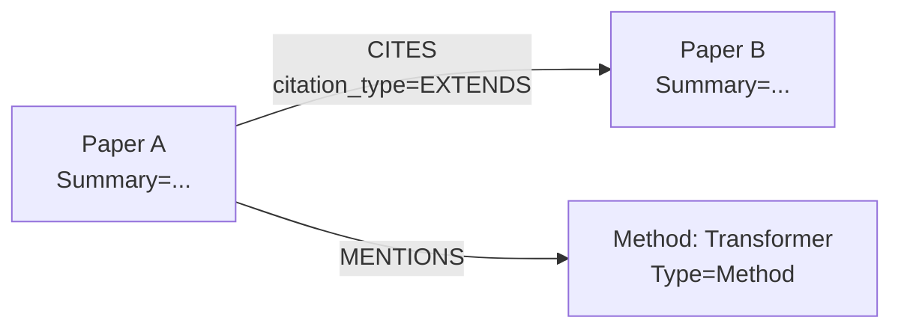
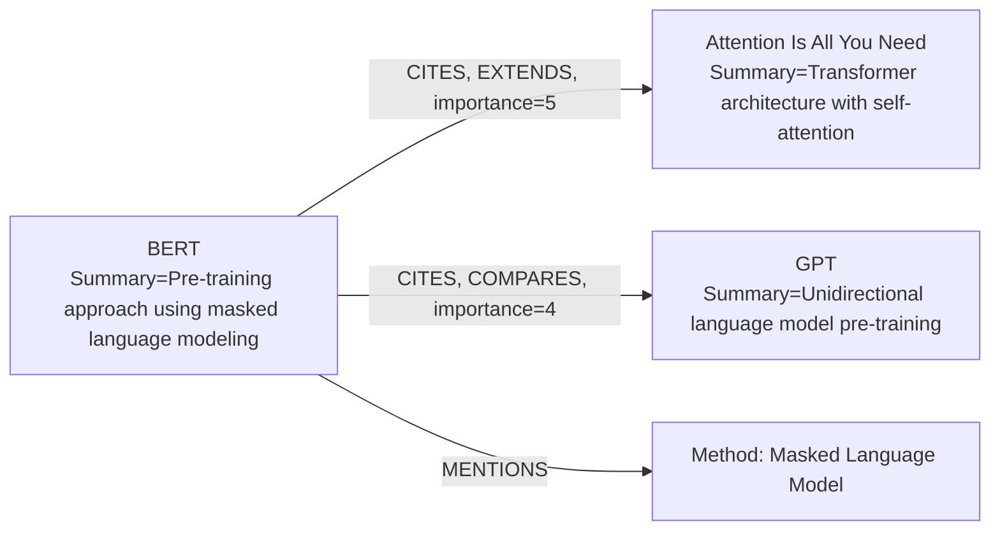

# IdeaGraph: 知識グラフを用いた研究アイデア自動生成システム

## 目次

1. [概要](#1-概要)
2. [コンセプト](#2-コンセプト)
3. [グラフの構築方法](#3-グラフの構築方法)
4. [分析とプロンプト生成](#4-分析とプロンプト生成)
5. [アイデア生成](#5-アイデア生成)
6. [評価](#6-評価)
7. [実験](#7-実験)
8. [補足資料](#8-補足資料)

---

## 1. 概要

IdeaGraphは、学術論文の引用ネットワークと内容情報をNeo4jグラフデータベース上に構築し、そのグラフ構造をLLMへのプロンプトとして活用することで、新規研究アイデアを自動生成するシステムである。

### 1.1 システムの全体像

```
[論文群] → [グラフ構築] → [マルチホップ分析] → [プロンプト生成] → [アイデア生成] → [評価]
            (ingestion)    (analysis)           (prompt_context)   (proposal)        (evaluation)
```

IdeaGraphのパイプラインは以下の5段階で構成される：

1. **グラフ構築（Ingestion）**: 論文をダウンロードし、LLMで構造化情報を抽出し、Neo4jグラフに書き込む
2. **マルチホップ分析（Analysis）**: ターゲット論文からグラフ上の経路を探索し、スコアリングにより重要な経路を特定する
3. **プロンプト生成（Prompt Context）**: 分析結果をMermaid図やパス形式のテキストに変換し、LLMプロンプトのコンテキストとして構成する
4. **アイデア生成（Proposal）**: グラフコンテキストを含むプロンプトをLLMに入力し、構造化された研究アイデアを生成する
5. **評価（Evaluation）**: 生成されたアイデアを5つの評価指標でLLMが評価し、ELOレーティングでランキングする

### 1.2 技術スタック

| コンポーネント | 技術 |
|---|---|
| 言語 | Python 3.11+ |
| パッケージ管理 | uv |
| グラフDB | Neo4j |
| LLMフレームワーク | LangChain |
| 抽出用LLM | Gemini (gemini-3-flash-preview) |
| 生成用LLM | GPT (gpt-5.2-2025-12-11) |
| 評価用LLM | GPT (gpt-5.2-2025-12-11)、マルチモデル対応 |
| API | FastAPI + SSE |
| UI | Vanilla JS + CSS（日本語ラベル）|
| 論文検索 | arXiv API + Semantic Scholar API |
| データモデル | Pydantic |

### 1.3 アーキテクチャ

```
CLI (cli.py)  ─┐
                ├─→ Services ─→ Models ─→ Neo4j / Cache
API (app.py)  ─┘
  ↑
UI (app.js)
```

CLIとWeb APIの両方が同一のサービス層を共有する。サービス層はPydanticモデルでデータを管理し、Neo4jグラフDBとファイルキャッシュの両方を利用する。

---

## 2. コンセプト

IdeaGraphの核心は「論文間の関係性を構造化されたグラフとして表現し、そのグラフ構造をLLMに入力することで、単一論文の知識を超えた研究アイデアを生成する」という点にある。

### 2.1 論文のつながりのグラフ化

#### 抽象的な概念図

```
          引用の種類と重要度を保持
            ┌──────────────┐
            │              │
[論文A] ──CITES──→ [論文B] ──CITES──→ [論文C]
  │   importance=5     │   importance=3
  │   type=EXTENDS     │   type=USES
  │   context="..."    │   context="..."
  │
  └──CITES──→ [論文D]
      importance=4
      type=COMPARES
```

IdeaGraphでは単なる引用関係ではなく、**引用のコンテキスト**を保持する。各CITES（引用）エッジには以下の属性がある：

- **importance_score** (1-5): 引用の重要度。5=本研究の基盤・直接拡張、4=主要手法・比較対象、3=関連手法、2=背景・一般参照、1=付随的言及
- **citation_type**: 引用の種類。EXTENDS（拡張）、COMPARES（比較）、USES（使用）、BACKGROUND（背景）、MENTIONS（言及）
- **context**: なぜその論文を引用しているかの説明文

#### 具体例

```
[Attention Is All You Need]
  ──CITES(importance=5, type=EXTENDS)──→ [Sequence to Sequence Learning]
     context="Our model replaces recurrence with attention mechanisms"
  ──CITES(importance=4, type=COMPARES)──→ [Neural Machine Translation by Jointly Learning to Align and Translate]
     context="Comparison baseline for attention-based translation"
  ──CITES(importance=3, type=USES)──→ [Layer Normalization]
     context="Applied after each sub-layer"
```

### 2.2 論文の内容のグラフ化

#### 抽象的な概念図

```
[論文A] ──MENTIONS──→ [Method: 手法X]
[論文A] ──MENTIONS──→ [Dataset: データセットY]
[論文B] ──MENTIONS──→ [Method: 手法X]   ← 同じエンティティを共有

[Method: 手法X] ──EXTENDS──→ [Method: 手法Z]
[Challenge: 課題W] ──ADDRESSES──→ [Method: 手法X]
```

各論文からLLMで抽出されるエンティティは9種類：

| エンティティ種類 | 説明 | 例 |
|---|---|---|
| Method | 名前付きアルゴリズム・モデル | Transformer, BERT, Adam |
| Approach | 名前のない研究手法 | attention mechanism, contrastive learning |
| Framework | 概念的フレームワーク | RLHF, chain-of-thought prompting |
| Finding | 主要な実証的発見 | scaling laws, in-context learning |
| Dataset | データセット | ImageNet, COCO |
| Benchmark | 評価ベンチマーク | GLUE, SQuAD |
| Challenge | 取り組む課題 | vanishing gradient, long-range dependencies |
| Task | ML/AIタスク | image classification, machine translation |
| Metric | 評価指標 | BLEU score, F1 score |

エンティティ間の関係タイプ：EXTENDS、ALIAS_OF、COMPONENT_OF、USES、COMPARES、ENABLES、IMPROVES、ADDRESSES

#### 具体例

```
[Attention Is All You Need] ──MENTIONS──→ [Method: Transformer]
[Attention Is All You Need] ──MENTIONS──→ [Method: Multi-Head Attention]
[Attention Is All You Need] ──MENTIONS──→ [Task: Machine Translation]
[Attention Is All You Need] ──MENTIONS──→ [Dataset: WMT 2014]
[Attention Is All You Need] ──MENTIONS──→ [Metric: BLEU score]

[Method: Multi-Head Attention] ──COMPONENT_OF──→ [Method: Transformer]
[Method: Transformer] ──ADDRESSES──→ [Challenge: Long-Range Dependencies]
```

### 2.3 グラフ構造のプロンプト

IdeaGraphの最大の特徴は、グラフ上の経路情報をLLMプロンプトに組み込むことである。

#### 抽象的な概念図

```
                    分析結果
                      ↓
   ターゲット論文 → [パス探索] → [スコアリング] → [フィルタリング]
                                                       ↓
                                              [Mermaid図 or パス形式]
                                                       ↓
                                              LLMプロンプトのコンテキスト
```

グラフコンテキストは2つの形式で生成可能：

**Mermaid形式**（デフォルト）：


**Paths形式**：
```
1. Paper A -(CITES{citation_type=EXTENDS, importance_score=5})-> Paper B -(CITES{citation_type=USES})-> Paper C
2. Paper A -(MENTIONS)-> Transformer -(MENTIONS)-> Paper D
```

#### 具体例

ターゲット論文「BERT: Pre-training of Deep Bidirectional Transformers」に対するプロンプトコンテキスト：



### 2.4 UIでの可視化

Web UIはFastAPI上で動作するシングルページアプリケーション（Vanilla JS + CSS、フレームワーク不使用）で、以下の機能を提供する：

- **グラフ探索タブ（Explore）**: Neo4jに対してCypherクエリを実行し、グラフデータを可視化。プリセットフィルタ（全ノード、論文間引用、Method、Dataset、Benchmark、Task等）を用意
- **分析タブ（Analyze）**: 論文IDを指定してマルチホップ分析を実行。Paper引用パスとEntity関連パスをスコア付きで表示
- **提案タブ（Propose）**: 分析結果を基にアイデアを生成。プロンプトオプション（グラフ形式、スコープ、ノード/エッジフィールド選択）をUI上で設定可能
- **評価タブ（Evaluate）**: Pairwise評価とSingle評価の両方を実行。SSEストリーミングで進捗をリアルタイム表示。ランキングテーブルで結果を比較
- **CoIタブ**: CoI-Agent（Chain of Ideas）の実行とProposal形式への変換。CoI結果ファイルのロードにも対応
- **ストレージタブ**: 分析結果・提案のJSON/Markdownエクスポート、評価・メモの付与
- **実験タブ**: 実験設定の一覧表示、実験の実行、結果の閲覧、論文用図表の生成

#### グラフ可視化ライブラリ

グラフの可視化には**NeoVis.js v2.1.0**（CDN読込み）を使用。内部的にvis.jsのネットワーク機能を利用し、Neo4jに直接接続してCypherクエリ結果をインタラクティブに描画する。物理エンジンはforceAtlas2Basedを採用。

- **Paperノード**: 青い丸（#4A90D9, size=20）、タイトルをラベル表示
- **Entityノード**: ダイヤモンド形（size=15）、種別ごとの色分け
- **CITESエッジ**: citation_type別の色分け + importance_scoreで太さ変化
- **その他のエッジ**: MENTIONS（緑）、EXTENDS（オレンジ破線）、COMPONENT_OF（紫破線）

ノード/エッジのクリックでサイドバーに詳細情報を表示。パスのハイライト表示にも対応。

#### UIの状態管理

グローバル状態オブジェクト`AppState`で管理：
```javascript
AppState = {
    selectedPaperId,     // 選択中の論文ID
    analysisResult,      // 分析結果
    proposals: [],       // 生成された提案リスト
    proposalSources: {}, // 各提案のソース（ideagraph/coi/target_paper）
    evaluationMode,      // 評価モード（pairwise/single）
    promptOptions: {     // プロンプト設定
        graph_format: 'mermaid',
        scope: 'path_plus_k_hop',
        node_type_fields, edge_type_fields, ...
    },
    ...
}
```

#### エンティティ・引用タイプの色分け

UI上ではエンティティ種別と引用タイプに固有の色を割り当て、視覚的な区別を容易にしている：

| エンティティ種別 | 色 |
|---|---|
| Method | #FF9800 (オレンジ) |
| Dataset | #9C27B0 (紫) |
| Task | #E91E63 (ピンク) |
| Challenge | #F44336 (赤) |
| Framework | #8BC34A (緑) |

| 引用タイプ | 色 |
|---|---|
| EXTENDS | #FF5722 (深オレンジ) |
| COMPARES | #2196F3 (青) |
| USES | #4CAF50 (緑) |
| BACKGROUND | #9E9E9E (グレー) |

---

## 3. グラフの構築方法

### 3.1 ターゲット論文の選定方法

#### 抽象的な概念図

```
                  ┌─ manual: 手動指定
                  ├─ random: ランダム
論文選定戦略 ──→ ├─ connectivity: CITES出次数上位
                  ├─ connectivity_stratified: 出次数3層均等
                  ├─ in_degree: CITES入次数上位
                  └─ in_degree_stratified: 入次数3層均等
```

実験用のターゲット論文選定には複数の戦略が用意されている。`connectivity_stratified`戦略では、グラフ内の全論文のCITES出次数を計算し、33パーセンタイルと66パーセンタイルを閾値として低・中・高の3層に分割し、各層から均等にサンプリングする。これにより、引用数の多い論文に偏らない多様な評価が可能になる。

`candidate_scope`パラメータで候補論文の範囲を制限できる。`dataset`を指定すると、最初にデータセットとして投入したシード論文のみが候補となる（`progress.json`から`source="dataset"`の論文を取得）。`all`を指定するとグラフ上の全論文が候補となる。

#### 具体例

`connectivity_stratified`で15論文を選定する場合：
1. グラフの全Paper論文のCITES出次数を昇順ソート
2. 33パーセンタイル=3, 66パーセンタイル=8 と算出
3. 低層（出次数<3）から5論文、中層（3≤出次数<8）から5論文、高層（出次数≥8）から5論文をランダム選択

### 3.2 論文のダウンロード

#### 抽象的な概念図

```
タイトル → [arXiv API検索] → 成功 → [LaTeXソース or PDF ダウンロード]
                ↓ 失敗
          [Semantic Scholar API検索] → 成功 → [Open Access PDF ダウンロード]
                ↓ 失敗
          not_found として記録
```

ダウンロードサービス（`downloader.py`）は以下の手順で論文を取得する：

1. **キャッシュ確認**: `cache/papers/{paper_id}/`ディレクトリにファイルが存在するか確認。LaTeXソース（`source.tar.gz`）を優先、なければPDF（`paper.pdf`）を使用
2. **arXiv検索**: `arxiv`ライブラリを使用し、タイトルで検索（`ti:"タイトル"`クエリ）。指数バックオフ付きリトライ（最大6回）
3. **arXivダウンロード**: LaTeXソース（tar.gz）の取得を優先。失敗時はPDFにフォールバック
4. **Semantic Scholarフォールバック**: arXivで見つからない場合、Semantic Scholar Graph API（`/graph/v1/paper/search`）でタイトル完全一致検索。Open Access PDFのURLがあればダウンロード

#### 具体例

論文「Attention Is All You Need」のダウンロード：
1. `cache/papers/abc123def456/`を確認 → 存在しない
2. arXiv APIで`ti:"Attention Is All You Need"`を検索 → ヒット
3. `source.tar.gz`をダウンロード → 成功
4. `metadata.json`に`published_date`を保存

### 3.3 ノードとエッジの種類

#### ノード

| ノードタイプ | プロパティ | 説明 |
|---|---|---|
| Paper | id, title, summary, claims, published_date | 論文ノード。IDはタイトルのSHA-256ハッシュ先頭16文字 |
| Entity | id, type, name, description | エンティティノード。IDは`"{type}:{name}"`のSHA-256ハッシュ先頭16文字 |

#### エッジ

| エッジタイプ | 始点 → 終点 | プロパティ | 説明 |
|---|---|---|---|
| CITES | Paper → Paper | importance_score, citation_type, context | 引用関係 |
| MENTIONS | Paper → Entity | なし | 論文がエンティティに言及 |
| EXTENDS | Entity → Entity | なし | エンティティの拡張関係 |
| ALIAS_OF | Entity → Entity | なし | 別名関係 |
| COMPONENT_OF | Entity → Entity | なし | 構成要素関係 |
| USES | Entity → Entity | なし | 使用関係 |
| COMPARES | Entity → Entity | なし | 比較関係 |
| ENABLES | Entity → Entity | なし | 実現関係 |
| IMPROVES | Entity → Entity | なし | 改善関係 |
| ADDRESSES | Entity → Entity | なし | 課題解決関係 |

### 3.4 要素抽出

#### 抽象的な概念図

```
[論文ファイル] → [前処理] → [LLM抽出] → [後処理] → [ExtractedInfo]
  (LaTeX/PDF)    (tar.gz展開    (Gemini      (タイトル
                  参考文献解析)   structured    正規化)
                                 output)
```

抽出サービス（`extractor.py`）はGemini LLM（`gemini-3-flash-preview`、temperature=0.0）を使用して論文から構造化情報を抽出する。

**前処理**:
- **LaTeX（tar.gz）**: tar.gzを展開し、`main.tex`または`paper.tex`を優先的に選択（なければ最大サイズの.texファイル）。.bblファイルも抽出して結合。参考文献リストから`\bibitem`エントリを解析し、番号付き参考文献マップを生成
- **PDF**: Base64エンコードしてマルチモーダル入力として送信

**LLM抽出**:
- `ChatGoogleGenerativeAI.with_structured_output(ExtractedInfo)`で構造化出力を強制
- 抽出項目: `paper_summary`（1-3文）、`claims`（主張リスト）、`entities`（エンティティリスト）、`relations`（エンティティ間関係）、`cited_papers`（重要引用論文、上位10-15件）
- 各引用論文には`reference_number`（LaTeX参考文献番号）を出力させ、タイトル推測ではなく番号ベースの確定的なタイトル解決を実現

**後処理**:
- 参考文献番号からタイトルを確定的に解決（正規表現によるタイトル抽出）
- タイトルに引用全文が入ってしまった場合の修正（`_looks_like_full_citation`で検出し、正規表現で抽出を試行）
- それでも失敗した場合、LLMでタイトルのみを抽出する（バッチ処理、最大20件）

#### 具体例

LaTeX論文の抽出結果（ExtractedInfo）：
```json
{
  "paper_id": "abc123def456",
  "paper_summary": "We propose the Transformer, a model architecture...",
  "claims": ["Self-attention can replace recurrence", "Achieves new SOTA on WMT 2014"],
  "entities": [
    {"type": "Method", "name": "Transformer", "description": "A novel architecture..."},
    {"type": "Method", "name": "Multi-Head Attention", "description": "..."},
    {"type": "Dataset", "name": "WMT 2014 English-German", "description": "..."}
  ],
  "relations": [
    {"source": "Multi-Head Attention", "target": "Transformer", "relation_type": "COMPONENT_OF"}
  ],
  "cited_papers": [
    {"title": "Sequence to Sequence Learning with Neural Networks",
     "reference_number": 12, "importance_score": 5,
     "citation_type": "EXTENDS", "context": "Our model extends..."}
  ]
}
```

### 3.5 グラフへの書き込み

`graph_writer.py`がNeo4jへの書き込みを担当する。以下の操作をバッチ処理で実行：

1. **Paperノード作成**: `MERGE (p:Paper {id: ...})` でID重複を防止
2. **Paperノード更新**: summary、claimsプロパティを追加
3. **Entityノード作成**: `MERGE (e:Entity {id: ...})` でID重複を防止
4. **MENTIONS関係作成**: Paper→Entityの言及関係
5. **Entity間関係作成**: 動的な関係タイプ（EXTENDS, COMPONENT_OF等）
6. **CITES関係作成**: 重要度スコア・引用タイプ・コンテキスト付き

インデックスと制約：
- `Paper.id`に一意制約
- `Entity.id`に一意制約
- `Paper.title`にインデックス
- `Entity.name`、`Entity.type`にインデックス

### 3.6 再帰的な構築によるグラフの成長

#### 抽象的な概念図

```
深度0: [シード論文A] [シード論文B]    ← データセットから投入
           ↓ 重要度上位N件の引用先
深度1: [論文C(imp=5)] [論文D(imp=4)] [論文E(imp=5)] [論文F(imp=4)]
           ↓ さらに引用先をキューに追加
深度2: [論文G(imp=5)] [論文H(imp=3)] ...

優先度キュー: (-importance_score, depth) でソート → 重要度が高く浅いものを優先
```

クローラー（`crawler.py`）は**重要度優先の幅優先探索**を実装する：

1. シード論文（depth=0）は既に処理済みとしてマーク
2. 各シード論文のCITES関係から重要度上位N件（`top_n_citations`、デフォルト5）の引用先を優先度キューに追加
3. 優先度は`(-importance_score, depth)`のタプル → 重要度が高く浅いものほど優先
4. キューから取り出し、ダウンロード→抽出→書き込みの3ステップを実行
5. 処理完了した論文の引用先をさらにキューに追加（次の深度として）
6. 終了条件: `max_depth`到達、`crawl_limit`到達、またはキュー空

**並列処理**: `crawl_parallel(max_workers=3)`メソッドでワーカースレッドを使った並列クロールが可能。共有キューへのアクセスは`threading.Lock`と`threading.Condition`で排他制御される。

**途中再開**: `ProgressManager`により処理状況がJSON（`progress.json`）に永続化される。既に完了済みの論文はスキップされるが、最大深度に達していなければ引用先のエンキューは行われる。

### 3.7 未来の論文の扱い

プロンプト生成時に`exclude_future_papers`オプション（デフォルト: true）により、**ターゲット論文の公開日よりも後に公開された論文をフィルタリング**する。これにより、「ターゲット論文の著者が知り得なかった情報」がプロンプトに含まれることを防止し、公平なアイデア生成を実現する。

具体的には：
1. パス上の全Paper IDの`published_date`をNeo4jから取得
2. ターゲット論文の`published_date`と比較
3. ターゲット論文より後の公開日を持つ論文をパスから除外

### 3.8 論文IDの生成方法

論文IDはタイトルのSHA-256ハッシュの先頭16文字で生成される（`dataset_loader.py`の`generate_paper_id()`）。これにより、同一タイトルの論文には常に同一IDが割り当てられ、グラフ上での重複を防止する。

---

## 4. 分析とプロンプト生成

### 4.1 マルチホップ分析

#### 抽象的な概念図

```
ターゲット論文 → [Neo4j パス探索] → [Paper引用パス] + [Entity関連パス]
                    ↓                    ↓                    ↓
               1..max_hops        CITES含むパス         MENTIONS含むパス
                                       ↓                    ↓
                                [スコアリング]         [スコアリング]
                                       ↓                    ↓
                                [ランキング（スコア降順でソート）]
```

分析サービス（`analysis.py`）は、ターゲット論文を起点としてNeo4jグラフ上のマルチホップパスを探索し、スコアリングによりランク付けする。

**パス探索クエリ**:
```cypher
MATCH path = (target:Paper {id: $target_id})-[rels*1..{max_hops}]->(n)
WHERE (n:Paper OR n:Entity)
  AND NONE(node IN nodes(path)[1..] WHERE node = target)
```

パスは2種類に分類される：
- **Paper引用パス**: CITESエッジを含むパス（引用の連鎖）
- **Entity関連パス**: CITESを含まず、MENTIONSやEntity間関係のみを含むパス

### 4.2 重要度の算出方法

#### 抽象的な概念図

```
パススコア = 引用重要度スコア + 引用タイプスコア + Entity関連スコア + パス長ペナルティ + ベーススコア

引用重要度スコア = Σ importance_score × 2.0
引用タイプスコア = EXTENDS×20 + COMPARES×15 + USES×12 + その他×10
Entity関連スコア = EXTENDS×10 + ENABLES×9 + USES×8 + IMPROVES×8 + COMPARES×7 + ADDRESSES×6 + MENTIONS×3
パス長ペナルティ = -path_length × 2.0
ベーススコア = 100
```

スコアリングの設計思想：
- **EXTENDS（拡張）** に最大の重みを付与：直接拡張された論文は最も関連性が高い
- **短いパスを優先**: パス長にペナルティをかけ、近い関係を重視
- **ベーススコア100**: 全パスが正のスコアを持つように調整

#### 具体例

パス: `論文A -(CITES, EXTENDS, imp=5)-> 論文B -(CITES, USES, imp=3)-> 論文C`

```
引用重要度スコア = (5 + 3) × 2.0 = 16.0
引用タイプスコア = 1×20 + 0×15 + 1×12 = 32
Entity関連スコア = 0
パス長ペナルティ = -2 × 2.0 = -4.0
ベーススコア = 100
────────────────
合計スコア = 144.0
```

### 4.3 プロンプトの設計方法

#### 抽象的な概念図

```
                        ┌── path: 分析結果のパスのみ
プロンプトスコープ ──→ ├── k_hop: 近傍探索（Neo4jで直接取得）
                        └── path_plus_k_hop: パス＋近傍の両方

                        ┌── mermaid: Mermaid記法のグラフ図
グラフ表現形式 ──→     └── paths: テキストベースのパス列挙
```

プロンプトコンテキストビルダー（`prompt_context.py`）は、分析結果をLLMが理解しやすい形式に変換する。

**3つのスコープ**:

1. **path**: 分析結果の上位パスのみを使用。最も集中的で、ターゲット論文に直接関連する情報のみを含む
2. **k_hop**: ターゲット論文から`neighbor_k`ホップ以内の近傍をNeo4jで直接取得。パスのスコアリングを経由しないため、分析で見逃された関係も含まれる
3. **path_plus_k_hop**: pathとk_hopの両方を結合。最も多くの情報を含むが、ノイズも増える

**主要なオプション**:

| オプション | デフォルト | 説明 |
|---|---|---|
| `graph_format` | mermaid | グラフの表現形式 |
| `scope` | path | プロンプトスコープ |
| `max_paths` | 5 | 使用する最大パス数 |
| `max_nodes` | 50 | 最大ノード数 |
| `max_edges` | 100 | 最大エッジ数 |
| `neighbor_k` | 2 | k_hopの近傍距離 |
| `include_target_paper` | false | ターゲット論文自体をプロンプトに含めるか |
| `exclude_future_papers` | true | ターゲット論文より後の論文を除外するか |

**ターゲット論文の除去について**:

`include_target_paper`がfalse（デフォルト）の場合、ターゲット論文自体はプロンプトコンテキストから除外される。これは「ターゲット論文の情報をリークさせず、周辺の知識のみからアイデアを生成する」ことを目的としている。

除去時のパス処理：
1. パス上のノードからターゲット論文を除外
2. 除外によりノード数が2未満になったパスは破棄
3. エッジの始点・終点が除外されたエッジも破棄
4. ノードとエッジの整合性が崩れたパスは、Mermaid形式の場合はエッジのみ省略して出力

**ノード情報の展開**:

パス上のノードIDに対してNeo4jから詳細情報を取得し、プロンプトに含める：
- Paperノード: title, summary, claims
- Entityノード: type, description

---

## 5. アイデア生成

### 5.1 生成方法

#### 抽象的な概念図

```
[グラフコンテキスト] + [プロンプトテンプレート]
        ↓
[LLM (GPT-5.2, temperature=0.0)]
        ↓
[構造化出力 (Pydantic)]
        ↓
[ProposalResult（N個の提案）]
```

アイデア生成サービス（`proposal.py`）は、`ChatOpenAI.with_structured_output(ProposalsOutput)`を使用してGPT-5.2から構造化された研究アイデアを生成する。

**3つの生成手法**:

1. **IdeaGraph方式** (`propose`): グラフコンテキスト付きのプロンプトでLLMを呼び出す。分析結果の全パスを含むMermaid図またはPaths形式のコンテキストが入力される
2. **Direct LLM方式** (`propose_direct`): グラフコンテキストなしの簡略プロンプト。ターゲット論文のtitle、summary、claims、entitiesのみを入力する。比較実験のベースラインとして使用
3. **CoI方式**: Chain of Ideas (CoI-Agent)を外部プロセスとして実行し、結果をProposal形式に変換する

### 5.2 出力項目

各提案（Proposal）には以下の項目が含まれる：

| 項目 | 語数制約 | 説明 |
|---|---|---|
| title | 1-2文 | 研究アイデアの仮タイトル |
| rationale | 200-300語 | 提案理由。知識グラフのどの接続・パスから着想したか |
| research_trends | 200-300語 | 研究動向。知識グラフから見える研究の流れ |
| motivation | 200-300語 | 動機。何が未解決で、なぜ重要か |
| method | 200-300語 | 手法。何をどう変えるか |
| experiment | - | 実験計画（下記参照） |
| grounding | - | 根拠情報 |
| differences | 3-5項目（各30-50語） | 既存との差分・貢献 |

**実験計画（Experiment）**:

| 項目 | 制約 | 説明 |
|---|---|---|
| datasets | 3-5項目（各5-15語） | 使用データセット候補 |
| baselines | 3-5項目（各5-15語） | 比較対象ベースライン |
| metrics | 3-5項目（各5-15語） | 評価指標 |
| ablations | 2-4項目（各20-40語） | アブレーション実験 |
| expected_results | 100-150語 | 期待される結果 |
| failure_interpretation | 50-100語 | 失敗時の解釈 |

**根拠情報（Grounding）**:
- papers: 分析結果の上位3パスから参照論文を抽出（最大5件）
- entities: 同様にエンティティを抽出（最大5件）
- path_mermaid: 上位1パスのMermaid図

#### 具体例

```json
{
  "title": "Graph-Augmented Retrieval for Multi-Document Summarization",
  "rationale": "The knowledge graph reveals a strong path from BERT through...",
  "research_trends": "Recent work has moved from single-document to...",
  "motivation": "Current multi-document summarization struggles with...",
  "method": "We propose augmenting the retrieval step with...",
  "experiment": {
    "datasets": ["Multi-News", "WikiSum", "arXiv-Long"],
    "baselines": ["PRIMERA", "LED-base", "Pegasus-X"],
    "metrics": ["ROUGE-1/2/L", "BERTScore", "Faithfulness"],
    "ablations": ["Without graph retrieval", "With random retrieval"],
    "expected_results": "5-8% improvement in ROUGE-2 over PRIMERA...",
    "failure_interpretation": "If graph retrieval adds noise rather than..."
  },
  "grounding": {
    "papers": ["BERT", "Attention Is All You Need", "PRIMERA"],
    "entities": ["Transformer", "Multi-Head Attention"],
    "path_mermaid": "graph LR\n  N0[BERT] --> N1[Transformer]..."
  },
  "differences": [
    "Unlike PRIMERA which uses LED, we integrate graph-based retrieval...",
    "Previous work treats documents independently; we leverage citation..."
  ]
}
```

### 5.3 プロンプトの構造

IdeaGraph方式のプロンプトは以下の構造で構成される：

```
You are an AI research advisor. Based on the following analysis...

## Graph Context
{Mermaid図 or パス形式のグラフコンテキスト}

## Constraints
{制約条件（指定がある場合）}

## Requirements for each proposal
1. **Title**: {制約}
2. **Rationale (Why This Proposal)**: {詳細な指示}
3. **Research Trends**: {詳細な指示}
4. **Motivation**: {詳細な指示}
5. **Method**: {詳細な指示}
6. **Experiment Plan**: {各項目の制約}
7. **Grounding**: {指示}
8. **Novelty & Differences**: {詳細な指示}

Generate diverse ideas that don't overlap...
```

Direct LLM方式のプロンプトはGraph Contextの代わりに：
```
## Target Paper
Title: {タイトル}
Summary: {要約}
Claims: {主張リスト}
Key Entities: {エンティティリスト（上位20件）}
```

---

## 6. 評価

### 6.1 評価の概要

#### 抽象的な概念図

```
                   ┌── Pairwise評価: 2つずつ比較 → ELOレーティング
評価モード ──→    ├── Single評価: 各アイデアに絶対スコア
                   └── Both: 両方実行
```

評価サービス（`evaluation.py`）は、生成されたアイデアをLLMで評価する。2つの評価モードがある：

- **Pairwise（ペアワイズ）評価**: 全ペアの総当たり比較（O(n^2)）。スワップテストによる位置バイアス補正付き。ELOレーティングでランキング生成
- **Single（単体/絶対）評価**: 各アイデアに独立して1-10の絶対スコアを付与（O(n)）。平均スコアでランキング生成

### 6.2 5つの評価指標

| 指標 | 説明 | Pairwiseでの判定 | Singleでのスコア |
|---|---|---|---|
| **Novelty** | 問題やアプローチは新しいか | A/B/Tie | 1-10 |
| **Significance** | 重要か、他の研究者が使うか | A/B/Tie | 1-10 |
| **Feasibility** | 既存技術で実装可能か | A/B/Tie | 1-10 |
| **Clarity** | 説明は明確か | A/B/Tie | 1-10 |
| **Effectiveness** | 提案は機能しそうか | A/B/Tie | 1-10 |

さらに、**実験計画評価**（`ExperimentComparator`）が3指標でオプション実行される：

| 指標 | 説明 |
|---|---|
| **Feasibility** | 実験が技術的に実行可能か？リソースは現実的か？ |
| **Quality** | 実験設計が論理的・厳密か？仮説を適切にテストするか？ |
| **Clarity** | 実験計画が明確に記述され再現可能か？ |

Pairwiseと同様のswap test方式で比較し、結果は`PairwiseResult.experiment_scores`に格納される。

### 6.3 Pairwise評価とスワップテスト

#### 抽象的な概念図

```
ペア(A, B)の比較:

順序1: [A, B] → LLM → 結果AB（各指標: 0=A勝, 1=B勝, 2=同等）
順序2: [B, A] → LLM → 結果BA（各指標: 0=B勝, 1=A勝, 2=同等）

正規化: BA結果を元の順序に変換（0→1, 1→0, 2→2）

一致チェック:
  AB == BA_normalized → そのまま採用
  AB != BA_normalized → TIE（不一致のため引き分け）
```

スワップテストは**位置バイアス（Position Bias）**を補正するための仕組みである。LLMは入力の順序によって評価が偏る傾向があるため、A→BとB→Aの2回評価を行い、結果が一致した場合のみその判定を採用し、不一致の場合はTIE（引き分け）とする。

非同期版（`compare_async`）では、AB評価とBA評価を`asyncio.gather`で並列実行する。

### 6.4 ELOレーティング

#### 抽象的な概念図

```
初期レーティング: 全アイデア = 1000.0
K-factor: 32.0

各ペアワイズ結果について:
  期待勝率_A = 1 / (1 + 10^((rating_B - rating_A) / 400))
  新rating_A = rating_A + K × (実績スコア - 期待勝率_A)

各指標ごとにELOを計算 → 総合レーティング = 5指標の平均
```

ELOレーティング（`EloRatingCalculator`）は、チェスの対戦レーティングシステムを応用し、ペアワイズ比較結果からアイデアの相対的な強さを算出する。

- 初期レーティング: 1000.0
- K-factor: 32.0（変動率）
- 実績スコア: 勝ち=1.0, 引き分け=0.5, 負け=0.0

### 6.5 Single（単体/絶対）評価

各アイデアに対して独立にLLMが1-10の絶対スコアを付与する。5つの指標それぞれにスコアと理由が出力される。総合スコアは5指標の平均値。

Single評価のメリット：
- O(n)の計算量（Pairwiseの O(n^2) と比較して効率的）
- ELO計算不要
- アイデア数が多い場合に適している

### 6.6 ターゲット論文のアイデア抽出

評価時にターゲット論文の全文を入力すると、`IdeaExtractor`がLLMで論文のアイデアをProposal形式に変換し、生成アイデアと同等の条件で比較評価に参加させる。これにより「生成アイデアが元論文のレベルに達しているか」を校正できる。

抽出される情報は生成プロンプトの出力項目と同一形式（title, motivation, method, differences, 実験計画等）で、語数制約も同一（`OUTPUT_CONSTRAINTS`を共有）。

### 6.7 アイデアソース

各アイデアには生成元（`IdeaSource`）が記録される：

| ソース | 説明 |
|---|---|
| ideagraph | IdeaGraph方式で生成 |
| direct_llm | Direct LLM方式で生成 |
| coi | CoI-Agent方式で生成 |
| target_paper | ターゲット論文から抽出 |

---

## 7. 実験

### 7.1 実験フレームワーク

#### 抽象的な概念図

```
[YAML設定ファイル] → [ExperimentRunner.run()] → [結果ディレクトリ]

実行フロー:
1. YAML読み込み・検証 (Pydanticモデル)
2. ターゲット論文選定 (選定戦略に基づく)
3. 各論文×各条件で提案生成
4. 評価（Single/Pairwise/Both）
5. 結果保存（JSON + Markdownレポート + 可視化）
```

実験ランナー（`experiment_runner.py`）は、YAML設定ファイルに基づいて実験を自動実行する。各実験は以下の要素で構成される：

- **experiment**: 実験ID、名前、カテゴリ、説明
- **seed**: 再現性のための乱数シード
- **targets**: ターゲット論文の選定方法
- **analysis**: マルチホップ分析の設定
- **prompt**: プロンプト生成の設定
- **conditions**: 比較条件のリスト（手法、モデル、パラメータ）
- **evaluation**: 評価の設定（モード、モデル、繰り返し回数）

**キャッシュ機構**: 分析結果と提案結果はキャッシュされ、同一条件での再実行を高速化する（`ExperimentCache`）。`--no-cache`フラグで無効化可能。

**一括実行スクリプト**（`run_all_experiments.sh`）: 全21実験を並行実行。`MAX_JOBS`環境変数で最大同時実行数を制御（デフォルト6）。各実験は`uv run idea-graph experiment run {yaml} --limit 5`で実行。1つでも失敗すると他の全ジョブをkillして終了（abort_on_failure）。全実験完了後に`uv run idea-graph experiment paper-figures`で論文用図表を自動生成。

**結果ディレクトリ構造**:
```
experiments/runs/EXP-101_20260223_123456/
  ├── config.yaml          # 実験設定のコピー
  ├── metadata.json        # gitハッシュ、Neo4j統計等
  ├── proposals/           # 各条件×各論文の提案結果
  │   ├── ideagraph/
  │   ├── direct_llm/
  │   └── coi/
  ├── evaluations/
  │   ├── single/          # Single評価結果
  │   └── pairwise/        # Pairwise評価結果
  ├── summary.json         # 実行サマリー
  └── report.md            # Markdownレポート
```

### 7.2 実験群の概要

全21実験は3つの群に分類される：

| 群 | テーマ | 実験数 | 評価方法 |
|---|---|---|---|
| **EXP-1xx** | システム有効性の検証 | 6 | Pairwise + Single |
| **EXP-2xx** | アブレーション・パラメータ感度分析 | 9 | 主にSingle |
| **EXP-3xx** | 評価手法の妥当性検証 | 6 | 両方 |

### 7.3 EXP-1xx群: システム有効性

#### EXP-101: IdeaGraph vs Direct LLM vs CoI-Agent

- **目的**: IdeaGraphがNoveltyとSignificanceで優位になるかを検証
- **条件**: IdeaGraph / Direct LLM / CoI-Agent の3手法
- **設定**: 15論文×各3提案、Pairwise評価
- **ターゲット選定**: connectivity_stratified（出次数3層均等）
- **分析**: max_hops=4, top_k=10
- **生成モデル**: gpt-5.2-2025-12-11, temperature=0.0
- **評価モデル**: gpt-5.2-2025-12-11

#### EXP-102: 生成アイデア vs 元論文

- **目的**: 生成提案の絶対的な品質水準を校正する。元論文は上位に入るが常に1位ではないことを検証
- **条件**: IdeaGraph（3提案）+ ターゲット論文のアイデア抽出
- **設定**: 15論文、Pairwise評価（include_target=true）
- **特徴**: `include_target_paper=false`でターゲット論文をプロンプトから除外し、かつ`include_target=true`で評価には含める

#### EXP-103: IdeaGraph 単体評価

- **目的**: IdeaGraphの絶対スコアを計測
- **条件**: IdeaGraphのみ
- **設定**: 15論文×各3提案、Single評価

#### EXP-104: Direct LLM 単体評価

- **目的**: Direct LLM（グラフコンテキストなし）の絶対スコアを計測
- **条件**: Direct LLMのみ
- **設定**: 15論文×各3提案、Single評価

#### EXP-105: CoI-Agent 単体評価

- **目的**: CoI-Agentの絶対スコアを計測
- **条件**: CoI-Agentのみ
- **設定**: 15論文×各3提案、Single評価

#### EXP-106: 元論文 単体評価

- **目的**: ターゲット論文のアイデア抽出結果を評価し、生成アイデアの品質校正用ベースラインとする
- **条件**: target_paper方式のみ
- **設定**: 15論文×各1抽出、Single評価

### 7.4 EXP-2xx群: アブレーション・パラメータ感度分析

#### EXP-201: マルチホップ深度アブレーション

- **目的**: `analysis.max_hops`の最適値を決める。2-3 hopsで品質が最大になるという仮説を検証
- **条件**: max_hops={1, 2, 3, 4, 5} の5条件
- **設定**: 10論文×各3提案、Single評価
- **変数**: 各条件で`analysis.max_hops`のみを変更

#### EXP-202: グラフ表現形式アブレーション

- **目的**: MermaidとPathsのどちらが有効かを決める。Mermaid形式がClarityで優位になるという仮説を検証
- **条件**: graph_format={mermaid, paths} の2条件
- **設定**: 10論文×各3提案、Single評価
- **変数**: `prompt.graph_format`のみを変更

#### EXP-203: プロンプトスコープアブレーション

- **目的**: `prompt.scope`の最適な範囲を決める。path_plus_k_hopは多様だがノイズが増えるという仮説を検証
- **条件**: scope={path, k_hop, path_plus_k_hop} の3条件
- **設定**: 10論文×各3提案、Single評価
- **変数**: `prompt.scope`のみを変更

#### EXP-204: パス数アブレーション

- **目的**: `prompt.max_paths`の適正値を決める。10前後で改善が頭打ちになるという仮説を検証
- **条件**: max_paths={3, 5, 10, 20} の4条件
- **設定**: 10論文×各3提案、Single評価（analysis.top_k=20で十分な候補を確保）
- **変数**: `prompt.max_paths`のみを変更

#### EXP-205: グラフサイズ効果

- **目的**: グラフ規模が品質に与える影響を測る。規模が大きいほど品質は上がるが改善幅は逓減するという仮説を検証
- **条件**: グラフサイズ={20, 50, 100, full}（手動でグラフを再構築）
- **設定**: 5論文（全サイズ共通）×各3提案、Single評価
- **特徴**: 手動で複数回実行が必要。最小グラフに存在する5論文を選定して固定

#### EXP-206: 提案数アブレーション

- **目的**: 生成数が品質に与える影響を測る。最良提案(best-of-k)の品質は上がるが平均品質(mean-of-k)は下がるという仮説を検証
- **条件**: num_proposals={1, 3, 5, 7, 10} の5条件
- **設定**: 10論文、Single評価
- **変数**: `generation.num_proposals`のみを変更

#### EXP-207: 品質-コスト効率

- **目的**: 品質改善が計算コストに見合うかを示す。一定以上のコンテキスト量では費用対効果が悪化するという仮説を検証。Pareto frontierを作成
- **条件**: max_paths/max_nodes={5/25, 10/50, 20/100} の3条件
- **設定**: 10論文×各3提案、Single評価
- **変数**: `prompt.max_paths`、`prompt.max_nodes`、`prompt.max_edges`を同時に変更

#### EXP-208: 接続性安定性

- **目的**: CITES出次数（引用している論文数）の異なる論文群に対してIdeaGraphの性能が安定しているかを確認
- **条件**: IdeaGraphのデフォルト設定のみ
- **設定**: 15論文（connectivity_stratifiedで高/中/低出次数の3層から均等サンプル）、Single評価
- **分析**: 各層での平均スコア・分散を比較

#### EXP-209: 被引用数安定性

- **目的**: CITES入次数（被引用数）の異なる論文群に対してIdeaGraphの性能が安定しているかを確認
- **条件**: IdeaGraphのデフォルト設定のみ
- **設定**: 15論文（in_degree_stratifiedで高/中/低被引用の3層から均等サンプル、candidate_scope=all）、Single評価
- **分析**: 各層での平均スコア・分散を比較

### 7.5 EXP-3xx群: 評価手法の妥当性検証

#### EXP-301: 評価モード整合性

- **目的**: PairwiseとSingleの順位が一致するかを確認。Spearman rho > 0.7という仮説を検証
- **条件**: IdeaGraph + Direct LLMの2条件
- **設定**: 10論文×各3提案、Both評価（PairwiseとSingleの両方を実施）
- **分析**: 同一提案セットに対する2つの評価方式の順位相関を計算

#### EXP-302: 評価再現性

- **目的**: LLM評価の再現性を測る。temperature=0.0ならKrippendorff's alpha > 0.9という仮説を検証
- **条件**: IdeaGraphのデフォルト設定のみ
- **設定**: 5論文×各3提案、Single評価を**5回繰り返し**（repeat=5）
- **分析**: 5回の評価間でのスコアの一致度を計算

#### EXP-303: ポジションバイアス測定

- **目的**: 位置バイアス補正（swap test）が効いているかを確認。AB/BAの不一致が5-15%存在するという仮説を検証
- **条件**: IdeaGraph + Direct LLMの2条件
- **設定**: 15論文×各3提案、Pairwise評価
- **分析**: AB/BAの一致率と補正前後の順位差を分析。`swap_test_raw`データ（AB/BAの生スコア）を使用

#### EXP-304: クロスモデル評価整合性

- **目的**: 評価モデルの違いで順位が変わるかを確認。モデル間でSpearman rho > 0.8という仮説を検証
- **条件**: IdeaGraphのデフォルト設定のみ
- **設定**: 10論文×各3提案、Both評価
- **評価モデル**: gpt-5.2-2025-12-11、gemini-2.5-pro の2モデル（models配列で指定）
- **分析**: 異なる評価モデルによる順位の相関を計算

#### EXP-305: 人間評価との相関

- **目的**: LLM評価が人間評価と整合するかを確認。主要指標でr > 0.6という仮説を検証
- **条件**: IdeaGraphのデフォルト設定のみ
- **設定**: 10論文×各3提案、Single評価
- **分析**: LLM評価結果と2-3人の人間評価者による手動評価を比較し、Pearson/Spearman相関とCohen's kappaを算出

#### EXP-306: 根拠トレーサビリティ評価

- **目的**: 提案内容がグラフ根拠に支えられているかを測る。IdeaGraphはDirect LLMより根拠リンク可能率が高いという仮説を検証
- **条件**: IdeaGraph + Direct LLMの2条件
- **設定**: 10論文×各3提案、Single評価
- **分析**: 提案文の主張単位でグラフ上のノード/エッジに紐づく割合を計測し、人手監査で精度を確認

---

## 8. 補足資料

### 8.1 LLMの使い分け

IdeaGraphでは3つの異なるLLMを異なるタスクに使用する：

| タスク | モデル | ライブラリ | temperature |
|---|---|---|---|
| **論文情報抽出** | Gemini (gemini-3-flash-preview) | langchain_google_genai.ChatGoogleGenerativeAI | 0.0 |
| **アイデア生成** | GPT (gpt-5.2-2025-12-11) | langchain_openai.ChatOpenAI | 0.0 |
| **評価** | GPT (gpt-5.2-2025-12-11) | langchain_openai.ChatOpenAI / 動的選択 | 0.0 |

評価モデルは`_create_chat_model()`で動的にインスタンス化される。モデル名に`gemini`を含む場合はChatGoogleGenerativeAI、`claude`を含む場合はChatAnthropic、それ以外はChatOpenAIが使用される。

全LLM呼び出しは`with_structured_output()`メソッドでPydanticモデルによる構造化出力を強制している。

### 8.2 キャッシュ戦略

| キャッシュ対象 | 保存先 | キー |
|---|---|---|
| 論文ファイル | cache/papers/{paper_id}/ | paper_id |
| 抽出結果 | cache/extractions/{paper_id}.json | paper_id（バージョン管理あり） |
| 分析結果 | cache/experiments/analysis/ | paper_id + max_hops |
| 提案結果 | cache/experiments/proposals/{method}/ | paper_id + 条件パラメータ |
| 評価結果 | cache/evaluations/ | 日時ベース |

抽出キャッシュにはバージョン番号（`EXTRACTION_CACHE_VERSION = 2`）があり、プロンプトやスキーマ変更時にバージョンを上げることで古いキャッシュを無効化する。

### 8.3 並列処理とレートリミッター

`parallel.py`と`rate_limiter.py`が外部APIのレート制限を管理する：

- **arXiv API**: リクエスト間隔制御（デフォルト3秒）、429/503時の指数バックオフ
- **Semantic Scholar API**: リクエスト間隔（デフォルト3.5秒）、APIキー認証対応
- **Gemini API**: 同時実行数制限（デフォルト3）

`RateLimiters`クラスがこれらをまとめ、`with`ステートメントで排他的なアクセス制御を提供する。

### 8.4 CoI-Agent連携

CoI (Chain of Ideas) は外部の研究アイデア生成手法であり、IdeaGraphでは比較手法として使用される。

#### CoIRunner（`coi_runner.py`）

CoI-Agentを`asyncio.create_subprocess_exec`でサブプロセスとして実行する。実行は`uv run --group coi python -m idea_graph.coi.cli`コマンドで行われ、CoI-Agent専用の環境変数（OPENAI_API_KEY、MAIN_LLM_MODEL、CHEAP_LLM_MODEL、SEMENTIC_SEARCH_API_KEY等）がセットされる。

**CoIの入力パラメータ**:
- `topic`: 研究トピック（ターゲット論文のタイトル）
- `max_chain_length`: アイデアチェーンの最大長（デフォルト5）
- `min_chain_length`: アイデアチェーンの最小長（デフォルト3）
- `max_chain_numbers`: 処理するチェーンの最大数（デフォルト1）
- `improve_cnt`: 実験改善の反復回数（デフォルト1）

**CoIの出力**（`CoIResult`）:
- `idea`: 生成されたアイデア全文（Title, Motivation, Methodologyを含む長文）
- `idea_chain`: 複数論文のアイデアチェーン
- `experiment`: 実験設計テキスト
- `related_experiments`: 関連実験ステップ
- `entities`, `trend`, `future`, `year`, `prompt`

進捗はstdoutの各行をリアルタイムで`CoIProgress`として`AsyncIterator`でストリーミングする。

#### CoIConverter（`coi_converter.py`）

CoI-Agentの非構造化テキスト出力をLLM（GPT）で解析し、IdeaGraphの`Proposal`形式に変換するコンバーター。

**変換フロー**:
1. CoIの`idea`、`experiment`、`trend`、`entities`をプロンプトに組み込み
2. `ChatOpenAI.with_structured_output(ExtractedProposal)`で構造化抽出
3. LLM抽出失敗時はフォールバック（テキストのセクションヘッダやキーワードベースの正規表現抽出）
4. `idea_chain`から関連論文タイトルを正規表現で抽出（`_extract_papers_from_chain`）
5. エンティティ文字列をリストに分割（`_parse_entities`）
6. アイデアチェーンからMermaid図を自動生成（`_generate_chain_mermaid`、最大5ステップ）

抽出された各フィールドには`OUTPUT_CONSTRAINTS`と同一の語数制約が適用され、生成アイデアとの公平な比較が可能になる。

#### CoI-Agentの内部アーキテクチャ

CoI-Agent（`3rdparty/CoI-Agent/`に配置された外部リポジトリ）は2つのエージェントで構成される：

- **DeepResearchAgent**: Semantic Scholar APIで論文検索し、アイデアチェーン（論文間の発想の連鎖）を辿りながらLLMで新しい研究アイデアを生成
- **ReviewAgent**: 生成されたアイデアと実験計画をレビューし改善

実行フロー: `DeepResearchAgent.generate_idea_with_chain(topic)` → `generate_experiment(idea, ...)` → `improve_experiment(review_agent, ...)` をimprove_cnt回繰り返し → result.jsonに保存

IdeaGraphのCoI CLIラッパー（`src/idea_graph/coi/cli.py`）は`nest_asyncio`を適用し、CoI-Agentのモジュールをインポートして実行する。設定は`.env`からCoI専用の環境変数（`COI_MAIN_LLM_MODEL`, `COI_CHEAP_LLM_MODEL`, `COI_OPENAI_BASE_URL`等）を読み込む。

### 8.5 CLIコマンド一覧

CLIは`idea-graph`コマンド（`cli.py`）で提供される。rich/tqdmによるリッチ表示に対応。

| コマンド | 説明 | 主なオプション |
|---|---|---|
| `ingest` | 論文データをダウンロード→抽出→グラフ書き込み | `--limit`, `--max-depth`, `--crawl-limit`, `--top-n-citations`, `--workers`, `--skip-download`, `--skip-extract` |
| `rebuild` | cache/extractionsからNeo4jを再構築 | `--cache-dir`, `--batch-size`, `--limit` |
| `serve` | Web APIサーバー起動（uvicorn） | `--host`, `--port`, `--reload` |
| `status` | Neo4j接続状態とノード/エッジ数を表示 | - |
| `analyze` | ターゲット論文のマルチホップ分析 | `paper_id`, `--max-hops`, `--top-k`, `--format {table,json,rich}`, `--save` |
| `propose` | 研究アイデア生成 | `paper_id`, `--num-proposals`, `--format {markdown,json,rich}`, `--output`, `--compare`, `--prompt-*`（全プロンプトオプション） |
| `evaluate` | 提案のペアワイズ/単体評価 | `proposals_file`, `--mode {pairwise,single}`, `--model`, `--include-target`, `--no-experiment`, `--format`, `--output` |
| `experiment run` | YAML設定ファイルに基づく実験実行 | `config`, `--limit`, `--no-cache`, `--clear-cache` |
| `experiment list` | 実験実行履歴の一覧 | - |
| `experiment aggregate` | 結果の集計・統計解析 | `run_dir` |
| `experiment compare` | 2つ以上の実行結果を比較 | `run_dirs` |
| `experiment cache-status` | 実験キャッシュの状況表示 | - |
| `experiment clear-cache` | 実験キャッシュの削除 | `--stage {analysis,proposals,evaluations}` |
| `experiment paper-figures` | 論文用クロス実験図表を生成 | `--output`, `--runs-base`, `--formats` |

**proposeコマンドのプロンプトオプション**:

`propose`コマンドにはプロンプト生成の全パラメータがCLIオプションとして公開されている：
- `--prompt-graph-format {mermaid,paths}`: グラフ表現形式
- `--prompt-scope {path,k_hop,path_plus_k_hop}`: プロンプトスコープ
- `--prompt-max-paths`, `--prompt-max-nodes`, `--prompt-max-edges`: 上限値
- `--prompt-neighbor-k`: k-hop近傍の深さ
- `--prompt-include-target-paper` / `--prompt-no-include-target-paper`: ターゲット論文の包含/除外
- `--prompt-exclude-future-papers` / `--prompt-no-exclude-future-papers`: 未来論文のフィルタリング
- `--prompt-node-type-fields`, `--prompt-edge-type-fields`: ノード/エッジ展開情報（JSON形式）

### 8.6 Web API エンドポイント一覧

FastAPI（`api/app.py`）は以下のエンドポイントを提供する：

| エンドポイント | メソッド | 説明 |
|---|---|---|
| `/health` | GET | ヘルスチェック（Neo4j接続確認） |
| `/api/visualization/config` | GET | グラフ可視化設定（Neo4j URI、スタイリング） |
| `/api/visualization/query` | POST | Cypherクエリ実行（読み取り専用、CREATE/DELETE等は拒否） |
| `/api/analyze` | POST | マルチホップ分析（response_limitで結果件数制限可能） |
| `/api/propose` | POST | アイデア生成（analysis_idまたはanalysis_resultを入力） |
| `/api/propose/preview` | POST | プロンプトプレビュー（LLM呼び出しなし） |
| `/api/evaluate` | POST | ペアワイズ評価（同期） |
| `/api/evaluate/stream` | POST | ペアワイズ評価（SSEストリーミング） |
| `/api/evaluate/single` | POST | 単体評価（同期） |
| `/api/evaluate/single/stream` | POST | 単体評価（SSEストリーミング） |
| `/api/storage/analyses` | GET/POST | 分析結果の一覧/保存 |
| `/api/storage/analyses/{id}` | GET/DELETE | 分析結果の取得/削除 |
| `/api/storage/proposals` | GET/POST | 提案の一覧/保存 |
| `/api/storage/proposals/{id}` | GET/PATCH/DELETE | 提案の取得/更新（評価・メモ）/削除 |
| `/api/storage/export/proposals` | GET | 提案のMarkdown/JSONエクスポート |
| `/api/coi/run` | POST | CoI-Agent実行（SSEストリーミング） |
| `/api/coi/run/sync` | POST | CoI-Agent実行（同期） |
| `/api/coi/convert` | POST | CoI結果をProposal形式に変換 |
| `/api/coi/load` | POST | CoI結果ファイルの読み込み |
| `/api/experiments/configs` | GET | 実験設定ファイル一覧 |
| `/api/experiments/runs` | GET | 実験実行一覧 |
| `/api/experiments/runs/{id}` | GET | 実験実行の詳細（サマリー、レポート、図） |
| `/api/experiments/run` | POST | 実験実行（SSEストリーミング） |
| `/api/experiments/runs/{id}/figures/{name}` | GET | 実験図の取得 |
| `/api/experiments/cache/status` | GET | 実験キャッシュ状況 |
| `/api/experiments/cache` | DELETE | 実験キャッシュクリア |
| `/api/paper-figures/generate` | POST | 論文用クロス実験図表を生成 |
| `/api/paper-figures` | GET | 生成済み論文図表の一覧 |
| `/api/paper-figures/{name}` | GET | 論文図表ファイルの取得 |
| `/` | GET | フロントエンドHTML（Jinja2テンプレート） |

**SSEストリーミング**: 評価系エンドポイントは`text/event-stream`形式で進捗イベント（`event_type: progress/extracting_target/completed/error`）をリアルタイム送信し、最終結果を含む`completed`イベントでストリームを終了する。

**セキュリティ**: Cypherクエリエンドポイントは`CREATE`、`DELETE`、`SET`、`REMOVE`、`MERGE`キーワードを含むクエリを拒否し、読み取り専用アクセスのみ許可する。

### 8.7 データセットローダー

`dataset_loader.py`がシード論文の初期投入を担当する。

**データソース**: HuggingFaceデータセット `yanshengqiu/AI_Idea_Bench_2025`

- `train`スプリットを優先、なければ最初のスプリットを使用
- 各レコードの`target_paper`フィールドからタイトルを取得
- `find_cite.top_references`から引用リストを取得
- 重複排除（`seen_ids`セット）

**論文ID生成**（`generate_paper_id`）:
1. タイトルをUnicode正規化（NFC）→ 小文字化 → 空白圧縮
2. SHA-256ハッシュの先頭16文字をIDとして使用

### 8.8 統計解析と集約（`aggregator.py`）

実験結果の集約と統計検定を行うサービス。

**統計関数**:

| 関数 | 用途 |
|---|---|
| `pearson(x, y)` | ピアソン相関係数（線形相関） |
| `spearman(x, y)` | スピアマン順位相関係数（単調相関） |
| `cohen_d(a, b)` | コーエンのd（効果量） |
| `cliffs_delta(a, b)` | クリフのデルタ（ノンパラメトリック効果量） |
| `paired_permutation_pvalue(a, b, n_iter=5000)` | 対応のある並べ替え検定のp値 |
| `krippendorffs_alpha(reliability_data)` | クリッペンドルフのアルファ（評価者間一致度） |
| `holm_bonferroni(pvalues, alpha=0.05)` | ホルム＝ボンフェローニ法による多重比較補正 |

**`aggregate(run_dir)`**: 実験実行ディレクトリの集約
1. Single評価スコアを条件別に読み込み
2. 各条件・各指標のn, mean, stdを算出
3. 条件ペア間で統計検定（permutation test, Cohen's d, Cliff's delta, Holm-Bonferroni補正）
4. Pairwise評価の上位ランクソース集計
5. 評価者間信頼性（Krippendorff's alpha）の計算（`repeat > 1`のファイル `*_r*.json` から）
6. `summary/aggregate.json`に保存

**`compare(run_dirs)`**: 複数実験のベースライン比較（最初のrunに対するoverall mean差分を算出）

**`correlate_human_llm(human_csv, llm_scores)`**: 人間評価とLLM評価のPearson/Spearman相関を計算

### 8.9 出力制約の統一

`constants.py`の`OutputConstraints`クラスにより、提案生成と評価の両方で同一の語数制約が適用される。これにより、生成されたアイデアとターゲット論文から抽出されたアイデアが同等の詳細度を持ち、公平な比較が可能になる。

### 8.9 実験設定のデータモデル

`models/experiment.py`で定義される主要なPydanticモデル：

| モデル | 説明 |
|---|---|
| ExperimentConfig | 実験全体の設定 |
| ExperimentMeta | 実験ID、名前、カテゴリ |
| SeedConfig | 乱数シード |
| TargetsConfig | ターゲット論文選定設定 |
| AnalysisConfig | マルチホップ分析設定 |
| PromptConfig | プロンプト生成設定 |
| GenerationConfig | アイデア生成設定 |
| ConditionConfig | 比較条件設定 |
| EvaluationConfig | 評価設定 |

各条件は条件固有の`analysis`と`prompt`設定を持つことができ、指定がない場合は実験全体の設定がフォールバックとして使用される。

### 8.10 SSEストリーミング

FastAPI APIは`AsyncIterator`を使用したSSEストリーミングで進捗を通知する：

1. **グラフ構築**: 各論文の処理ステップ（downloading → extracting → writing → completed）をリアルタイム送信
2. **評価**: ペアワイズ比較の進捗（N/M件完了）をリアルタイム送信
3. **最終結果**: ストリームの最後に完全な結果JSONを送信

### 8.11 Neo4jインデックスと制約

```cypher
CREATE CONSTRAINT paper_id IF NOT EXISTS FOR (p:Paper) REQUIRE p.id IS UNIQUE
CREATE CONSTRAINT entity_id IF NOT EXISTS FOR (e:Entity) REQUIRE e.id IS UNIQUE
CREATE INDEX paper_title IF NOT EXISTS FOR (p:Paper) ON (p.title)
CREATE INDEX entity_name IF NOT EXISTS FOR (e:Entity) ON (e.name)
CREATE INDEX entity_type IF NOT EXISTS FOR (e:Entity) ON (e.type)
```

### 8.12 設定パラメータ一覧

環境変数で設定可能なパラメータ：

| パラメータ | 環境変数 | デフォルト値 |
|---|---|---|
| Google API Key | GOOGLE_API_KEY | - |
| OpenAI API Key | OPENAI_API_KEY | - |
| Anthropic API Key | ANTHROPIC_API_KEY | - |
| Neo4j URI | NEO4J_URI | bolt://localhost:7687 |
| Neo4j User | NEO4J_USER | neo4j |
| Neo4j Password | NEO4J_PASSWORD | password |
| Semantic Scholar API Key | SEMANTIC_SCHOLAR_API_KEY | - |
| Ingestion Max Workers | INGESTION_MAX_WORKERS | 3 |
| Gemini Max Concurrent | GEMINI_MAX_CONCURRENT | 3 |
| Gemini Model | - | gemini-3-flash-preview |
| OpenAI Model | - | gpt-5.2-2025-12-11 |
| Evaluation Model | - | gpt-5.2-2025-12-11 |
| Download Delay | - | 3.0秒 |
| arXiv Max Retries | ARXIV_SEARCH_MAX_RETRIES | 6 |
| S2 Request Delay | - | 3.5秒 |
