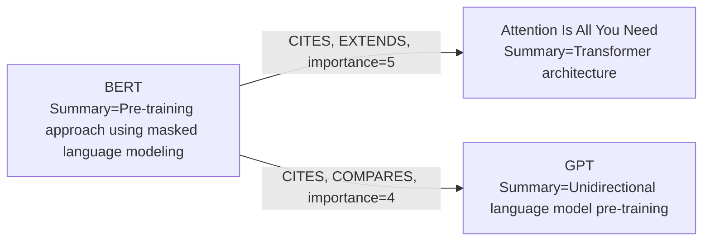
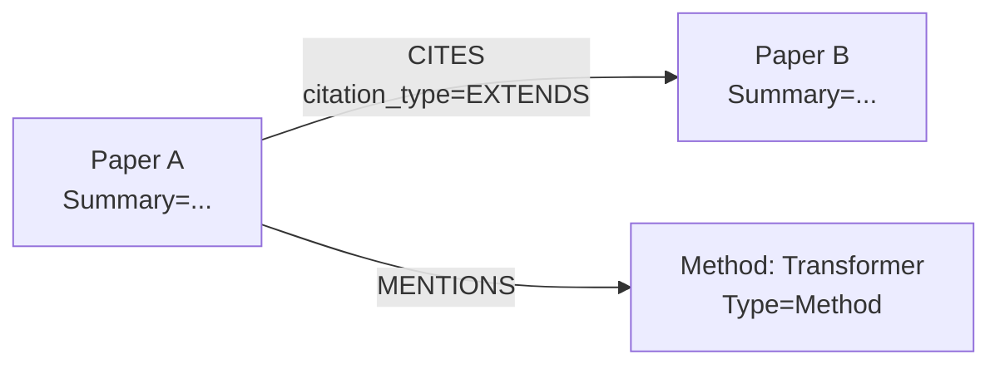

# IdeaGraph: 知識グラフを用いた研究アイデア自動生成システム

## 目次

### 本編
1. [概要](#1-概要)
2. [手法](#2-手法)
3. [実験設計](#3-実験設計)

### 補足
- [A. グラフスキーマ詳細](#補足a-グラフスキーマ詳細)
- [B. グラフ構築の実装](#補足b-グラフ構築の実装)
- [C. プロンプト設計の詳細](#補足c-プロンプト設計の詳細)
- [D. 出力フォーマット](#補足d-出力フォーマット)
- [E. 実験設定一覧](#補足e-実験設定一覧)
- [F. インターフェース](#補足f-インターフェース)
- [G. システム構成](#補足g-システム構成)

---

## 1. 概要

IdeaGraphは、学術論文の引用ネットワークと内容情報をグラフデータベース上に構築し、そのグラフ構造をLLMへのプロンプトとして活用することで、新規研究アイデアを自動生成するシステムである。

### 1.1 着想

既存のLLMベースのアイデア生成手法は、単一論文またはキーワードを起点として研究アイデアを生成する。しかし、優れた研究アイデアはしばしば複数の研究分野の交差点から生まれる。IdeaGraphは**論文間の引用関係と内容的つながりをグラフとして構造化**し、そのグラフ上の**マルチホップ経路**をLLMに与えることで、単一論文の知識を超えた発想を促す。

### 1.2 パイプライン

```
[論文群] → [グラフ構築] → [マルチホップ分析] → [プロンプト生成] → [アイデア生成] → [評価]
            (ingestion)    (analysis)           (prompt_context)   (proposal)        (evaluation)
```

1. **グラフ構築**: 論文をダウンロードし、LLMで構造化情報を抽出し、グラフに書き込む
2. **マルチホップ分析**: ターゲット論文からグラフ上の経路を探索し、スコアリングにより重要な経路を特定する
3. **プロンプト生成**: 分析結果をMermaid図やパス形式のテキストに変換し、LLMプロンプトのコンテキストとして構成する
4. **アイデア生成**: グラフコンテキストを含むプロンプトをLLMに入力し、構造化された研究アイデアを生成する
5. **評価**: 生成されたアイデアを5つの評価指標でLLMが評価し、ランキングする

---

## 2. 手法

### 2.1 グラフの構築

IdeaGraphのグラフは**2層構造**で論文の知識を表現する。

**第1層：引用ネットワーク（Paper → Paper）**

単なる引用の有無ではなく、**引用のコンテキスト**を保持する点が特徴である。各引用エッジには「なぜ引用したか」の意味情報が付与される。

```
[Attention Is All You Need]
  ──CITES(importance=5, type=EXTENDS)──→ [Sequence to Sequence Learning]
     context="Our model replaces recurrence with attention mechanisms"
  ──CITES(importance=4, type=COMPARES)──→ [Neural Machine Translation ...]
     context="Comparison baseline for attention-based translation"
```

- **importance_score** (1-5): 引用の重要度（5=基盤、1=付随的言及）
- **citation_type**: 引用の種類（EXTENDS, COMPARES, USES, BACKGROUND, MENTIONS）
- **context**: 引用の理由を説明するテキスト

**第2層：エンティティネットワーク（Paper → Entity → Entity）**

各論文からLLMで抽出されるエンティティ（手法、データセット、課題など9種類）が、論文を跨いで共有・接続される。これにより、直接の引用関係がない論文間でも、共通のエンティティを介した**暗黙的なつながり**が発見できる。

```
[論文A] ──MENTIONS──→ [Method: Transformer] ←──MENTIONS── [論文B]
                            │
                      COMPONENT_OF
                            │
                    [Method: Multi-Head Attention]
```

複数の論文が同一エンティティに言及することで、分野横断的な接続が自然に形成される（エンティティの種類と関係タイプの詳細は[補足A](#補足a-グラフスキーマ詳細)を参照）。

**再帰的なグラフ成長**

シード論文群から出発し、重要度の高い引用先を優先的にたどりながらグラフを拡張する。重要度優先の幅優先探索により、学術的に重要な論文から順にグラフに取り込まれる（実装詳細は[補足B](#補足b-グラフ構築の実装)を参照）。

### 2.2 マルチホップ分析

ターゲット論文を起点として、グラフ上の1〜Nホップの経路を探索し、重要度でランク付けする。

```
ターゲット論文 → [パス探索] → [スコアリング] → [上位パス選択]
```

パスは2種類に分類される：
- **Paper引用パス**: 引用（CITES）エッジを含む経路。論文間の知的系譜を表す
- **Entity関連パス**: エンティティ間の関係のみを含む経路。概念的なつながりを表す

**スコアリング**の設計思想：
- **EXTENDS（拡張）関係に最大の重み**: 直接拡張された研究は最も関連性が高い
- **短いパスを優先**: パス長にペナルティをかけ、近い関係を重視
- **引用の重要度を加算**: importance_scoreが高い引用ほどスコアに寄与

（スコアリングの計算式は[補足C](#補足c-プロンプト設計の詳細)を参照）

### 2.3 グラフコンテキストによるプロンプト生成

IdeaGraphの最大の特徴は、**スコアリング済みのグラフ経路をLLMプロンプトのコンテキストとして埋め込む**点にある。

上位パスからノードとエッジを集約し、**Mermaid図**または**パス列挙形式**のテキストに変換する：



このグラフコンテキストにより、LLMは「どの論文がどの論文を拡張し、どの手法が何の課題を解決しているか」という**構造化された研究の文脈**を把握した上でアイデアを生成できる。

**公平性のための設計**:
- **ターゲット論文の除外**: デフォルトではターゲット論文自体をプロンプトから除外し、周辺知識のみからアイデアを生成させる
- **未来の論文の除外**: ターゲット論文より後に公開された論文をフィルタリングし、著者が知り得なかった情報のリークを防ぐ

（プロンプトオプションの詳細は[補足C](#補足c-プロンプト設計の詳細)を参照）

### 2.4 アイデア生成

グラフコンテキストを含むプロンプトをLLMに入力し、構造化された研究アイデア（Proposal）を生成する。各提案にはtitle、rationale、motivation、method、experiment plan、groundingなどが含まれる（出力フォーマットの詳細は[補足D](#補足d-出力フォーマット)を参照）。

**3つの生成手法**を用意し、比較実験に使用する：

| 手法 | 入力 | 目的 |
|---|---|---|
| **IdeaGraph** | グラフコンテキスト付きプロンプト | 提案手法 |
| **Direct LLM** | ターゲット論文の情報のみ（グラフなし） | ベースライン |
| **CoI-Agent** | 外部手法（Chain of Ideas） | 比較手法 |

IdeaGraph方式とDirect LLM方式の違いは、プロンプトに**グラフ構造の情報が含まれるか否か**のみである。この比較により、グラフコンテキストの効果を直接測定できる。

### 2.5 評価

生成されたアイデアをLLMで評価する。**5つの評価指標**を使用する：

| 指標 | 問い |
|---|---|
| **Novelty** | 問題やアプローチは新しいか？ |
| **Significance** | 重要か？他の研究者が使うか？ |
| **Feasibility** | 既存技術で実装可能か？ |
| **Clarity** | 説明は明確か？ |
| **Effectiveness** | 提案は機能しそうか？ |

**2つの評価モード**：

- **Pairwise評価**: 全ペアの総当たり比較（O(n²)）。**スワップテスト**（A→BとB→Aの2回評価し、結果が一致した場合のみ採用）で位置バイアスを補正。ELOレーティングでランキング生成
- **Single評価**: 各アイデアに独立して1-10の絶対スコアを付与（O(n)）。アイデア数が多い場合に効率的

**ターゲット論文との比較**: 評価時にターゲット論文のアイデアをProposal形式に変換し、生成アイデアと同条件で比較することで、「生成アイデアが元論文のレベルに達しているか」を校正できる。

---

## 3. 実験設計

### 3.1 実験フレームワーク

YAML設定ファイルに基づいて実験を自動実行する。ターゲット論文の選定、提案生成、評価をパイプラインとして実行し、結果をJSON + Markdownレポートとして保存する（実験フレームワークの実装詳細は[補足E](#補足e-実験設定一覧)を参照）。

### 3.2 実験群の概要

全21実験は3つの群に分類される：

| 群 | テーマ | 実験数 | 主な問い |
|---|---|---|---|
| **EXP-1xx** | システム有効性 | 6 | IdeaGraphは既存手法より優れたアイデアを生成するか？ |
| **EXP-2xx** | アブレーション | 9 | 各コンポーネント・パラメータの寄与はどの程度か？ |
| **EXP-3xx** | 評価妥当性 | 6 | LLM評価は信頼できるか？ |

**EXP-1xx群: システム有効性の検証**

- **EXP-101**: IdeaGraph vs Direct LLM vs CoI-Agent の3手法比較（主実験）
- **EXP-102**: 生成アイデア vs 元論文の品質校正
- **EXP-103〜106**: 各手法の絶対スコア計測（Single評価）

**EXP-2xx群: アブレーション・パラメータ感度分析**

| 実験 | 変数 | 問い |
|---|---|---|
| EXP-201 | マルチホップ深度（1〜5） | 何ホップが最適か？ |
| EXP-202 | グラフ表現形式（Mermaid vs Paths） | どちらの形式が有効か？ |
| EXP-203 | プロンプトスコープ（path / k_hop / 両方） | どの範囲の情報が最適か？ |
| EXP-204 | パス数（3, 5, 10, 20） | 何パスで改善が頭打ちになるか？ |
| EXP-205 | グラフサイズ（20〜full） | グラフ規模と品質の関係は？ |
| EXP-206 | 提案数（1〜10） | best-of-k vs mean-of-kのトレードオフは？ |
| EXP-207 | コンテキスト量（小/中/大） | 品質-コスト効率のPareto frontierは？ |
| EXP-208 | 出次数の異なる論文群 | 接続性による性能変動はあるか？ |
| EXP-209 | 入次数の異なる論文群 | 被引用数による性能変動はあるか？ |

**EXP-3xx群: 評価手法の妥当性検証**

| 実験 | 問い |
|---|---|
| EXP-301 | PairwiseとSingleの順位は一致するか？（Spearman rho > 0.7） |
| EXP-302 | LLM評価は再現可能か？（Krippendorff's alpha > 0.9） |
| EXP-303 | 位置バイアス補正は有効か？（AB/BA不一致率の測定） |
| EXP-304 | 評価モデル間で順位は安定するか？（GPT vs Gemini） |
| EXP-305 | LLM評価は人間評価と相関するか？（r > 0.6） |
| EXP-306 | IdeaGraphの提案はグラフ根拠に支えられているか？ |

（各実験の詳細設定は[補足E](#補足e-実験設定一覧)を参照）

---
---

# 補足資料

## 補足A: グラフスキーマ詳細

### ノード

| ノードタイプ | プロパティ | 説明 |
|---|---|---|
| Paper | id, title, summary, claims, published_date | 論文ノード。IDはタイトルのSHA-256ハッシュ先頭16文字 |
| Entity | id, type, name, description | エンティティノード。IDは`"{type}:{name}"`のSHA-256ハッシュ先頭16文字 |

### エンティティの種類（9種類）

| エンティティ種類 | 説明 | 例 |
|---|---|---|
| Method | 名前付きアルゴリズム・モデル | Transformer, BERT, Adam |
| Approach | 名前のない研究手法 | attention mechanism, contrastive learning |
| Framework | 概念的フレームワーク | RLHF, chain-of-thought prompting |
| Finding | 主要な実証的発見 | scaling laws, in-context learning |
| Dataset | データセット | ImageNet, COCO |
| Benchmark | 評価ベンチマーク | GLUE, SQuAD |
| Challenge | 取り組む課題 | vanishing gradient, long-range dependencies |
| Task | ML/AIタスク | image classification, machine translation |
| Metric | 評価指標 | BLEU score, F1 score |

### エッジ

| エッジタイプ | 始点 → 終点 | プロパティ | 説明 |
|---|---|---|---|
| CITES | Paper → Paper | importance_score, citation_type, context | 引用関係 |
| MENTIONS | Paper → Entity | なし | 論文がエンティティに言及 |
| EXTENDS | Entity → Entity | なし | エンティティの拡張関係 |
| ALIAS_OF | Entity → Entity | なし | 別名関係 |
| COMPONENT_OF | Entity → Entity | なし | 構成要素関係 |
| USES | Entity → Entity | なし | 使用関係 |
| COMPARES | Entity → Entity | なし | 比較関係 |
| ENABLES | Entity → Entity | なし | 実現関係 |
| IMPROVES | Entity → Entity | なし | 改善関係 |
| ADDRESSES | Entity → Entity | なし | 課題解決関係 |

---

## 補足B: グラフ構築の実装

### 論文のダウンロード

```
タイトル → [arXiv API検索] → 成功 → [LaTeXソース or PDF ダウンロード]
                ↓ 失敗
          [Semantic Scholar API検索] → 成功 → [Open Access PDF ダウンロード]
                ↓ 失敗
          not_found として記録
```

ダウンロードサービス（`downloader.py`）はarXiv APIを優先し、失敗時にSemantic Scholar APIにフォールバックする。LaTeXソース（tar.gz）の取得を優先し、なければPDFを使用する。キャッシュは`cache/papers/{paper_id}/`に保存される。

### 要素抽出

```
[論文ファイル] → [前処理] → [LLM抽出] → [後処理] → [ExtractedInfo]
  (LaTeX/PDF)    (tar.gz展開    (Gemini      (タイトル
                  参考文献解析)   structured    正規化)
                                 output)
```

抽出サービス（`extractor.py`）はGemini LLMを使用して構造化出力を取得する。

- **LaTeX**: tar.gzを展開し、.texと.bblを結合。参考文献番号から確定的なタイトル解決を実現
- **PDF**: Base64エンコードしてマルチモーダル入力として送信
- **抽出項目**: summary、claims、entities、relations、cited_papers（重要引用上位10-15件）
- **後処理**: 参考文献番号→タイトル解決、フルサイテーション→タイトル抽出、LLMフォールバック

### 再帰的クロール

```
深度0: [シード論文A] [シード論文B]    ← データセットから投入
           ↓ 重要度上位N件の引用先
深度1: [論文C(imp=5)] [論文D(imp=4)] [論文E(imp=5)] [論文F(imp=4)]
           ↓ さらに引用先をキューに追加
深度2: [論文G(imp=5)] [論文H(imp=3)] ...

優先度キュー: (-importance_score, depth) でソート → 重要度が高く浅いものを優先
```

クローラー（`crawler.py`）は重要度優先の幅優先探索を実装する。`max_depth`、`crawl_limit`、`top_n_citations`（デフォルト5）で探索範囲を制御。`crawl_parallel(max_workers=3)`で並列クロールが可能。`ProgressManager`により途中再開に対応。

### グラフ書き込み

`graph_writer.py`がNeo4jへの書き込みを担当。`MERGE`でID重複を防止し、一意制約とインデックスを設定：

```cypher
CREATE CONSTRAINT paper_id IF NOT EXISTS FOR (p:Paper) REQUIRE p.id IS UNIQUE
CREATE CONSTRAINT entity_id IF NOT EXISTS FOR (e:Entity) REQUIRE e.id IS UNIQUE
CREATE INDEX paper_title IF NOT EXISTS FOR (p:Paper) ON (p.title)
CREATE INDEX entity_name IF NOT EXISTS FOR (e:Entity) ON (e.name)
CREATE INDEX entity_type IF NOT EXISTS FOR (e:Entity) ON (e.type)
```

### ターゲット論文の選定戦略

実験用のターゲット論文選定には複数の戦略を用意：

| 戦略 | 説明 |
|---|---|
| manual | 手動指定 |
| random | ランダム |
| connectivity | CITES出次数上位 |
| connectivity_stratified | 出次数3層均等サンプリング |
| in_degree | CITES入次数上位 |
| in_degree_stratified | 入次数3層均等サンプリング |

`candidate_scope`で候補範囲を制限可能（`dataset`: シード論文のみ、`all`: 全論文）。

---

## 補足C: プロンプト設計の詳細

### スコアリング計算式

```
パススコア = 引用重要度スコア + 引用タイプスコア + Entity関連スコア + パス長ペナルティ + ベーススコア

引用重要度スコア = Σ importance_score × 2.0
引用タイプスコア = EXTENDS×20 + COMPARES×15 + USES×12 + その他×10
Entity関連スコア = EXTENDS×10 + ENABLES×9 + USES×8 + IMPROVES×8 + COMPARES×7 + ADDRESSES×6 + MENTIONS×3
パス長ペナルティ = -path_length × 2.0
ベーススコア = 100
```

計算例：パス `論文A -(CITES, EXTENDS, imp=5)-> 論文B -(CITES, USES, imp=3)-> 論文C`

```
引用重要度: (5+3)×2.0 = 16.0 / 引用タイプ: 20+12 = 32 / パス長: -2×2.0 = -4.0 / ベース: 100
合計 = 144.0
```

### プロンプトスコープ

| スコープ | 説明 |
|---|---|
| path | 分析結果の上位パスのみ。最も集中的 |
| k_hop | ターゲットからk-hop近傍をNeo4jで直接取得 |
| path_plus_k_hop | 両方を結合。最も多くの情報を含むがノイズも増える |

### プロンプトオプション

| オプション | デフォルト | 説明 |
|---|---|---|
| graph_format | mermaid | グラフの表現形式（mermaid / paths） |
| scope | path | プロンプトスコープ |
| max_paths | 5 | 使用する最大パス数 |
| max_nodes | 50 | 最大ノード数 |
| max_edges | 100 | 最大エッジ数 |
| neighbor_k | 2 | k_hopの近傍距離 |
| include_target_paper | false | ターゲット論文自体をプロンプトに含めるか |
| exclude_future_papers | true | ターゲット論文より後の論文を除外するか |

### グラフ表現形式

**Mermaid形式**（デフォルト）：


**Paths形式**：
```
1. Paper A -(CITES{citation_type=EXTENDS, importance_score=5})-> Paper B -(CITES{citation_type=USES})-> Paper C
2. Paper A -(MENTIONS)-> Transformer -(MENTIONS)-> Paper D
```

### プロンプト構造

IdeaGraph方式：
```
You are an AI research advisor. Based on the following analysis...

## Graph Context
{Mermaid図 or パス形式のグラフコンテキスト}

## Requirements for each proposal
1. Title / 2. Rationale / 3. Research Trends / 4. Motivation
5. Method / 6. Experiment Plan / 7. Grounding / 8. Novelty & Differences
```

Direct LLM方式ではGraph Contextの代わりにターゲット論文のtitle、summary、claims、entitiesのみを入力。

---

## 補足D: 出力フォーマット

### 提案（Proposal）の項目

| 項目 | 語数制約 | 説明 |
|---|---|---|
| title | 1-2文 | 研究アイデアの仮タイトル |
| rationale | 200-300語 | 提案理由。知識グラフのどの接続・パスから着想したか |
| research_trends | 200-300語 | 研究動向。知識グラフから見える研究の流れ |
| motivation | 200-300語 | 動機。何が未解決で、なぜ重要か |
| method | 200-300語 | 手法。何をどう変えるか |
| experiment | - | 実験計画（下記参照） |
| grounding | - | 根拠情報 |
| differences | 3-5項目（各30-50語） | 既存との差分・貢献 |

### 実験計画（Experiment）

| 項目 | 制約 | 説明 |
|---|---|---|
| datasets | 3-5項目（各5-15語） | 使用データセット候補 |
| baselines | 3-5項目（各5-15語） | 比較対象ベースライン |
| metrics | 3-5項目（各5-15語） | 評価指標 |
| ablations | 2-4項目（各20-40語） | アブレーション実験 |
| expected_results | 100-150語 | 期待される結果 |
| failure_interpretation | 50-100語 | 失敗時の解釈 |

### 根拠情報（Grounding）

- papers: 分析結果の上位3パスから参照論文を抽出（最大5件）
- entities: 同様にエンティティを抽出（最大5件）
- path_mermaid: 上位1パスのMermaid図

### アイデアソース

| ソース | 説明 |
|---|---|
| ideagraph | IdeaGraph方式で生成 |
| direct_llm | Direct LLM方式で生成 |
| coi | CoI-Agent方式で生成 |
| target_paper | ターゲット論文から抽出 |

### 出力制約の統一

`constants.py`の`OutputConstraints`クラスにより、提案生成と評価の両方で同一の語数制約が適用される。生成アイデアとターゲット論文抽出アイデアが同等の詳細度を持ち、公平な比較が可能。

---

## 補足E: 実験設定一覧

### 実験フレームワーク

YAML設定ファイルに基づく自動実行パイプライン：

```
[YAML設定] → [ターゲット選定] → [各論文×各条件で提案生成] → [評価] → [結果保存]
```

各実験は以下の要素で構成：experiment（ID、名前）、seed（乱数シード）、targets（選定戦略）、analysis（分析設定）、prompt（プロンプト設定）、conditions（比較条件）、evaluation（評価設定）

結果ディレクトリ構造：
```
experiments/runs/EXP-101_20260223_123456/
  ├── config.yaml / metadata.json / summary.json / report.md
  ├── proposals/{condition}/     # 各条件の提案結果
  └── evaluations/{mode}/        # 評価結果
```

### EXP-1xx群: システム有効性

#### EXP-101: IdeaGraph vs Direct LLM vs CoI-Agent
- **目的**: IdeaGraphがNoveltyとSignificanceで優位になるかを検証
- **条件**: IdeaGraph / Direct LLM / CoI-Agent の3手法
- **設定**: 15論文×各3提案、Pairwise評価、connectivity_stratified選定
- **分析**: max_hops=4, top_k=10
- **モデル**: gpt-5.2-2025-12-11（生成・評価とも）

#### EXP-102: 生成アイデア vs 元論文
- **目的**: 元論文は上位に入るが常に1位ではないことを検証
- **条件**: IdeaGraph（3提案）+ ターゲット論文抽出
- **設定**: 15論文、Pairwise評価（`include_target_paper=false`、`include_target=true`）

#### EXP-103〜106: 各手法の絶対スコア
- IdeaGraph / Direct LLM / CoI-Agent / 元論文のSingle評価（15論文×各3提案）

### EXP-2xx群: アブレーション・パラメータ感度分析

| 実験 | 変数 | 条件 | 設定 |
|---|---|---|---|
| EXP-201 | max_hops | {1,2,3,4,5} | 10論文×3提案、Single |
| EXP-202 | graph_format | {mermaid, paths} | 10論文×3提案、Single |
| EXP-203 | scope | {path, k_hop, path_plus_k_hop} | 10論文×3提案、Single |
| EXP-204 | max_paths | {3,5,10,20} | 10論文×3提案、Single |
| EXP-205 | グラフサイズ | {20,50,100,full} | 5論文×3提案、Single（手動再構築） |
| EXP-206 | num_proposals | {1,3,5,7,10} | 10論文、Single |
| EXP-207 | max_paths/max_nodes | {5/25, 10/50, 20/100} | 10論文×3提案、Single |
| EXP-208 | 出次数3層 | IdeaGraphデフォルト | 15論文、Single |
| EXP-209 | 入次数3層 | IdeaGraphデフォルト | 15論文、Single |

### EXP-3xx群: 評価手法の妥当性検証

#### EXP-301: 評価モード整合性
- PairwiseとSingleの順位相関（Spearman rho > 0.7の仮説）
- IdeaGraph + Direct LLM、10論文×3提案、Both評価

#### EXP-302: 評価再現性
- temperature=0.0での再現性（Krippendorff's alpha > 0.9の仮説）
- 5論文×3提案、Single評価を5回繰り返し

#### EXP-303: ポジションバイアス測定
- AB/BAの不一致率測定（5-15%存在の仮説）
- IdeaGraph + Direct LLM、15論文×3提案、Pairwise評価

#### EXP-304: クロスモデル評価整合性
- GPT vs Geminiの順位相関（Spearman rho > 0.8の仮説）
- 10論文×3提案、Both評価

#### EXP-305: 人間評価との相関
- LLM vs 人間評価者2-3名の相関（r > 0.6の仮説）
- 10論文×3提案、Single評価

#### EXP-306: 根拠トレーサビリティ
- 提案内容がグラフ上のノード/エッジに紐づく割合の計測
- IdeaGraph + Direct LLM、10論文×3提案

### 統計解析

`aggregator.py`による実験結果の集約と統計検定：

| 手法 | 用途 |
|---|---|
| Pearson / Spearman相関 | 評価間の相関分析 |
| Cohen's d / Cliff's delta | 効果量の計測 |
| 対応のある並べ替え検定 | 有意差検定 |
| Krippendorff's alpha | 評価者間一致度 |
| Holm-Bonferroni法 | 多重比較補正 |

---

## 補足F: インターフェース

### CLI コマンド一覧

CLIは`idea-graph`コマンド（`cli.py`）で提供される。

| コマンド | 説明 | 主なオプション |
|---|---|---|
| `ingest` | 論文データをダウンロード→抽出→グラフ書き込み | `--limit`, `--max-depth`, `--crawl-limit`, `--top-n-citations`, `--workers` |
| `rebuild` | cache/extractionsからNeo4jを再構築 | `--cache-dir`, `--batch-size`, `--limit` |
| `serve` | Web APIサーバー起動 | `--host`, `--port`, `--reload` |
| `status` | Neo4j接続状態とノード/エッジ数を表示 | - |
| `analyze` | マルチホップ分析 | `paper_id`, `--max-hops`, `--top-k`, `--format`, `--save` |
| `propose` | 研究アイデア生成 | `paper_id`, `--num-proposals`, `--compare`, `--prompt-*` |
| `evaluate` | 提案の評価 | `proposals_file`, `--mode`, `--model`, `--include-target` |
| `experiment run` | 実験実行 | `config`, `--limit`, `--no-cache` |
| `experiment list` | 実験履歴一覧 | - |
| `experiment aggregate` | 結果の集計・統計解析 | `run_dir` |
| `experiment compare` | 実行結果の比較 | `run_dirs` |
| `experiment paper-figures` | 論文用図表を生成 | `--output`, `--formats` |

### Web API エンドポイント

FastAPI（`api/app.py`）で提供。SSEストリーミングで進捗をリアルタイム通知。

| カテゴリ | エンドポイント | 説明 |
|---|---|---|
| 基本 | `GET /health` | ヘルスチェック |
| 可視化 | `GET /api/visualization/config` | グラフ可視化設定 |
| 可視化 | `POST /api/visualization/query` | Cypherクエリ実行（読み取り専用） |
| 分析 | `POST /api/analyze` | マルチホップ分析 |
| 提案 | `POST /api/propose` | アイデア生成 |
| 提案 | `POST /api/propose/preview` | プロンプトプレビュー |
| 評価 | `POST /api/evaluate[/stream]` | Pairwise評価（同期/SSE） |
| 評価 | `POST /api/evaluate/single[/stream]` | Single評価（同期/SSE） |
| 保存 | `GET/POST /api/storage/{analyses,proposals}` | 分析・提案の保存・取得 |
| CoI | `POST /api/coi/{run,convert,load}` | CoI-Agent実行・変換 |
| 実験 | `GET/POST /api/experiments/*` | 実験設定・実行・結果 |
| 図表 | `GET/POST /api/paper-figures/*` | 論文用図表の生成・取得 |

### Web UI

Vanilla JS + CSS（フレームワーク不使用）のシングルページアプリケーション。NeoVis.js v2.1.0によるグラフ可視化。

| タブ | 機能 |
|---|---|
| Explore | Neo4jグラフの可視化・探索 |
| Analyze | マルチホップ分析の実行・結果表示 |
| Propose | プロンプトオプション設定・アイデア生成 |
| Evaluate | Pairwise/Single評価の実行・ランキング表示 |
| CoI | CoI-Agentの実行・Proposal変換 |
| Storage | 分析・提案のエクスポート・評価付与 |
| Experiments | 実験設定一覧・実行・結果閲覧・図表生成 |

---

## 補足G: システム構成

### 技術スタック

| コンポーネント | 技術 |
|---|---|
| 言語 | Python 3.11+ |
| パッケージ管理 | uv |
| グラフDB | Neo4j |
| LLMフレームワーク | LangChain |
| 抽出用LLM | Gemini (gemini-3-flash-preview) |
| 生成用LLM | GPT (gpt-5.2-2025-12-11) |
| 評価用LLM | GPT (gpt-5.2-2025-12-11)、マルチモデル対応 |
| API | FastAPI + SSE |
| UI | Vanilla JS + CSS（日本語ラベル）|
| 論文検索 | arXiv API + Semantic Scholar API |
| データモデル | Pydantic |

### アーキテクチャ

```
CLI (cli.py)  ─┐
                ├─→ Services ─→ Models ─→ Neo4j / Cache
API (app.py)  ─┘
  ↑
UI (app.js)
```

CLIとWeb APIが同一のサービス層を共有する。全LLM呼び出しは`with_structured_output()`でPydanticモデルによる構造化出力を強制。

### LLMの使い分け

| タスク | モデル | temperature |
|---|---|---|
| 論文情報抽出 | Gemini (gemini-3-flash-preview) | 0.0 |
| アイデア生成 | GPT (gpt-5.2-2025-12-11) | 0.0 |
| 評価 | GPT (gpt-5.2-2025-12-11) / マルチモデル | 0.0 |

評価モデルは動的選択：モデル名に`gemini`→ChatGoogleGenerativeAI、`claude`→ChatAnthropic、それ以外→ChatOpenAI。

### キャッシュ戦略

| キャッシュ対象 | 保存先 | キー |
|---|---|---|
| 論文ファイル | cache/papers/{paper_id}/ | paper_id |
| 抽出結果 | cache/extractions/{paper_id}.json | paper_id（バージョン管理あり） |
| 分析結果 | cache/experiments/analysis/ | paper_id + max_hops |
| 提案結果 | cache/experiments/proposals/{method}/ | paper_id + 条件パラメータ |
| 評価結果 | cache/evaluations/ | 日時ベース |

### 並列処理とレートリミッター

- **arXiv API**: リクエスト間隔3秒、429/503時の指数バックオフ
- **Semantic Scholar API**: リクエスト間隔3.5秒、APIキー認証対応
- **Gemini API**: 同時実行数3

### CoI-Agent連携

CoI (Chain of Ideas) は外部の比較手法。`CoIRunner`がサブプロセスとして実行し、`CoIConverter`がLLMで非構造化テキストをProposal形式に変換する。CoI-Agentは`3rdparty/CoI-Agent/`に配置。

### 環境変数

| パラメータ | 環境変数 | デフォルト値 |
|---|---|---|
| Google API Key | GOOGLE_API_KEY | - |
| OpenAI API Key | OPENAI_API_KEY | - |
| Anthropic API Key | ANTHROPIC_API_KEY | - |
| Neo4j URI | NEO4J_URI | bolt://localhost:7687 |
| Neo4j User | NEO4J_USER | neo4j |
| Neo4j Password | NEO4J_PASSWORD | password |
| Semantic Scholar API Key | SEMANTIC_SCHOLAR_API_KEY | - |
| Ingestion Max Workers | INGESTION_MAX_WORKERS | 3 |
| Gemini Max Concurrent | GEMINI_MAX_CONCURRENT | 3 |

### データセットローダー

HuggingFaceデータセット `yanshengqiu/AI_Idea_Bench_2025` からシード論文を読み込む。論文IDはタイトルのSHA-256ハッシュ先頭16文字（Unicode NFC正規化→小文字化→空白圧縮後）。
